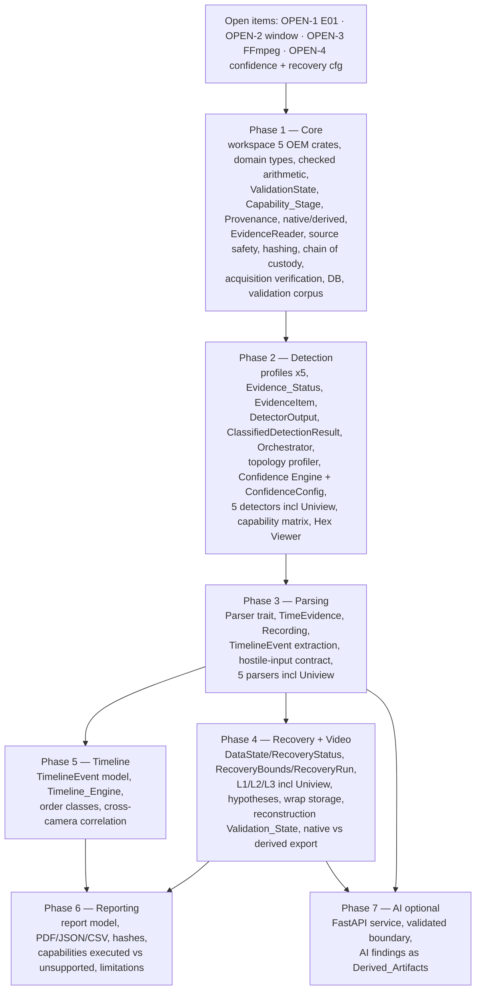

# Implementation Plan

## Overview

This plan implements the Multi-Vendor DVR/NVR Forensic Analysis Platform strictly from the
approved `requirements.md` (Requirements 1–25) and `design.md` (including the Final
Engineering Specification Extensions C-14..C-26). It is a Rust workspace (forensic-core,
evidence-reader, hashing, detection, confidence, recovery, timeline, reporting, and five
per-OEM parser crates for Dahua, Hikvision, Honeywell, CP Plus/UBS, and Uniview), an
Axum/Tokio API, a React/TypeScript frontend, PostgreSQL via sqlx, an optional Python/FastAPI
AI service, and versioned TOML OEM profiles for all five OEMs.

Tasks are grouped by the approved phases (1 Core → 2 Detection → 3 Parsing → 4 Recovery +
Video → 5 Timeline → 6 Reporting → 7 AI optional), with UI tasks placed in the phase that
first needs them. Each task carries requirement and design traceability, dependencies,
forensic constraints, acceptance criteria, and required tests.

Five ideas from the extended design shape the plan and appear in almost every phase:

- **Capability_Stage** (Detection / Profiling / Parsing / Reconstruction / Validation) is
  implementation maturity, tracked independently per dimension, derived from what is actually
  implemented — never a single "supported" boolean.
- **Validation_State** (`PASS | REVIEW | FAIL | UNKNOWN` + required reason) is the outcome of
  an operation that ran. It is never rendered as a Capability_Stage, and an operation that did
  not run is never `PASS`.
- **Native vs Derived artifacts** are separate classes with separate provenance; a native
  artifact is never silently replaced by a derived copy.
- **Bounded search honesty**: every scan/recovery run records searched and skipped ranges and
  reports `REVIEW` when truncated, never claiming a global optimum.
- **Attribution ownership**: Detectors emit `DetectorOutput` (evidence + Detection_Status
  only); the Confidence_Engine is the sole producer of `ClassifiedDetectionResult`
  (Classification + Attribution_Status + confidence).

## Dependency / Phase Ordering

- Phase 1 (Core) is foundational and blocks all later phases. It also owns source safety,
  acquisition verification, ValidationState, Capability_Stage, native/derived artifacts, and
  the checked-arithmetic/hostile-input primitives that Requirement 24 depends on.
- Phase 2 (Detection) depends on Phase 1 (reader, profiles infra, DB, ValidationState) and
  includes the storage topology profiler and all five OEM detectors.
- Phase 3 (Parsing) depends on Phase 2 (a selected storage family/profile version) and owns
  the TimeEvidence model and all five OEM parsers.
- Phase 4 (Recovery + Video) depends on Phase 3 (parser recovery knowledge) and applies
  L1/L2/L3 to all five OEMs including Uniview.
- Phase 5 (Timeline) depends on Phase 3 (Parser-extracted TimelineEvent candidates).
- Phase 6 (Reporting) depends on data produced in Phases 1–5, including capability stages and
  per-operation validation states.
- Phase 7 (AI, optional) depends on Phase 3 validated evidence and never blocks 1–6.

## Open Decisions / Blockers (do NOT silently resolve)

- **OPEN-1 — E01/EWF dependency (BLOCKER for E01 only):** selection + license verification
  of a Rust EWF/E01 library (read-only, segmented, compressed, error handling). Until
  resolved, `.E01` is a *planned integration*; Phase 1 ships `.raw/.dd/.img` only. A custom
  E01 reader MUST NOT be written (Req 8.8).
- **OPEN-2 — Maximum read-window default (DECISION):** the bounded-buffer/window cap size is
  an open engineering decision; implement it as configuration with a documented provisional
  default, not a hard-coded forensic constant.
- **OPEN-3 — FFmpeg runtime dependency (DEPENDENCY, Phase 4):** remux/transmux and decode
  test require FFmpeg; version, invocation, and packaging are an open dependency decision.
  When FFmpeg is absent the decode/QC step is `UNKNOWN`/`REVIEW`, never `PASS`.
- **OPEN-4 — Confidence threshold/margin/quality/weight values and recovery bounds
  (DECISION):** all such numeric values — ConfidenceConfig policy values, per-signature
  weights, and RecoveryBounds limits — are provisional engineering configuration in
  versioned profile/config data and are not validated forensic constants (Req 10.7, 13.9).

These appear below as explicit spike/decision tasks (OPEN-1..OPEN-4) and are referenced by
the tasks that depend on them.

## Definition of Done (per task)

A task is done when: its acceptance criteria are met; its listed tests pass; it introduces
no OEM facts/signatures/offsets/constants beyond versioned profile data; it upholds every
applicable forensic constraint (read-only evidence, no writable evidence handle, source
safety enforced, Evidence_Status preserved and distinct from rule_match_status, non-validated
evidence never upgraded by score, attribution written only by the Confidence_Engine,
confirmed requires OEM_Exclusive_Evidence, DataState/RecoveryStatus independent, overwritten
never reconstructed, bounded searches reported as REVIEW when truncated, raw and
recorder-native timestamps never overwritten, native artifacts never replaced by derived
ones, Capability_Stage never advertised above reality, no `PASS` for an operation that did
not run, no panic on hostile input and checked arithmetic throughout, deterministic forensic
results); and it does not implement E01 prematurely.

---

## Task Dependency Graph

Phase-level ordering (each phase depends on the prior; UI tasks depend on their phase's API):



Key intra-phase dependencies are listed per task under **Dependencies**. OPEN-1 gates E01
only (not Phase 1); OPEN-3 gates Phase 4 video reconstruction; OPEN-2 gates the reader
window; OPEN-4 gates confidence configuration and recovery bounds.

Wave-based parallel execution schedule (each wave may run in parallel once the previous
waves complete; every task appears exactly once and after all its dependencies):

```json
{
  "waves": [
    { "wave": 1, "tasks": ["1", "2", "3", "4", "5"] },
    { "wave": 2, "tasks": ["6"] },
    { "wave": 3, "tasks": ["7", "8", "9", "12", "14", "23", "27", "28", "33", "64", "79"] },
    { "wave": 4, "tasks": ["10", "13", "15", "21", "34"] },
    { "wave": 5, "tasks": ["11", "16", "17", "19", "35", "37", "65", "80"] },
    { "wave": 6, "tasks": ["18", "20", "22", "25", "38", "42", "43", "67", "68"] },
    { "wave": 7, "tasks": ["24", "26", "29", "30", "36", "39", "40", "44", "45", "58", "63", "75", "81", "103"] },
    { "wave": 8, "tasks": ["31", "41", "46", "50", "51", "52", "54", "55", "66", "69", "82", "86", "99", "104"] },
    { "wave": 9, "tasks": ["32", "47", "48", "57", "70", "71", "72", "73", "74", "83", "84", "85", "87", "88", "89", "90", "91", "92", "105"] },
    { "wave": 10, "tasks": ["49", "59", "76", "77", "93", "94", "96", "98", "101", "106", "107"] },
    { "wave": 11, "tasks": ["53", "60", "62", "95", "97", "108", "119"] },
    { "wave": 12, "tasks": ["56", "61", "100", "120", "122"] },
    { "wave": 13, "tasks": ["78", "102", "109", "110", "121"] },
    { "wave": 14, "tasks": ["111", "112", "113", "115", "116", "123"] },
    { "wave": 15, "tasks": ["114"] },
    { "wave": 16, "tasks": ["117", "118"] }
  ]
}
```

## Tasks

The complete task list follows, grouped by phase. Open-item spike/decision tasks come first
because several implementation tasks depend on them.

### Open-Item Tasks

- [-] 1. OPEN-1 — Spike: select and license-verify a Rust EWF/E01 dependency
  - **Requirement Traceability:** Req 8.8
  - **Design Traceability:** Component 1 (Evidence Reader); Open Items to Confirm; R1–R25
    matrix row 8.8 (PARTIAL, dependency-gated)
  - **Description:** Research candidate Rust EWF/E01 crates; verify license compatibility,
    read-only behavior, segmented and compressed E01 support, and error handling. Produce a
    written recommendation (adopt / defer). Do NOT implement a reader.
  - **Dependencies:** none
  - **Implementation Notes:** Output is documentation only. E01 remains a planned
    integration until this spike approves a dependency. No custom E01 parser (Req 8.8).
  - **Acceptance Criteria:** A decision note lists the evaluated crates, licenses, and a
    go/no-go recommendation; no E01 code is added.
  - **Tests:** none (research spike).
  - _Requirements: 8.8_

- [-] 2. OPEN-2 — Decision: maximum read-window / bounded-buffer default
  - **Requirement Traceability:** Req 8.2, 8.3
  - **Design Traceability:** Cross-Cutting (bounded memory); Bounded Scanning; Component 1
  - **Description:** Decide the configurable maximum read-window size and record it as a
    documented provisional default in configuration.
  - **Dependencies:** none
  - **Implementation Notes:** Must be configuration, not a hard-coded constant; label as
    provisional engineering default (design proposes 8–64 MiB as a range, not a fact).
  - **Acceptance Criteria:** A configuration key exists with a documented default and range;
    the value is referenced by the reader (P1-013).
  - **Tests:** none (decision); enforced by P1-013 bounded-memory tests.
  - _Requirements: 8.2, 8.3_

- [-] 3. OPEN-3 — Dependency: FFmpeg runtime for remux and decode test
  - **Requirement Traceability:** Req 14.4, 14.5, 14.9
  - **Design Traceability:** Component 9 (Video Reconstruction); Codec / Media Validation;
    Open Items to Confirm
  - **Description:** Define the FFmpeg dependency (version, invocation strategy, packaging,
    absence-handling) for Phase 4. Do not implement reconstruction here.
  - **Dependencies:** none
  - **Implementation Notes:** If FFmpeg is absent at runtime, the decode/QC step assigns
    `Validation_State = UNKNOWN` (validation did not run) or `REVIEW` (unverified candidate)
    with a reason — never `PASS`, and never fabricated content (Req 14.3, 14.9, 22.3).
  - **Acceptance Criteria:** A dependency note specifies FFmpeg version/invocation and the
    UNKNOWN/REVIEW degradation behavior.
  - **Tests:** none (dependency decision).
  - _Requirements: 14.4, 14.5, 14.9_

- [-] 4. OPEN-4 — Decision: provisional confidence configuration and recovery bounds
  - **Requirement Traceability:** Req 10.7, 10.11, 13.9
  - **Design Traceability:** Component 6 (Confidence Engine); Recovery Engine (Expanded);
    Data Models (`confidence_configs`)
  - **Description:** Record initial threshold, minimum margin, minimum evidence quality,
    validation/quality factors, per-signature weights, and the RecoveryBounds limits
    (`max_scan_bytes`, `max_scan_regions`, `max_candidates`, `max_hypotheses`) as provisional
    engineering configuration (versioned ConfidenceConfig + OEM_Profile weights + recovery
    config). Do not present as validated forensic constants.
  - **Dependencies:** none
  - **Implementation Notes:** Values live in versioned config/profile data with a
    `config_version` and `config_hash`; every value is labeled provisional unless
    independently validated. No confidence or bound value is a source constant.
  - **Acceptance Criteria:** Config/profile data holds the values with a provisional label
    and a version + hash; no confidence or recovery-bound constant is hard-coded in source.
  - **Tests:** covered by P2-013/P2-014 classification tests and P4-003 bounds tests.
  - _Requirements: 10.7, 10.11, 13.9_

---

## Phase 1 — Core

- [x] 5. P1-001 — Initialize Rust workspace and crate skeletons (five OEMs)
  - **Requirement Traceability:** Req 6.1, 6.2, 6.3, 6.4, 25.1
  - **Design Traceability:** Workspace Layout; System Topology; OEM Profile Directory
  - **Description:** Create the Cargo workspace at repo root with crate skeletons
    (`forensic-core`, `evidence-reader`, `hashing`, `detection`, `confidence`, `recovery`,
    `timeline`, `reporting`, `parsers/{dahua,hikvision,honeywell,cpplus-ubs,uniview}`),
    `apps/api`, `apps/frontend`, and directories for
    `profiles/{dahua,hikvision,honeywell,cpplus,uniview}`, `services/ai/`,
    `validation_corpus/`, `tests/`, `docs/`. Create `profiles/{tplink,godrej,matrix}` as
    empty future placeholders that are explicitly NOT marked implemented. Add `.gitignore`
    excluding `cases/` (never commit evidence). No business logic yet.
  - **Dependencies:** none
  - **Implementation Notes:** Core crates must stay free of network/DB deps; only `apps/api`
    touches network/DB. No OEM constants anywhere in source. Uniview is a first-class crate
    and profile directory alongside the other four (Req 25.1); future OEM directories are
    placeholders and must not be advertised as supported.
  - **Acceptance Criteria:** `cargo build` succeeds for the empty workspace; `cases/` is
    git-ignored; crate and profile boundaries match the design layout including
    `parsers/uniview` and `profiles/uniview`; future OEM dirs are present but unimplemented.
  - **Tests:** CI build check that the workspace compiles; layout assertion test.
  - _Requirements: 6.1, 6.2, 6.3, 6.4, 25.1_

- [x] 6. P1-002 — forensic-core domain types and ForensicError
  - **Requirement Traceability:** Req 3.3, 5.4, 6.3, 6.4, 24.1
  - **Design Traceability:** forensic-core; Error Handling; Failure / Adversarial Handling
  - **Description:** Define shared identifiers (CaseId, EvidenceId, ExaminerId), `Hash`,
    `Region`, and the `ForensicError` enum (`Io`, `OutOfBounds`, `UnsupportedFormat`,
    `ProfileInvalid`, `CorruptStructure`, `WriteDenied`, `DecodeFailed`, `Cancelled`). No
    panics on malformed input; malformed evidence is data, not failure.
  - **Dependencies:** P1-001
  - **Implementation Notes:** Types are pure and serde-serializable; no environment coupling
    so forensic results stay deterministic (Req 20). Core crates return
    `Result<T, ForensicError>` and never panic on hostile input (Req 24.1).
  - **Acceptance Criteria:** Types compile and round-trip through serde; error variants cover
    the design list; no `unwrap`/`expect` on evidence-derived values.
  - **Tests:** Unit: serde round-trip; error mapping smoke tests; lint gate against panicking
    calls on evidence paths.
  - _Requirements: 3.3, 5.4, 6.3, 6.4, 24.1_

- [x] 7. P1-003 — Checked-arithmetic and bounds primitives (hostile input contract)
  - **Requirement Traceability:** Req 24.1, 24.2, 24.4, 8.11
  - **Design Traceability:** Failure / Adversarial Handling; Component 1 (bounds); Honeywell
    bounds/arithmetic note
  - **Description:** Implement the shared checked-arithmetic helpers used for every
    offset/size/length computation (checked add/mul/sub over `u64`, `sector_size ×
    start_sector`, region intersection, end-offset computation) plus a bounds validator that
    rejects out-of-range, negative-encoded, overflowing, and impossible values with
    `OutOfBounds` or `CorruptStructure`.
  - **Dependencies:** P1-002
  - **Implementation Notes:** All parsers, detectors, topology profiling, and recovery MUST
    use these helpers — no raw `+`/`*` on evidence-derived offsets. Integer/offset/length
    overflow, truncated structures, and impossible values are rejected, never panicked on
    (Req 24.2, 24.4). No OEM constants here.
  - **Acceptance Criteria:** Overflowing and out-of-range computations return errors instead
    of wrapping or panicking; helpers are the only sanctioned offset arithmetic path.
  - **Tests:** Property: no input causes a panic or silent wrap; unit: overflow, zero-length,
    end-past-source, and impossible-value cases.
  - _Requirements: 24.1, 24.2, 24.4, 8.11_

- [x] 8. P1-004 — ValidationState enum with required reason
  - **Requirement Traceability:** Req 22.1, 22.2, 22.3
  - **Design Traceability:** Validation State; Data Models (`validation_states`)
  - **Description:** Implement `ValidationState { Pass, Review, Fail, Unknown }` together
    with a mandatory reason/explanation, and the recording API that attaches a state + reason
    to a named operation on a named subject.
  - **Dependencies:** P1-002
  - **Implementation Notes:** A reason is structurally required (not optional) so no state is
    recorded without an explanation (Req 22.2). An operation that has not executed or been
    verified is `UNKNOWN`, never `PASS` (Req 22.3). Validation_State is the outcome of an
    operation and is never used as, or rendered as, a Capability_Stage.
  - **Acceptance Criteria:** The type cannot be constructed without a reason; helper for
    "operation did not run" yields `UNKNOWN`; serde round-trips all four values.
  - **Tests:** Unit: four values + reason requirement; adversarial: attempting to mark an
    unexecuted operation `PASS` is impossible by construction/API.
  - _Requirements: 22.1, 22.2, 22.3_

- [x] 9. P1-005 — Capability_Stage model (five independent dimensions)
  - **Requirement Traceability:** Req 3.6, 3.7, 21.1, 21.2, 21.3, 21.4
  - **Design Traceability:** Capability Maturity Model; Data Models (`capability_stages`)
  - **Description:** Implement `CapabilityStage { NotImplemented, Partial, Implemented }` and
    a per-OEM `CapabilityStages { detection, profiling, parsing, reconstruction, validation }`
    record with five independent fields.
  - **Dependencies:** P1-002
  - **Implementation Notes:** The five dimensions are never collapsed into a single
    "supported" boolean (Req 3.6). Capability_Stage is implementation maturity and is
    structurally distinct from `ValidationState` — the two types are not interchangeable and
    neither converts into the other (Req 21.2). Values are derived from implemented
    capability, never from intent (Req 21.4).
  - **Acceptance Criteria:** All five dimensions are independently settable; no API produces a
    single aggregate "supported" flag; no conversion exists between CapabilityStage and
    ValidationState.
  - **Tests:** Unit: independence of the five dimensions; compile-time check that no
    From/Into exists between CapabilityStage and ValidationState.
  - _Requirements: 3.6, 3.7, 21.1, 21.2, 21.3, 21.4_

- [x] 10. P1-006 — Provenance and SourceRegion model
  - **Requirement Traceability:** Req 5.4, 5.8
  - **Design Traceability:** Native vs Derived Artifacts (`Provenance`); Cross-Cutting
    (Provenance & Chain of Custody); Data Models (`provenance`, `source_regions`)
  - **Description:** Implement the design's `Provenance` struct (source evidence id, source
    hash, source regions, producing component + version, OEM profile version + hash, parser
    version, recovery level, output hash, ordered transformation history, validation state)
    and the structured `source_regions` representation.
  - **Dependencies:** P1-002, P1-004
  - **Implementation Notes:** Source offsets are structured/queryable (not opaque blobs) so an
    examiner can ask "what bytes X..Y of evidence E produced this artifact". Provenance
    carries a `ValidationState` with a reason.
  - **Acceptance Criteria:** Provenance records resolve source evidence, hash, offsets,
    component + version, profile version + hash, transformation history, and output hash for a
    derived artifact.
  - **Tests:** Unit: provenance construction and serialization; completeness assertion
    (Property 10).
  - _Requirements: 5.4, 5.8_

- [x] 11. P1-007 — Artifact model: native vs derived
  - **Requirement Traceability:** Req 5.8, 5.9
  - **Design Traceability:** Native vs Derived Artifacts (`Artifact`, `NativeArtifact`,
    `DerivedArtifact`); Data Models (`artifacts`)
  - **Description:** Implement `Artifact { Native(NativeArtifact), Derived(DerivedArtifact) }`
    where each variant owns its own `Provenance`, plus the derived-kind descriptor
    (elementary stream, remux, review copy, AI output).
  - **Dependencies:** P1-006
  - **Implementation Notes:** A native artifact is NEVER silently replaced by a derived copy —
    both are retained and independently queryable (Req 5.9). Derived artifacts always carry
    their own provenance and transformation history; they never inherit the native artifact's
    identity.
  - **Acceptance Criteria:** Native and derived artifacts coexist for the same source region;
    no API path overwrites or discards a native artifact when a derived one is produced.
  - **Tests:** Unit: construction + serde; adversarial: producing a derived artifact leaves the
    native artifact and its hash intact.
  - _Requirements: 5.8, 5.9_

- [x] 12. P1-008 — Case and Evidence domain model
  - **Requirement Traceability:** Req 7.1, 7.2, 7.3, 7.5, 7.6, 1.8
  - **Design Traceability:** Component 2 (Case & Evidence Model); Data Models (`cases`,
    `evidence`)
  - **Description:** Define `Case` and `Evidence` structs including required acquisition
    fields (source device, acquisition time, capacity, image format, responsible examiner),
    optional `acquisition_tool` / `acquisition_tool_version`, the `source_state` field, and a
    link to an `Acquisition` record.
  - **Dependencies:** P1-002
  - **Implementation Notes:** Optional tool fields must not block registration when unknown
    (Req 7.6). Each evidence belongs to exactly one case (Req 7.3). `source_state` defaults to
    `unknown` and is never asserted as `read_only` without inspection (Req 1.12).
  - **Acceptance Criteria:** Models represent all required and optional fields plus
    source_state; a piece of evidence references exactly one case.
  - **Tests:** Unit: construction with and without optional tool fields; default source_state
    is `unknown`.
  - _Requirements: 7.1, 7.2, 7.3, 7.5, 7.6, 1.8_

- [x] 13. P1-009 — Acquisition model and AcquisitionStatus
  - **Requirement Traceability:** Req 7.7, 7.8, 7.9, 23.1, 23.2, 23.3, 23.4
  - **Design Traceability:** Acquisition Verification; Component 2 (Acquisition); Data Models
    (`acquisitions`)
  - **Description:** Implement `Acquisition` with `AcquisitionStatus { Complete, Partial,
    Failed, Unknown }`, tool + tool version, acquisition map/receipt reference and map hash,
    bad-sector ranges, unresolved ranges, and a verification `ValidationState` + reason.
  - **Dependencies:** P1-008, P1-004
  - **Implementation Notes:** An incomplete acquisition is NEVER labeled complete (Req 7.9,
    23.4); where acquisition information is unavailable the status is `unknown` and
    completeness is never fabricated (Req 7.8). Bad-sector and unresolved ranges are recorded
    as structured regions so they remain queryable.
  - **Acceptance Criteria:** Status covers the four values; an acquisition with non-empty
    unresolved/bad-sector ranges cannot be represented as `Complete`; missing info yields
    `Unknown`.
  - **Tests:** Unit: four statuses; adversarial: incomplete acquisition rejected from
    `Complete`; unknown-info path yields `Unknown` not `Complete`.
  - _Requirements: 7.7, 7.8, 7.9, 23.1, 23.2, 23.3, 23.4_

- [x] 14. P1-010 — EvidenceReader trait (read-only, no write API)
  - **Requirement Traceability:** Req 1.1, 8.1, 8.7, 8.9
  - **Design Traceability:** Component 1 (Evidence Reader)
  - **Description:** Define the `EvidenceReader` trait: `len`, `read_at(offset, buf)`,
    sequential streaming, bounded region scanning, `mmap_region`, `source_kind`. The trait
    exposes NO write method.
  - **Dependencies:** P1-002
  - **Implementation Notes:** No write method exists at the type level (primary read-only
    guarantee, Req 1.1). `Send + Sync` for parallel detection. Random access, sequential
    streaming, and bounded scanning all operate over the same read-only source (Req 8.9).
  - **Acceptance Criteria:** Trait compiles with no write-capable method; source kinds cover
    Raw/Dd/Img/PhysicalDisk (E01 reserved, not implemented).
  - **Tests:** Compile-time check that no write method exists; trait-object usage test.
  - _Requirements: 1.1, 8.1, 8.7, 8.9_

- [x] 15. P1-011 — Raw/.dd/.img backend with read-only OS handles
  - **Requirement Traceability:** Req 1.1, 1.2, 1.6, 1.7, 8.1, 8.7
  - **Design Traceability:** Component 1; Cross-Cutting (Read-Only Enforcement); Source Safety
    (a) read-only OS handle
  - **Description:** Implement the file/physical-disk backend opening sources with read-only
    OS handles (Linux `O_RDONLY`; Windows `GENERIC_READ` + `FILE_SHARE_READ`; physical disks
    read access only, never a writable handle).
  - **Dependencies:** P1-010
  - **Implementation Notes:** A read-only OS handle describes how THIS process opened the
    source; it is not the source's actual safety state and is not hardware write blocking —
    the three are never conflated (design Source Safety (a)/(b)/(c); Req 1.7). E01 NOT
    implemented (Req 8.8, gated by OPEN-1); Phase 1 ships `.raw/.dd/.img` only.
  - **Acceptance Criteria:** `.raw/.dd/.img` and physical disks open read-only; no code path
    acquires a writable handle to evidence; E01 returns `UnsupportedFormat`.
  - **Tests:** Integration: open fixtures read-only; assert no writable handle; platform
    handle-flag unit tests where feasible; E01 rejected as unsupported.
  - _Requirements: 1.1, 1.2, 1.6, 1.7, 8.1, 8.7_

- [x] 16. P1-012 — Source safety inspection (SourceState, SafetyDecision, report)
  - **Requirement Traceability:** Req 1.8, 1.9, 1.10, 1.11, 1.12
  - **Design Traceability:** Source Safety (`inspect_source`, `SourceSafetyReport`); Data
    Models (`source_safety_reports`)
  - **Description:** Implement `SourceState { ReadOnly, ReadWrite, Unknown }`,
    `SafetyDecision { Accepted, Rejected }`, `SourceSafetyReport { source_state, decision,
    reason, inspected_at }`, and `inspect_source(source)` which runs BEFORE any analysis of a
    physical block device and rejects mounted or write-enabled sources by default with a
    visible failure.
  - **Dependencies:** P1-011, P1-004
  - **Implementation Notes:** A `read_write`, mounted, or write-enabled source produces a
    VISIBLE failure and analysis never silently proceeds (Req 1.10). Where the state cannot be
    determined it is `Unknown` and `Unknown` is NEVER reported as `read_only` (Req 1.12). The
    decision and its reason are recorded in the Chain_Of_Custody (Req 1.11, wired in P1-022).
    Software controls do not replace a hardware write blocker (Req 1.7).
  - **Acceptance Criteria:** Inspection precedes analysis for block devices; write-enabled and
    mounted sources are rejected with a reason; undeterminable state yields `Unknown`, never
    `ReadOnly`; every inspection yields a persisted report.
  - **Tests:** Adversarial: write-enabled source rejected with visible failure; mounted source
    rejected; undeterminable state recorded as `Unknown`; analysis blocked on rejection.
  - _Requirements: 1.8, 1.9, 1.10, 1.11, 1.12_

- [x] 17. P1-013 — Bounded read_at and RegionScanner with searched/skipped accounting
  - **Requirement Traceability:** Req 8.2, 8.3, 8.9, 13.9
  - **Design Traceability:** Component 1 (read_at, RegionScanner); Bounded Scanning;
    Cross-Cutting (bounded memory)
  - **Description:** Implement positioned `read_at` and a windowed `RegionScanner` taking
    explicit `start`, `length`, `window_size`, `alignment`, cancellation, progress, and
    candidate limits from the OPEN-2 configuration; every scan records the searched range,
    searched bytes, skipped ranges, and a termination reason.
  - **Dependencies:** P1-011, P1-003, OPEN-2
  - **Implementation Notes:** Whole-image reads are forbidden; buffers are bounded and never
    proportional to total size (Req 8.3). A truncated scan makes its truncation explicit so
    downstream validation can be `REVIEW` rather than claiming completeness (design Bounded
    Scanning; Req 13.10). All offset arithmetic uses P1-003 checked helpers.
  - **Acceptance Criteria:** Reading/scanning a large sparse image stays under the configured
    cap; concatenated windowed reads equal a single-range read; every scan reports searched
    bytes, skipped ranges, and a termination reason.
  - **Tests:** Property: read fidelity (Property 3); bounded-memory test on a large sparse
    fixture (Property 2); unit: searched/skipped accounting and termination reason.
  - _Requirements: 8.2, 8.3, 8.9, 13.9_

- [x] 18. P1-014 — Sparse awareness, truncation reporting, and out-of-bounds rejection
  - **Requirement Traceability:** Req 8.10, 8.11, 24.2
  - **Design Traceability:** Component 1 (sparse/out-of-bounds); Failure / Adversarial Handling
  - **Description:** Make the reader sparse-image aware: preserve logical offsets, distinguish
    sparse/unallocated logical regions from actual source truncation/end-of-source, report
    actual truncation separately, and reject reads outside source bounds with `OutOfBounds`.
  - **Dependencies:** P1-013
  - **Implementation Notes:** Sparse holes are NEVER silently treated as truncation, and
    truncation never crashes the reader (Req 8.10). Bounds checks use the P1-003 checked
    helpers (Req 24.4).
  - **Acceptance Criteria:** A sparse fixture reports holes as sparse, not truncated; a
    truncated fixture reports truncation without panic; out-of-bounds reads return
    `OutOfBounds`.
  - **Tests:** Adversarial: sparse image, truncated image, out-of-bounds read; property: no
    input panics the reader.
  - _Requirements: 8.10, 8.11, 24.2_

- [x] 19. P1-015 — Read-only memory-mapped region support
  - **Requirement Traceability:** Req 8.4, 1.6
  - **Design Traceability:** Component 1 (mmap_region); Read-Only Enforcement
  - **Description:** Implement optional read-only memory mapping for bounded regions where
    beneficial.
  - **Dependencies:** P1-011
  - **Implementation Notes:** Mappings are read-only only (`PROT_READ` / `PAGE_READONLY`);
    no writable mapping of evidence is ever created (Req 1.6). Large sources never force a
    full-image map.
  - **Acceptance Criteria:** Mapped reads return correct bytes and are read-only; large
    sources do not force full-image maps.
  - **Tests:** Integration: mmap region equals `read_at` output; read-only mapping assertion.
  - _Requirements: 8.4, 1.6_

- [x] 20. P1-016 — Progress reporting and cancellation
  - **Requirement Traceability:** Req 8.5, 8.6, 24.3
  - **Design Traceability:** Component 1 (RegionScanner); Failure / Adversarial Handling
  - **Description:** Add progress reporting and cooperative cancellation to long
    reads/scans/hashing; cancellation returns `Cancelled` with progress preserved. A
    random-access `read_at` may complete without progress reporting.
  - **Dependencies:** P1-013
  - **Implementation Notes:** Cancellation and interrupted reads return a defined result
    rather than crashing (Req 24.3); the result classification stays deterministic.
  - **Acceptance Criteria:** A scan reports progress and stops promptly on cancel, returning
    `Cancelled` with the searched extent preserved.
  - **Tests:** Integration: cancellation mid-scan; progress monotonicity; adversarial:
    interrupted read yields a defined error.
  - _Requirements: 8.5, 8.6, 24.3_

- [x] 21. P1-017 — WriteGuard and write-denied chain-of-custody logging
  - **Requirement Traceability:** Req 1.3, 1.4, 1.5
  - **Design Traceability:** Cross-Cutting (Read-Only Enforcement, secondary guard)
  - **Description:** Implement the secondary application-level WriteGuard: reject writes
    resolving inside the evidence directory, emit a `write_denied` chain-of-custody event, and
    validate that derived artifacts resolve outside the evidence directory.
  - **Dependencies:** P1-002, P1-019
  - **Implementation Notes:** Secondary safeguard only; read-only OS handles are primary.
    Evidence-directory immutability is application-level best-effort and the Platform never
    implies it can stop a privileged OS process (Req 1.5).
  - **Acceptance Criteria:** A write attempt against evidence is denied and logged; artifact
    paths inside the evidence dir are rejected; derived artifacts land in a separate
    artifacts directory.
  - **Tests:** Adversarial: write-attempt test asserts denial + logged event (Property 1);
    re-hash of evidence before/after operations is unchanged.
  - _Requirements: 1.3, 1.4, 1.5_

- [x] 22. P1-018 — Streaming SHA-256 Hashing_Service with hash metadata
  - **Requirement Traceability:** Req 5.1, 5.6, 5.7
  - **Design Traceability:** Component 3 (Hashing); Data Models (`hashes`)
  - **Description:** Implement streaming SHA-256 over the reader in bounded windows,
    producing `HashRecord { artifact, algo, value, computed_at, status, duration_ms,
    bytes_hashed }`.
  - **Dependencies:** P1-013
  - **Implementation Notes:** Never load the whole image (Req 5.7); the `algo` field allows
    future algorithms without a schema change (SHA-256 required now). Hashing reports progress
    and is cancellable via P1-016.
  - **Acceptance Criteria:** Hash of a known fixture matches a reference; status, bytes
    hashed, and duration are recorded; memory stays bounded.
  - **Tests:** Unit: known-vector SHA-256; integration: bounded-memory hashing of a large
    sparse fixture.
  - _Requirements: 5.1, 5.6, 5.7_

- [x] 23. P1-019 — Chain_Of_Custody logging
  - **Requirement Traceability:** Req 5.3, 5.5
  - **Design Traceability:** Cross-Cutting (Provenance & Chain of Custody); Data Models
    (`chain_of_custody`)
  - **Description:** Implement the chain-of-custody event log `{timestamp, examiner, action,
    artifact, result}` for significant actions (ingest, source-safety decision, detection run,
    parse, recovery, export, report, write-denied), retained for the case lifetime.
  - **Dependencies:** P1-002
  - **Implementation Notes:** Events are append-only within a case; the source safety decision
    and its reason are logged here (Req 1.11).
  - **Acceptance Criteria:** Significant actions produce events with the required fields;
    events persist for the case lifetime and cannot be mutated after append.
  - **Tests:** Unit: event creation; integration: retention across the case; append-only
    assertion.
  - _Requirements: 5.3, 5.5_

- [x] 24. P1-020 — Export provenance and hashing hooks (native vs derived)
  - **Requirement Traceability:** Req 5.2, 5.4, 5.8, 5.9
  - **Design Traceability:** Component 3; Native vs Derived Artifacts; Cross-Cutting
    (Provenance)
  - **Description:** When an export is produced, compute its SHA-256 and record it with the
    export `Provenance` and the correct `Artifact` classification (native or derived), plus a
    chain-of-custody event.
  - **Dependencies:** P1-018, P1-006, P1-007, P1-019
  - **Implementation Notes:** Every derived artifact must resolve to source evidence, offsets,
    component + version, profile version(s), and output hash (Property 10). Producing a derived
    export never replaces or invalidates the native artifact (Req 5.9).
  - **Acceptance Criteria:** A produced export has a hash record, complete provenance, an
    artifact kind, and a COC event; the native artifact remains present and unchanged.
  - **Tests:** Integration: export → hash + provenance + artifact kind + COC recorded;
    native-artifact-preserved assertion.
  - _Requirements: 5.2, 5.4, 5.8, 5.9_

- [x] 25. P1-021 — PostgreSQL schema and sqlx migrations (Phase 1 tables)
  - **Requirement Traceability:** Req 5.3, 5.4, 5.8, 5.9, 7.1, 7.2, 7.3, 7.7, 21.1, 22.1,
    23.1, 23.2
  - **Design Traceability:** Data Models; Database / Data Model (Extensions)
  - **Description:** Create sqlx migrations for the Phase-1 metadata tables: `cases`,
    `acquisitions`, `evidence` (incl. `source_state`, `acquisition_id`),
    `source_safety_reports`, `chain_of_custody`, `hashes`, `source_regions`, `artifacts`,
    `provenance`, `validation_states`, and `capability_stages`. Metadata only.
  - **Dependencies:** P1-008, P1-009, P1-006, P1-007, P1-004, P1-005, P1-019
  - **Implementation Notes:** No multi-TB media in PostgreSQL; `evidence` rows point to
    immutable read-only files. `source_regions` is normalized/queryable, not JSONB.
    `artifacts.kind` distinguishes `native` from `derived` and each row links to a
    `provenance` row so native-vs-derived lineage is queryable (Req 5.9). `capability_stages`
    holds five independent stage columns; `validation_states` holds a state + required reason
    per operation.
  - **Acceptance Criteria:** Migrations apply cleanly up and down; schema matches the design
    tables and FKs; no media-blob columns; five stage columns present; reason column is NOT
    NULL.
  - **Tests:** Integration: migrate up/down; insert/select round-trips against a test DB;
    constraint test that a validation_state row requires a reason.
  - _Requirements: 5.3, 5.4, 5.8, 5.9, 7.1, 7.2, 7.3, 7.7, 21.1, 22.1, 23.1, 23.2_

- [x] 26. P1-022 — Case_Manager service, validation, and acquisition verification
  - **Requirement Traceability:** Req 7.1, 7.2, 7.3, 7.4, 7.5, 7.6, 7.7, 7.8, 7.9, 1.9, 1.11,
    23.1, 23.2, 23.4
  - **Design Traceability:** Component 2 (Case & Evidence Model); Acquisition Verification;
    Source Safety
  - **Description:** Implement case creation and evidence registration with required-field
    validation that names the missing field; compute the evidence SHA-256 at ingest; run
    `inspect_source` before analysis of a physical device and reject unsafe sources; preserve
    and hash the acquisition map/receipt; record unresolved and bad-sector ranges and the
    acquisition verification state; log ingest and the safety decision to chain of custody.
  - **Dependencies:** P1-021, P1-018, P1-019, P1-009, P1-012
  - **Implementation Notes:** Optional tool fields never block registration (Req 7.6); a
    missing required field is rejected with the field named (Req 7.4). An incomplete
    acquisition is never labeled complete (Req 7.9, 23.4); unavailable acquisition info is
    `unknown`, never fabricated (Req 7.8). A rejected source safety decision blocks analysis
    with a visible failure and is recorded with its reason (Req 1.10, 1.11).
  - **Acceptance Criteria:** Valid registration succeeds, hashes evidence, and stores the
    source safety report; missing required field is rejected naming the field; unknown tool
    fields still succeed; acquisition map is hashed; incomplete acquisition never reports
    `Complete`.
  - **Tests:** Unit: validation paths; integration: ingest computes hash + COC event +
    safety report; adversarial: write-enabled source blocks ingest/analysis;
    incomplete-acquisition-not-complete test; acquisition-map-hash test.
  - _Requirements: 7.1, 7.2, 7.3, 7.4, 7.5, 7.6, 7.7, 7.8, 7.9, 1.9, 1.11, 23.1, 23.2, 23.4_

- [x] 27. P1-023 — Deterministic forensic-result comparison harness
  - **Requirement Traceability:** Req 20.1, 20.2, 20.3, 20.4
  - **Design Traceability:** Cross-Cutting (Determinism, bounded); Correctness Properties
    (Property 4)
  - **Description:** Provide a reusable harness that compares Forensic_Results while excluding
    environment-dependent metadata (execution timestamps, DB IDs, temp paths, durations). The
    harness captures the full determinism input set: evidence bytes/hash, OEM_Profile
    version + hash, ConfidenceConfig version + hash, recovery configuration, and the
    Detector/Parser/Confidence_Engine/Recovery_Engine versions.
  - **Dependencies:** P1-002
  - **Implementation Notes:** Determinism applies to forensic results only; runtime metadata
    is excluded by design (Req 20.2). The ConfidenceConfig version + hash and the recovery
    configuration are first-class determinism inputs (Req 20.1) — omitting either makes a
    determinism claim invalid.
  - **Acceptance Criteria:** The harness reports equality of two runs' forensic fields while
    ignoring excluded metadata, and fails the comparison when any determinism input differs.
  - **Tests:** Unit: identical forensic results compare equal; differing metadata ignored;
    differing ConfidenceConfig hash or recovery configuration flagged as a different input set.
  - _Requirements: 20.1, 20.2, 20.3, 20.4_

- [x] 28. P1-024 — Synthetic fixture generator (labeled synthetic)
  - **Requirement Traceability:** Req 19.7, 19.11
  - **Design Traceability:** Testing Strategy (synthetic fixture generator); Validation Corpus
  - **Description:** Build a generator that produces small deterministic images (including
    sparse, truncated, fragmented, overlapping-signature, wrong-offset, lone-magic, and
    overwritten shapes) for tests, for all five OEM profile shapes. Every fixture is labeled
    `synthetic`.
  - **Dependencies:** P1-002
  - **Implementation Notes:** Fixtures are explicitly NOT real OEM evidence and introduce no
    authoritative OEM facts — they are profile-shaped test data only (Req 19.11). Same seed →
    same bytes so corpus cases stay deterministic.
  - **Acceptance Criteria:** Generator emits reproducible fixtures usable without real
    evidence; every emitted fixture carries a `synthetic` label; the five OEM shapes are
    parameterised from profile data, not hard-coded constants.
  - **Tests:** Unit: fixture reproducibility (same seed → same bytes); label presence
    assertion.
  - _Requirements: 19.7, 19.11_

- [x] 29. P1-025 — Machine-readable validation corpus
  - **Requirement Traceability:** Req 19.10, 19.11
  - **Design Traceability:** Validation Corpus; Data Models (`validation_corpus`)
  - **Description:** Implement the `validation_corpus/` layout and its machine-readable
    manifest schema + loader, where each case records a case id, source hash, source type,
    expected detection, expected detection status, expected classification, expected
    attribution status, expected regions, expected parser state, expected recovery state,
    expected validation state, expected warnings, provenance, and a `synthetic` flag.
  - **Dependencies:** P1-024, P1-021
  - **Implementation Notes:** Corpus cases are deterministic and are the machine-readable
    source of truth for regression assertions; synthetic cases are labeled `synthetic` and are
    never described as real forensic evidence (Req 19.11). The corpus carries expected values
    only — it introduces no OEM facts of its own.
  - **Acceptance Criteria:** Corpus manifests load and validate against the schema; each case
    exposes all required expected fields; a case missing a required field is rejected; the
    corpus is persisted to `validation_corpus`.
  - **Tests:** Unit: manifest schema validation, rejection of an incomplete case; integration:
    corpus load → DB round-trip; determinism of corpus case ordering.
  - _Requirements: 19.10, 19.11_

- [x] 30. P1-026 — Phase 1 foundational test suite
  - **Requirement Traceability:** Req 1.1, 1.4, 1.10, 8.2, 8.3, 8.6, 8.10, 8.11, 19.6, 20.1,
    24.1, 24.2, 24.3, 24.4
  - **Design Traceability:** Testing Strategy; Correctness Properties (P1–P4); Failure /
    Adversarial Handling; Testing and QA (Release Gates)
  - **Description:** Assemble the Phase-1 test suite: read-only enforcement (write denied +
    logged, evidence re-hash unchanged), source-safety rejection, bounded memory, read
    fidelity, sparse vs truncated, out-of-bounds, cancellation and interrupted reads,
    streaming-hash correctness, checked-arithmetic overflow rejection, hostile-input no-panic
    property, and a determinism repeat check on Phase-1 outputs.
  - **Dependencies:** P1-017, P1-018, P1-023, P1-024, P1-003, P1-012, P1-014, P1-016
  - **Implementation Notes:** Uses synthetic fixtures only. The no-panic contract applies to
    every evidence-consuming code path in Phase 1 (Req 24.1).
  - **Acceptance Criteria:** All listed foundational tests pass in CI and are wired as release
    gates.
  - **Tests:** Property (1, 2, 3, 4) + adversarial + integration as listed above.
  - _Requirements: 1.1, 1.4, 1.10, 8.2, 8.3, 8.6, 8.10, 8.11, 19.6, 20.1, 24.1, 24.2, 24.3, 24.4_

- [x] 31. P1-027 — Axum API skeleton: case, evidence, acquisition, source-safety endpoints
  - **Requirement Traceability:** Req 7.1, 7.2, 7.4, 7.7, 1.10, 18.8
  - **Design Traceability:** System Topology (Rust Backend); Component 2; Data Models
    (Frontend byte access)
  - **Description:** Stand up the Axum/Tokio API with endpoints to create cases, register
    evidence, submit/read acquisition details, and read the source safety report; long
    operations return a job id + progress.
  - **Dependencies:** P1-022, P1-012
  - **Implementation Notes:** The API is the only crate touching network/DB; it maps
    `ForensicError` to structured problem responses and never leaks panics. A rejected source
    is surfaced as a visible failure response, not a warning (Req 1.10). The frontend never
    opens filesystem paths — all byte access goes through this API/EvidenceReader. Flag that
    these endpoints are unauthenticated for the SIH prototype; add authentication and access
    control before any network exposure.
  - **Acceptance Criteria:** Create-case, register-evidence, acquisition, and source-safety
    endpoints work end-to-end against the test DB; no endpoint accepts a filesystem path as a
    byte-read target.
  - **Tests:** Integration: HTTP create case, register evidence, error on missing field,
    rejected-source response; negative test that arbitrary-path reads are not exposed.
  - _Requirements: 7.1, 7.2, 7.4, 7.7, 1.10, 18.8_

- [x] 32. P1-UI-001 — UI shell, navigation, Case/Evidence/Acquisition, Overview
  - **Requirement Traceability:** Req 18.1, 18.5, 18.7, 18.8
  - **Design Traceability:** Component 13 (UI & Hex Viewer); UI (Extensions)
  - **Description:** Build the React/TypeScript shell with navigation (Case, Evidence,
    Acquisition, Detection, Parsing, Recovery, Timeline, Evidence/Provenance, Reports) and
    implement the Case, Evidence, and Acquisition screens plus the Overview showing case,
    evidence name, hash, size, analysis status, acquisition status, and source provenance
    (source state + safety decision). OEM/confidence/capability fields populate in Phase 2.
  - **Dependencies:** P1-027
  - **Implementation Notes:** Forensic-workstation style (light neutral, charcoal text, thin
    borders, compact tables, restrained blue accents); no neon/gradients/chatbot/AI graphics.
    Acquisition status shows `unknown` rather than implying completeness (Req 7.8). The
    frontend never opens arbitrary local paths; all data comes from the API.
  - **Acceptance Criteria:** Navigation renders all nine sections; Case/Evidence/Acquisition
    are functional; Overview displays Phase-1 fields including acquisition status and source
    provenance; visual style matches Req 18.5.
  - **Tests:** Component tests for nav + Case/Evidence/Acquisition forms; acquisition-status
    and source-state rendering tests; visual style checklist.
  - _Requirements: 18.1, 18.5, 18.7, 18.8_

---

## Phase 2 — Detection

- [x] 33. P2-001 — Evidence_Status domain type
  - **Requirement Traceability:** Req 11.5, 11.6, 11.8
  - **Design Traceability:** Component 4 (OEM Profiles); Cross-Cutting (OEM Knowledge Safety)
  - **Description:** Implement the `EvidenceStatus` enum (`validated`, `provisional`,
    `model_specific`, `firmware_specific`, `unvalidated`).
  - **Dependencies:** P1-002
  - **Implementation Notes:** Canonical concept; the profile key is `evidence_status` and
    "basis" is prose only, never a field. Status is never upgraded by score (Req 10.8) and a
    non-validated signature is never treated as a universal forensic fact (Req 11.6).
  - **Acceptance Criteria:** Enum matches the five approved values and serde round-trips;
    unknown values are rejected.
  - **Tests:** Unit: parse/serialize all five values; reject unknown value.
  - _Requirements: 11.5, 11.6, 11.8_

- [x] 34. P2-002 — OEM_Profile TOML schema and types (incl. applicability)
  - **Requirement Traceability:** Req 11.1, 11.2, 11.7, 6.5, 6.6
  - **Design Traceability:** Component 4 (OEM Profiles); C-22 (applicability)
  - **Description:** Define the `OemProfile` types (`profile_id`, `profile_version`,
    `schema_version`, `storage_family`, `oem`, attribution rules, signatures, offset
    constraints, endianness, expected ranges, validation rules, confidence weights, and
    `Applicability { model, firmware, hardware/storage variant, evidence source/reference,
    validation state }`) with a REQUIRED per-signature `evidence_status`.
  - **Dependencies:** P2-001
  - **Implementation Notes:** Profiles are data artifacts, not source constants; no OEM values
    are invented here — profile content is authored/curated separately and every value carries
    its Evidence_Status and applicability. One OEM does not map to a single universal
    filesystem (Req 6.5).
  - **Acceptance Criteria:** A well-formed profile deserializes with applicability; a signature
    without `evidence_status` fails to deserialize/validate.
  - **Tests:** Unit: valid profile parses; missing `evidence_status` rejected; applicability
    round-trip.
  - _Requirements: 11.1, 11.2, 11.7, 6.5, 6.6_

- [x] 35. P2-003 — Profile loader, strict validation, and applicability selection
  - **Requirement Traceability:** Req 6.1, 6.5, 6.6, 11.4, 11.5, 11.8
  - **Design Traceability:** Component 4 (profile loader); OEM Profile Directory
  - **Description:** Implement loading of versioned profiles from `profiles/` for all five
    OEMs, schema validation, rejection of any signature/rule lacking `evidence_status` or of a
    malformed profile (`ProfileInvalid`), and applicable-profile selection by the combination
    of OEM, model, firmware, and storage variant.
  - **Dependencies:** P2-002
  - **Implementation Notes:** The loader lives outside detector source; adding a profile adds
    an OEM without core changes (Req 6.2, exercised in P2-009). Future OEM directories
    (tplink/godrej/matrix) load as empty and are never reported as supported. No undocumented
    factual signature is admitted (Req 11.8).
  - **Acceptance Criteria:** Valid profiles for all five OEMs load; invalid profiles are
    rejected with a clear error; profile selection honours model/firmware/variant
    applicability; profiles remain separate from source code.
  - **Tests:** Unit: valid/invalid profile loading; adversarial: missing evidence_status,
    malformed profile, unknown-model and unknown-firmware selection paths.
  - _Requirements: 6.1, 6.5, 6.6, 11.4, 11.5, 11.8_

- [x] 36. P2-004 — Profile hashing and version recording
  - **Requirement Traceability:** Req 11.2, 11.3
  - **Design Traceability:** Component 4; Data Models (`profiles`)
  - **Description:** Compute and record each loaded profile's `profile_version`,
    `schema_version`, and `profile_hash` so results can cite exactly which profile produced a
    claim; persist to the `profiles` table.
  - **Dependencies:** P2-003, P1-021
  - **Implementation Notes:** BOTH the profile version and the profile hash are stamped into
    every DetectorOutput and EvidenceItem so every claim cites the exact profile; the pair is
    also a determinism input (Req 20.1).
  - **Acceptance Criteria:** Loaded profile version + hash are recorded and retrievable per
    OEM; a profile edit changes the recorded hash.
  - **Tests:** Integration: load → profile row with version + hash; profile-version-change test.
  - _Requirements: 11.2, 11.3_

- [x] 37. P2-005 — EvidenceItem model (rule_match_status vs evidence_status)
  - **Requirement Traceability:** Req 2.2, 2.8, 9.4, 10.8
  - **Design Traceability:** Component 5 (Detection, `EvidenceItem`); Data Models
    (`evidence_items`)
  - **Description:** Implement `EvidenceItem { source_evidence_id, kind, offset, length,
    observed, expected, rule_match_status, evidence_status, score_contribution, explanation,
    profile_version, profile_hash, applicability }` with `RuleMatchStatus { Match, Mismatch,
    Partial, Absent }`.
  - **Dependencies:** P2-001, P1-006
  - **Implementation Notes:** `evidence_status` (how well established the profile RULE is) and
    `rule_match_status` (whether the OBSERVED bytes matched what the rule EXPECTED) are
    distinct axes and are NEVER conflated — a `validated` rule can yield `Mismatch` and a
    `provisional` rule can yield `Match`. `observed`/`expected` store bounded byte snippets,
    never payloads. Each item retains its Evidence_Status unchanged downstream.
  - **Acceptance Criteria:** Evidence items capture all required fields including both status
    axes; snippets are bounded; neither status axis can be derived from the other.
  - **Tests:** Unit: construction + serde; snippet bounding; validated-rule-with-mismatch and
    provisional-rule-with-match cases.
  - _Requirements: 2.2, 2.8, 9.4, 10.8_

- [x] 38. P2-006 — DetectorOutput model (no attribution, no confidence)
  - **Requirement Traceability:** Req 2.6, 2.7, 9.2, 9.3
  - **Design Traceability:** Component 5 (`DetectorOutput`, Attribution ownership)
  - **Description:** Implement `DetectorOutput { oem_key, storage_family, status:
    DetectionStatus, evidence, candidate_regions, warnings, profile_version, profile_hash }`
    with `DetectionStatus { Confirmed, Ambiguous, Insufficient, NotDetected }`.
  - **Dependencies:** P2-005
  - **Implementation Notes:** `DetectorOutput` deliberately has NO `attribution_status`, NO
    `confidence`, and NO `classification` field — a Detector cannot claim an OEM (Req 2.6,
    9.3). Detection_Status, Classification, and Attribution_Status remain three distinct
    concepts and are never interchangeable (Req 2.7).
  - **Acceptance Criteria:** The struct exposes the listed fields only; a compile-time/schema
    check proves no attribution, confidence, or classification field exists.
  - **Tests:** Unit: construction + serde; structural test asserting absence of
    attribution/confidence/classification fields.
  - _Requirements: 2.6, 2.7, 9.2, 9.3_

- [x] 39. P2-007 — ClassifiedDetectionResult model (Confidence_Engine output only)
  - **Requirement Traceability:** Req 2.6, 2.7, 9.6, 10.9
  - **Design Traceability:** Component 5 / 6 (`ClassifiedDetectionResult`)
  - **Description:** Implement `ClassifiedDetectionResult { detector_output, raw_score,
    confidence, top_candidate, second_candidate, margin, evidence_quality, classification,
    attribution_status, validation_state, explanation }` with `Classification { Confirmed,
    CompatibleCandidate, Ambiguous, Insufficient, Unknown }` and `AttributionStatus
    { Confirmed, CompatibleCandidate, Unsupported, Unknown }`.
  - **Dependencies:** P2-006, P1-004
  - **Implementation Notes:** This type is constructible ONLY by the Confidence_Engine — it is
    the sole carrier and sole producer of Classification, Attribution_Status, and confidence
    (Req 9.6). It exposes the top and second candidate, margin, evidence quality, validation
    state, applicability, and contributing Evidence_Status (Req 10.9). `candidate` is not a
    Classification value.
  - **Acceptance Criteria:** The model carries every listed field; construction is restricted
    to the confidence crate; `Classification` and `AttributionStatus` value sets match the
    requirements exactly.
  - **Tests:** Unit: construction + serde; visibility test that detection crates cannot
    construct it.
  - _Requirements: 2.6, 2.7, 9.6, 10.9_

- [x] 40. P2-008 — Detector trait
  - **Requirement Traceability:** Req 3.1, 6.4, 2.5
  - **Design Traceability:** Component 5 (Detector trait; Detector/Parser content boundary)
  - **Description:** Define `Detector` with `oem_key` and `detect(reader, profile) ->
    Result<DetectorOutput, ForensicError>`, consuming profile data only, producing evidence
    items; it MUST NOT interpret recording, packet, frame, or video content.
  - **Dependencies:** P2-006, P1-010, P2-003
  - **Implementation Notes:** Generic interpretation logic only; all OEM facts come from
    profiles and no magic value is hard-coded (Req 2.5). Detectors reason over
    storage-structure evidence only — recording/index/frame/payload interpretation belongs to
    the Parser, Recovery Engine, and Video Reconstructor (Req 3.1).
  - **Acceptance Criteria:** Trait compiles; a stub detector consumes a profile and returns a
    `DetectorOutput` without content interpretation and without attribution.
  - **Tests:** Compile + stub detector unit test; detector-does-not-interpret-content test.
  - _Requirements: 3.1, 6.4, 2.5_

- [x] 41. P2-009 — Detection_Orchestrator (parallel, five OEMs, evidence-independent)
  - **Requirement Traceability:** Req 6.2, 9.1, 9.2, 9.5, 25.1
  - **Design Traceability:** Component 5 (Detection_Orchestrator)
  - **Description:** Load all available profiles/detectors and run `detect` in parallel over
    the same read-only reader for Dahua, Hikvision, Honeywell, CP Plus/UBS, and Uniview; emit
    one `DetectorOutput` per detector; merge in a stable, sorted order; no detector mutates
    another's evidence.
  - **Dependencies:** P2-008
  - **Implementation Notes:** Uniview participates as a first-class detector alongside the
    other four (Req 9.1, 25.1). New OEMs join by adding a profile + detector with no
    orchestration edits (Req 6.2). Parallelism is throughput-only; results are order- and
    thread-scheduling-independent (Req 20.4). The orchestrator produces no attribution.
  - **Acceptance Criteria:** All five detectors run in parallel over one reader; adding a
    profile adds an OEM; results are independent of execution order; each output is a
    `DetectorOutput` with no attribution.
  - **Tests:** Integration: parallel run over five OEMs; property: evidence independence
    (Property 5) and order-independence (Property 4); new-profile-joins test.
  - _Requirements: 6.2, 9.1, 9.2, 9.5, 25.1_

- [x] 42. P2-010 — Storage Topology Profiler
  - **Requirement Traceability:** Req 3.6, 8.9, 24.4, 19.6
  - **Design Traceability:** Storage Topology Profiler; Bounded Scanning; Honeywell flow
  - **Description:** Implement the common topology profiler that identifies, where applicable,
    MBR, GPT, partitions, unpartitioned/raw regions, filesystem signatures, and candidate OEM
    regions, emitting candidate regions with provenance for downstream detectors/parsers.
  - **Dependencies:** P1-013, P1-006, P2-003
  - **Implementation Notes:** Key rules: **partition ≠ sector** (a sector is an addressing
    unit, a partition is a region), **partition identity ≠ OEM identity** (a partition
    establishes only a candidate region), **filesystem ≠ recording storage**, and the largest
    partition is not proof of any OEM. Sector size is NOT assumed to be 512 — it is read or
    taken from profile data. Byte offset = `sector_size × start_sector` computed with the
    P1-003 checked helpers, returning `OutOfBounds` when it falls outside the evidence. No
    partition table means no crash and no fabricated table: only profile-supported alternative
    candidate strategies. The profiler never mounts proprietary DVR storage.
  - **Acceptance Criteria:** Topology candidates are produced with provenance and region types;
    no candidate implies an OEM; missing/invalid partition tables are handled without crash or
    fabrication; non-512 sector sizes are handled.
  - **Tests:** Adversarial: no partition table, multiple partitions, unpartitioned region,
    non-512 sector size, invalid sector size, invalid partition, partition beyond image,
    largest-partition-is-not-proof; property: no input panics the profiler.
  - _Requirements: 3.6, 8.9, 24.4, 19.6_

- [x] 43. P2-011 — Deterministic weighted evidence scoring
  - **Requirement Traceability:** Req 10.5, 10.7, 10.8
  - **Design Traceability:** Component 6 (Confidence Engine, per-evidence/per-OEM score)
  - **Description:** Implement `evidence_score = signature_weight × validation_factor ×
    quality_factor` and `oem_score = Σ applicable items`; include applicable items regardless
    of Evidence_Status while preserving that status.
  - **Dependencies:** P2-005, OPEN-4
  - **Implementation Notes:** Weights come from versioned OEM_Profile data and factors from
    versioned classification configuration — never from source constants, and all are
    provisional (Req 10.7, OPEN-4). A high score NEVER upgrades Evidence_Status (Req 10.8);
    non-validated items contribute only within their declared applicability. Summation order
    must not affect the result.
  - **Acceptance Criteria:** Scores are deterministic and order-independent; the
    Evidence_Status of contributing items is unchanged after scoring; no weight is hard-coded.
  - **Tests:** Property: order-independent sum; unit: non-validated item stays non-validated;
    source-constant lint check.
  - _Requirements: 10.5, 10.7, 10.8_

- [x] 44. P2-012 — Confidence normalization (score → confidence)
  - **Requirement Traceability:** Req 10.5
  - **Design Traceability:** Component 6 (per-OEM confidence)
  - **Description:** Normalize `oem_score` to `confidence` in 0..1 via
    `max_achievable_score(profile)`, and compute the top/second candidate margin.
  - **Dependencies:** P2-011
  - **Implementation Notes:** `score`, `confidence`, and `classification` remain three
    distinct concepts and are never merged.
  - **Acceptance Criteria:** Confidence is in 0..1 and comparable across OEMs; margin is the
    top1 − top2 confidence separation.
  - **Tests:** Unit: normalization bounds; distinctness of score vs confidence vs
    classification; margin computation.
  - _Requirements: 10.5_

- [x] 45. P2-013 — Versioned ConfidenceConfig
  - **Requirement Traceability:** Req 10.7, 10.11, 20.1
  - **Design Traceability:** Component 6 (two configuration inputs); Data Models
    (`confidence_configs`)
  - **Description:** Implement `ConfidenceConfig { config_version, config_hash, threshold,
    min_margin, min_quality, validation_factors, quality_factors }`, load it from versioned
    configuration data, and persist it to `confidence_configs`.
  - **Dependencies:** OPEN-4, P1-021
  - **Implementation Notes:** Classification-policy values live in versioned configuration and
    OEM weights in versioned profiles — never in source (Req 10.7). All values are provisional
    engineering configuration unless independently validated. The config version + hash is a
    determinism input recorded with every classified result (Req 20.1).
  - **Acceptance Criteria:** Config loads with a version and hash, is persisted, and is cited
    by every classified result; changing a value changes the recorded hash.
  - **Tests:** Unit: load + hash stability; integration: config row persisted and referenced;
    determinism-input test via P1-023.
  - _Requirements: 10.7, 10.11, 20.1_

- [x] 46. P2-014 — Classification decision order
  - **Requirement Traceability:** Req 2.3, 10.1, 10.2, 10.3, 10.4, 10.6, 10.10, 10.11
  - **Design Traceability:** Component 6 (Decision rules)
  - **Description:** Implement the Req 10.11 decision order exactly: (1) structurally
    insufficient evidence OR a lone magic value → `Insufficient`; (2) else no candidate reaches
    the threshold → `Unknown`; (3) else top-two margin below the minimum → `Ambiguous`;
    (4) else threshold + margin + quality satisfied AND OEM_Exclusive_Evidence present →
    `Confirmed`; (5) otherwise → `CompatibleCandidate`.
  - **Dependencies:** P2-012, P2-013, P2-007
  - **Implementation Notes:** Insufficiency and the lone-magic case take precedence over the
    threshold check, so a lone magic value is `Insufficient` and never `Unknown` (Req 10.11,
    2.3). Ambiguity is preserved and a winner is never selected on the marginally-highest score
    (Req 10.3, 10.10). `Confirmed` is unreachable without OEM_Exclusive_Evidence (Req 10.4).
    Evidence_Status is preserved; a high score never upgrades it.
  - **Acceptance Criteria:** Each of the five branches is reachable and exercised in the stated
    order; below-margin never yields `Confirmed`; a lone magic value yields `Insufficient`.
  - **Tests:** Property: margin-respecting / no-confirmed-without-exclusive (Properties 6, 7);
    unit: each classification branch and the exact ordering.
  - _Requirements: 2.3, 10.1, 10.2, 10.3, 10.4, 10.6, 10.10, 10.11_

- [x] 47. P2-015 — Attribution_Status and detection Validation_State assignment
  - **Requirement Traceability:** Req 2.6, 2.7, 9.6, 22.1, 22.2, 22.3
  - **Design Traceability:** Component 5 (Attribution ownership); Component 6; Validation State
  - **Description:** In the Confidence_Engine, derive `AttributionStatus` from the
    Classification plus OEM_Exclusive_Evidence, attach a detection `ValidationState` with a
    reason, and persist attribution/classification/confidence/margin to
    `detection_results` — written by the Confidence_Engine only.
  - **Dependencies:** P2-014, P1-004
  - **Implementation Notes:** The Confidence_Engine is the SOLE producer of Attribution_Status,
    Classification, and confidence; the Detector never sets any of them (Req 2.6, 9.6).
    `confirmed` requires OEM_Exclusive_Evidence; otherwise `compatible_candidate` or `unknown`,
    and the Platform prefers `unknown` over an incorrect attribution. Detection that did not
    fully run is `UNKNOWN`, never `PASS` (Req 22.3).
  - **Acceptance Criteria:** Attribution is written only from the confidence crate; a
    `confirmed` attribution is unreachable without exclusive evidence; every classified result
    carries a validation state and reason.
  - **Tests:** Property 7 (attribution honesty); unit: attribution derivation per
    classification; adversarial: attempt to set attribution from a detector fails to compile.
  - _Requirements: 2.6, 2.7, 9.6, 22.1, 22.2, 22.3_

- [x] 48. P2-016 — Deterministic detection result ordering
  - **Requirement Traceability:** Req 20.1, 20.3, 20.4
  - **Design Traceability:** Cross-Cutting (Determinism); Component 5
  - **Description:** Ensure orchestrator and confidence output (results, evidence items,
    candidate regions, warnings) is emitted in a stable, deterministic order.
  - **Dependencies:** P2-009, P1-023
  - **Implementation Notes:** Stable sort keys independent of thread scheduling (Req 20.4);
    determinism inputs include profile version + hash, ConfidenceConfig version + hash, and
    component versions.
  - **Acceptance Criteria:** Repeated runs on identical inputs yield identical ordered forensic
    results across all five detectors.
  - **Tests:** Property: determinism via P1-023 harness (Property 4); repeated-analysis
    adversarial test.
  - _Requirements: 20.1, 20.3, 20.4_

- [x] 49. P2-017 — CP Plus/UBS attribution rule enforcement
  - **Requirement Traceability:** Req 2.4
  - **Design Traceability:** Component 5 (CP Plus/UBS); Cross-Cutting (OEM Knowledge Safety)
  - **Description:** Enforce that, absent OEM_Exclusive_Evidence, a UBS result is reported as
    "UBS storage / CP Plus-compatible candidate", never "CP Plus confirmed".
  - **Dependencies:** P2-015
  - **Implementation Notes:** A matching UBS signature never alone yields confirmed CP Plus,
    and UBS storage is not equated with CP Plus. All candidate values remain provisional /
    model_specific / firmware_specific profile data — none are asserted here.
  - **Acceptance Criteria:** UBS-without-exclusive-evidence yields `compatible_candidate` with
    the correct label in results and reports.
  - **Tests:** Unit/adversarial: UBS signature match → compatible_candidate, not confirmed
    (Property 7).
  - _Requirements: 2.4_

- [x] 50. P2-018 — Dahua detector (profile-driven)
  - **Requirement Traceability:** Req 2.1, 2.2, 2.5, 2.8, 3.1, 9.1, 11.3
  - **Design Traceability:** Component 5 (Dahua pipeline); OEM Spec → Dahua
  - **Description:** Implement the Dahua detector as generic interpretation logic consuming the
    Dahua profile: candidate search → DHFS/storage-structure evidence → surrounding structure →
    structural validation → size/boundary validation → metadata/index locators, recording
    profile version + hash, evidence_status, rule_match_status, applicability, observed bytes,
    offsets, and validation results.
  - **Dependencies:** P2-008, P2-003
  - **Implementation Notes:** No hard-coded Dahua magic or offsets — DHFS/DHFS 4.1/DHAV names
    and candidate offsets are profile data whose Evidence_Status is `provisional` (offsets are
    search strategies, not universal rules). DHFS/storage structure is the detector's evidence;
    DHAV presence may corroborate structurally but **DHAV/frame/video content interpretation is
    downstream** and "DHAV found" alone NEVER establishes Dahua. The detector emits no
    attribution. Offsets use checked arithmetic (Req 24.4).
  - **Acceptance Criteria:** Detector reasons only via profile rules; emits evidence items with
    offsets, both status axes, and profile version + hash; never confirms on a single magic;
    produces a `DetectorOutput` with no attribution.
  - **Tests:** Fixture-based known-good/known-negative; adversarial lone-magic, wrong-offset,
    valid-signature-with-corrupted-surroundings.
  - _Requirements: 2.1, 2.2, 2.5, 2.8, 3.1, 9.1, 11.3_

- [x] 51. P2-019 — Hikvision detector (profile-driven)
  - **Requirement Traceability:** Req 2.1, 2.2, 2.5, 2.8, 3.1, 9.1, 11.3
  - **Design Traceability:** Component 5 (Hikvision pipeline); OEM Spec → Hikvision
  - **Description:** Implement the Hikvision detector consuming its profile: candidate →
    surrounding storage structure → header → size/offset → structural boundary arithmetic
    (`start + size = expected boundary`) → structural validation, emitting evidence items.
  - **Dependencies:** P2-008, P2-003
  - **Implementation Notes:** A boundary mismatch lowers confidence via evidence items and does
    NOT by itself mean "not Hikvision" (corruption, fragmentation, overwrite, or missing data
    are all possible). No illustrative bytes or frame layouts are hard-coded — they are
    `unvalidated`/`provisional` profile data. Recording/frame/video interpretation is the
    Parser/Reconstructor's job. Boundary arithmetic uses the checked helpers.
  - **Acceptance Criteria:** Detector uses only profile rules; boundary logic affects
    confidence through evidence items rather than a hard rejection; no attribution emitted.
  - **Tests:** Fixture-based; adversarial: valid signature with corrupted surroundings, wrong
    offset, boundary mismatch, lone magic.
  - _Requirements: 2.1, 2.2, 2.5, 2.8, 3.1, 9.1, 11.3_

- [x] 52. P2-020 — Honeywell detector (profile-driven, topology-aware)
  - **Requirement Traceability:** Req 2.1, 2.2, 2.5, 2.8, 3.1, 9.1, 11.3, 24.4
  - **Design Traceability:** Component 5 (Honeywell pipeline); OEM Spec → Honeywell; Storage
    Topology Profiler
  - **Description:** Implement the Honeywell detector consuming its profile and the topology
    profiler's candidate regions: partition metadata/table where available → determined sector
    size → partition start sector → `start_sector × sector_size` absolute byte offset →
    candidate Honeywell region → structural validation → storage metadata locators.
  - **Dependencies:** P2-008, P2-003, P2-010
  - **Implementation Notes:** **partition ≠ sector**; sector size is NOT assumed to be 512; the
    largest partition is NOT proof of Honeywell; a partition is a candidate region only and
    never proof of an OEM. No partition table means no crash and no fabricated table. The
    absolute offset is computed with checked arithmetic and returns `OutOfBounds` when it falls
    outside the evidence. Observed layouts are `model_specific`/`provisional` profile
    observations, not universal rules. Recording/index interpretation is the Parser's job.
  - **Acceptance Criteria:** Detector uses only profile rules and topology candidates; layout
    observations carry Evidence_Status; offset arithmetic is checked; no attribution emitted.
  - **Tests:** Fixture-based; adversarial: magic at incorrect offset, no partition table,
    non-512 sector, invalid sector size, partition beyond image, largest-partition-not-proof.
  - _Requirements: 2.1, 2.2, 2.5, 2.8, 3.1, 9.1, 11.3, 24.4_

- [x] 53. P2-021 — CP Plus/UBS detector (profile-driven)
  - **Requirement Traceability:** Req 2.1, 2.2, 2.4, 2.5, 2.8, 3.1, 9.1, 11.3
  - **Design Traceability:** Component 5 (CP Plus/UBS pipeline); OEM Spec → CP Plus / UBS
  - **Description:** Implement the CP Plus/UBS detector consuming its profile: UBS partition
    marker → superblock → page-size validation → CRC/consistency → storage-structure locators,
    producing evidence that resolves to a compatible-candidate result unless OEM-exclusive
    evidence exists.
  - **Dependencies:** P2-008, P2-003, P2-017
  - **Implementation Notes:** All candidate values and page-size observations are
    `provisional`/`model_specific`/`firmware_specific`/`unvalidated` profile data — none is a
    universal fact and none is hard-coded. No single value confirms CP Plus; the result is
    "UBS storage / CP Plus-compatible candidate" absent exclusive evidence (Req 2.4). Recording
    DB/index/packet/video interpretation is the Parser's job.
  - **Acceptance Criteria:** UBS match yields evidence leading to `compatible_candidate` with
    the correct label; no single value confirms; no attribution emitted by the detector.
  - **Tests:** Fixture-based; adversarial: lone magic, wrong offset, CRC failure, corrupt
    superblock, invalid page size, overlapping OEM signatures, unknown firmware.
  - _Requirements: 2.1, 2.2, 2.4, 2.5, 2.8, 3.1, 9.1, 11.3_

- [x] 54. P2-022 — Uniview detector (profile-driven, bounded initial scan)
  - **Requirement Traceability:** Req 2.1, 2.2, 2.5, 2.8, 3.1, 9.1, 11.3, 25.1, 25.2, 25.3,
    25.4
  - **Design Traceability:** Component 5 (Uniview bullet); OEM Spec → Uniview; Bounded Scanning
  - **Description:** Implement the Uniview detector consuming the Uniview profile:
    read-only → bounded initial scan → `super`/`super-data` candidate → candidate
    magic/version → surrounding metadata → timestamp validation → `EcPortId` validation where
    applicable → structural validation → evidence → `DetectorOutput`.
  - **Dependencies:** P2-008, P2-003, P1-003
  - **Implementation Notes:** The initial scan range, alignment, expected structures, and
    applicability are **profile-controlled**; a 16 KiB initial read MAY be used as a bounded
    profile strategy but is **NOT a universal Uniview rule** (Req 25.2) and no scan constant is
    hard-coded. The region vocabulary (`super`, `super-data`, `ui-ctl`, `ui-data`, `di`,
    `flow`, `data`), magic/version candidates including `0x1367` and `0x1587`, the `EcPortId`
    form, and the timestamp encoding are non-validated profile data (`provisional` /
    `model_specific` / `firmware_specific`) and are never treated as universal facts (Req 25.3).
    `EcPortId` (e.g. the illustrative `00000#EC1001` form) and timestamp evidence are
    **CORROBORATING evidence validated by profile rules and are NEVER alone proof of Uniview**
    (Req 25.4). Timestamp fields are validated per the profile encoding — no encoding is
    invented. DI/index/DATA/video-payload interpretation is downstream. All offset/size
    arithmetic uses the checked helpers, and the detector emits no attribution.
  - **Acceptance Criteria:** The detector runs a profile-bounded initial scan; emits evidence
    items for super/super-data candidates, magic/version candidates, timestamp, and EcPortId
    with their Evidence_Status and rule_match_status; never confirms on a lone magic,
    EcPortId, or timestamp alone; produces a `DetectorOutput` with no attribution.
  - **Tests:** Fixture-based known-good/known-negative; adversarial: lone magic, magic at wrong
    location, missing superblock, corrupted super metadata, invalid timestamp, missing/invalid
    EcPortId (full suite in P2-023).
  - _Requirements: 2.1, 2.2, 2.5, 2.8, 3.1, 9.1, 11.3, 25.1, 25.2, 25.3, 25.4_

- [x] 55. P2-023 — Detection-phase migrations
  - **Requirement Traceability:** Req 2.6, 2.8, 9.3, 9.6, 10.7, 11.2, 11.3, 19.10
  - **Design Traceability:** Data Models (`detection_results`, `evidence_items`, `profiles`,
    `confidence_configs`, `validation_corpus`); Attribution ownership in the schema
  - **Description:** Add sqlx migrations for `detection_results`, `evidence_items`, `profiles`,
    `confidence_configs`, and `validation_corpus`, with foreign keys to `evidence` and
    `source_regions`.
  - **Dependencies:** P1-021, P2-005, P2-007, P2-013
  - **Implementation Notes:** `detection_results.attribution_status`, `classification`,
    `confidence`, and `margin` are written ONLY by the Confidence_Engine; only
    `detection_status` originates from the Detector's `DetectorOutput`. Both `profile_version`
    AND `profile_hash` are persisted on results and evidence items so every claim cites the
    exact profile. `evidence_items` carries both `rule_match_status` and `evidence_status` plus
    `applicability`; `observed`/`expected` are bounded snippets, not payloads.
  - **Acceptance Criteria:** Migrations apply cleanly; both status axes and both profile
    identity columns exist; a write path test confirms the detector cannot populate attribution
    columns.
  - **Tests:** Integration: migrate up/down; round-trip inserts; attribution-write-ownership
    test.
  - _Requirements: 2.6, 2.8, 9.3, 9.6, 10.7, 11.2, 11.3, 19.10_

- [x] 56. P2-024 — Adversarial detection test suite (five OEMs)
  - **Requirement Traceability:** Req 2.3, 19.6, 19.8, 19.9
  - **Design Traceability:** Testing Strategy (adversarial cases); Validation Corpus
  - **Description:** Implement detection adversarial tests across all five OEMs: lone magic
    value, magic at an incorrect offset, valid signature with corrupted surrounding structure,
    overlapping OEM signatures, ambiguous confidence, unknown filesystem, truncated image,
    sparse image, out-of-bounds read, cancellation, write attempt, profile-version change,
    repeated deterministic analysis, unknown model, and unknown firmware, plus the per-OEM
    known-good / known-negative / corrupted / partial / false-positive classes.
  - **Dependencies:** P2-018, P2-019, P2-020, P2-021, P2-022, P1-024, P1-023, P2-015
  - **Implementation Notes:** The purpose is preventing false OEM attribution: a lone magic
    value is never `Confirmed` and is not by itself a `CompatibleCandidate` — it is
    `Insufficient` (Req 2.3, 10.11). Synthetic fixtures only, driven by the machine-readable
    validation corpus expectations.
  - **Acceptance Criteria:** All adversarial detection cases pass for all five OEMs; no false
    confirmed attribution occurs in any case; expectations are read from the corpus.
  - **Tests:** Adversarial + property (determinism, confidence honesty, attribution honesty).
  - _Requirements: 2.3, 19.6, 19.8, 19.9_

- [x] 57. P2-025 — Uniview detection edge-case and adversarial suite

  - **Requirement Traceability:** Req 25.7, 19.9, 24.1, 24.2, 24.4
  - **Design Traceability:** OEM Spec → Uniview (Edge cases); Failure / Adversarial Handling
  - **Description:** Implement the Uniview-specific edge-case suite over synthetic fixtures:
    missing superblock, wrong magic location, lone magic, corrupted super metadata, invalid
    timestamp, missing `EcPortId`, invalid `EcPortId`, model mismatch, firmware mismatch,
    region inconsistency, missing `DI`, orphan `DATA`, wrap/overwrite, truncated image,
    out-of-bounds block, multiple/conflicting candidates, conflicting OEM signatures, and
    unknown variant.
  - **Dependencies:** P2-022, P1-003, P1-024
  - **Implementation Notes:** Every case must complete without panic and via checked arithmetic
    (Req 25.7, 24.1, 24.4). A lone magic, a lone `EcPortId`, or a lone timestamp is never
    treated as proof of Uniview (Req 25.4). Unknown model/firmware yields a
    `model_specific`/`firmware_specific` applicability mismatch rather than a confident claim.
  - **Acceptance Criteria:** All listed Uniview edge cases pass with no panic; none produces a
    confirmed Uniview attribution without OEM_Exclusive_Evidence.
  - **Tests:** Adversarial suite as listed; property: no Uniview input panics the detector.
  - _Requirements: 25.7, 19.9, 24.1, 24.2, 24.4_

- [x] 58. P2-026 — Capability stage derivation and reporting service
  - **Requirement Traceability:** Req 3.6, 3.7, 21.1, 21.2, 21.3, 21.4
  - **Design Traceability:** Capability Maturity Model; Data Models (`capability_stages`)
  - **Description:** Implement the service that derives and persists the five per-OEM
    Capability_Stage values (Detection, Profiling, Parsing, Reconstruction, Validation) from
    actually implemented capability — presence of a loadable profile, an implemented detector,
    an implemented parser, implemented reconstruction, and executed validation coverage — and
    exposes them for the UI and reports.
  - **Dependencies:** P1-005, P1-021
  - **Implementation Notes:** Stages are derived from implementation reality, never from intent
    or marketing (Req 21.4), and are never advertised higher than what is implemented (Req
    21.3). The five dimensions stay independent and are never collapsed into a "supported"
    boolean (Req 3.6). Capability_Stage is presented separately from Validation_State and never
    rendered as `PASS` (Req 21.2).
  - **Acceptance Criteria:** Each of the five OEMs has five independently derived stage values
    reflecting the current implementation; an unimplemented dimension reports
    `NOT_IMPLEMENTED`; future OEMs (tplink/godrej/matrix) report `NOT_IMPLEMENTED` throughout.
  - **Tests:** Integration: derived stages match a controlled implementation fixture; unit:
    no aggregate "supported" output; adversarial: cannot mark an unimplemented dimension
    `IMPLEMENTED`.
  - _Requirements: 3.6, 3.7, 21.1, 21.2, 21.3, 21.4_

- [x] 59. P2-027 — Detection API endpoints
  - **Requirement Traceability:** Req 9.1, 9.2, 9.3, 9.6, 18.8
  - **Design Traceability:** System Topology; Component 5 / 6; UI (Extensions)
  - **Description:** Add endpoints to trigger detection and fetch `ClassifiedDetectionResult`s
    (attribution status, classification, confidence, margin, evidence list with both status
    axes, candidate regions, warnings, profile version + hash, validation state), plus
    endpoints for topology candidates and per-OEM capability stages; long runs return a job id
    + progress.
  - **Dependencies:** P2-009, P1-027, P2-015, P2-023, P2-026
  - **Implementation Notes:** Read-only over evidence; deterministic responses for identical
    inputs. Detection responses always separate Detection_Status, Classification, and
    Attribution_Status, and separate Capability_Stage from Validation_State. Byte access is
    exposed only as evidence id + offset + length, never as a filesystem path.
  - **Acceptance Criteria:** Detection can be triggered and results retrieved with all fields
    for all five OEMs; topology and capability endpoints return the expected shapes.
  - **Tests:** Integration: run detection on a fixture case; verify result payload including
    both status axes and capability stages.
  - _Requirements: 9.1, 9.2, 9.3, 9.6, 18.8_

- [x] 60. P2-UI-001 — Detection screen (evidence-backed)
  - **Requirement Traceability:** Req 18.2, 18.7, 18.8
  - **Design Traceability:** Component 13 (UI); UI (Extensions)
  - **Description:** Build the Detection screen showing, per OEM, the attribution status,
    classification, confidence, margin, the supporting evidence list (with offsets,
    rule_match_status, and Evidence_Status), profile version + hash, profile applicability
    including model/firmware, warnings, and the detection validation state — never only a
    percentage.
  - **Dependencies:** P2-027, P1-UI-001
  - **Implementation Notes:** Detection_Status, Classification, and Attribution_Status are
    displayed as distinct fields and never merged. A confidence percentage alone is never
    shown (Req 18.2). Overview OEM/confidence fields now populate.
  - **Acceptance Criteria:** The screen displays supporting evidence and all three status
    concepts distinctly for all five OEMs; no percentage-only display exists.
  - **Tests:** Component tests: evidence list rendering; distinct status fields; no
    percentage-only path.
  - _Requirements: 18.2, 18.7, 18.8_

- [x] 61. P2-UI-002 — Hex Viewer (bytes only via API/EvidenceReader)
  - **Requirement Traceability:** Req 18.3, 18.4, 18.6
  - **Design Traceability:** Component 13 (Hex Viewer); Data Models (Frontend byte access)
  - **Description:** Implement the Hex Viewer: selecting an Evidence_Item resolves evidence id +
    offset + length and navigates there, showing the offset, hex bytes, ASCII, the selected
    range, and the interpretation, reading from the original source evidence.
  - **Dependencies:** P2-UI-001, P1-011, P2-027
  - **Implementation Notes:** The frontend NEVER opens arbitrary local filesystem paths — all
    byte access goes through the API/`EvidenceReader` resolving evidence id → offset → length.
    Where the original evidence is available the viewer reads it directly and never an exported
    or copied version (Req 18.6).
  - **Acceptance Criteria:** Clicking an evidence item jumps to its offset and shows bytes read
    from source evidence through the API; no code path accepts a local path.
  - **Tests:** Integration: evidence-item → offset navigation reads source bytes via the API;
    component test for hex/ASCII rendering; negative test that path-based reads are impossible.
  - _Requirements: 18.3, 18.4, 18.6_

- [x] 62. P2-UI-003 — Capability matrix, validation status, and storage topology views
  - **Requirement Traceability:** Req 18.8, 18.9, 21.2, 22.1
  - **Design Traceability:** UI (Extensions); Capability Maturity Model; Validation State;
    Storage Topology Profiler
  - **Description:** Build the Capability Matrix view showing, per OEM, the five
    Capability_Stage dimensions separately; a Validation Status view showing per-operation
    `PASS/REVIEW/FAIL/UNKNOWN` with reasons; and a Storage Topology view showing MBR/GPT,
    partitions, unpartitioned regions, filesystem signatures, and candidate OEM regions with
    provenance.
  - **Dependencies:** P2-027, P2-026, P2-010, P1-UI-001
  - **Implementation Notes:** The UI NEVER shows only "Supported" (Req 18.9): the five
    dimensions are rendered separately and Capability_Stage (implementation maturity) is
    presented separately from Validation_State (operation outcome) — a Validation_State is
    never rendered as a Capability_Stage. Topology views label partitions as candidate regions
    only, never as OEM identity.
  - **Acceptance Criteria:** The matrix renders five independent stages per OEM; validation
    states render with reasons in a separate panel; topology rows are labeled candidate
    regions; no aggregated "Supported" badge exists anywhere.
  - **Tests:** Component tests: five-dimension rendering; stage-vs-state separation test;
    absence-of-"Supported"-only assertion; topology candidate labeling test.
  - _Requirements: 18.8, 18.9, 21.2, 22.1_

---

## Phase 3 — Parsing

- [x] 63. P3-001 — Parser trait (common interface, no attribution/timeline/recovery ownership)
  - **Requirement Traceability:** Req 3.2, 3.3, 3.4, 3.5, 6.3, 12.1, 12.5
  - **Design Traceability:** Component 7 (Parsers; Responsibility boundary)
  - **Description:** Define the `Parser` trait shared by all five OEM parsers:
    `parse_filesystem`, `parse_metadata`, `parse_recordings`, `extract_timeline_events`,
    `validate_structure`, `recognize_candidate`. It interprets structures for the storage
    family and profile version passed in from detection.
  - **Dependencies:** P2-006
  - **Implementation Notes:** The Parser NEVER makes or overrides final OEM attribution (Req
    3.5, 12.5); it does NOT build the unified timeline (Req 15.5); it does NOT own the
    recovery-level state machine — it exposes OEM recovery knowledge that the Recovery_Engine
    calls (Req 12.1). Detection output (storage family + profile version) is parser input
    (Req 3.4).
  - **Acceptance Criteria:** Trait compiles; the interface excludes final attribution, unified
    timeline construction, and recovery-level orchestration; a stub parser conforms.
  - **Tests:** Compile + stub parser conformance test; structural test asserting no attribution
    or recovery-level API.
  - _Requirements: 3.2, 3.3, 3.4, 3.5, 6.3, 12.1, 12.5_

- [x] 64. P3-002 — TimeEvidence model (replaces TimestampPair)
  - **Requirement Traceability:** Req 4.1, 4.2, 4.3, 4.4, 4.5, 4.6, 4.7
  - **Design Traceability:** Component 7 (`TimeEvidence`, `TimeZoneState`, `ClockCorrection`);
    Time Evidence
  - **Description:** Implement `TimeEvidence { raw: RawTimestamp, recorder_native:
    Option<RecorderNativeTime>, normalized: Option<NormalizedTime>, reference:
    Option<ReferenceTime>, timezone: TimeZoneState, normalization_method: Option<String>,
    correction: Option<ClockCorrection> }`, `TimeZoneState { Known(Tz), Unknown }`, and
    `ClockCorrection { method, anchor_evidence: Provenance, offset, drift, residual }`. This
    replaces the earlier `TimestampPair` model entirely.
  - **Dependencies:** P1-002
  - **Implementation Notes:** `Raw_Timestamp`, `Recorder_Native_Time`, `Normalized_Timestamp`,
    and `Reference_Time` are four SEPARATE evidence classes and NO field ever overwrites
    another (Req 4.5). Normalization stores its method alongside the raw value and never
    replaces it (Req 4.2, 4.4). An unknown timezone stays `Unknown` and is NEVER silently
    treated as UTC (Req 4.6). A clock correction stores anchor evidence, offset, drift, and
    residual without mutating `raw` or `recorder_native` (Req 4.7). Impossible timestamps are
    recorded as invalid rather than panicking (Req 24.2).
  - **Acceptance Criteria:** Raw is always recoverable; the four time classes coexist; unknown
    timezone never becomes UTC; correction never mutates raw or recorder-native values;
    normalization method is recorded.
  - **Tests:** Property 8: raw and recorder-native immutability under normalization and
    correction; unit: unknown-timezone test, correction fields, impossible-timestamp handling.
  - _Requirements: 4.1, 4.2, 4.3, 4.4, 4.5, 4.6, 4.7_

- [x] 65. P3-003 — Recording model and integrity
  - **Requirement Traceability:** Req 12.2, 12.4
  - **Design Traceability:** Component 7 (`Recording`); Data Models (`recordings`)
  - **Description:** Implement `Recording { channel, time: TimeEvidence, source_image,
    source_offsets, parser_id, parser_version, status, integrity, exported_video_path }` plus
    integrity flags for profile-inconsistent structures.
  - **Dependencies:** P3-002, P1-006
  - **Implementation Notes:** Inconsistencies are recorded in `integrity`, never discarded
    (Req 12.4). `exported_video_path` is not required from the Parser — it is associated later
    by the Video_Reconstructor or export step and never by the Parser (Req 12.2). The recording
    carries the full `TimeEvidence`, not a flattened timestamp.
  - **Acceptance Criteria:** Recording captures all fields including all time classes; an
    inconsistency sets `integrity` without dropping the recording; the parser can produce a
    recording without an exported path.
  - **Tests:** Unit: recording construction; inconsistency → integrity flag; no-exported-path
    construction succeeds.
  - _Requirements: 12.2, 12.4_

- [x] 66. P3-004 — Filesystem/metadata/recording interpretation scaffolding
  - **Requirement Traceability:** Req 12.1, 12.3, 6.3
  - **Design Traceability:** Component 7 (Parsers)
  - **Description:** Implement the generic interpretation scaffolding that applies the detected
    `OemProfile` (and its applicability) to filesystem/metadata/recording/index structures,
    shared by all five per-OEM parsers.
  - **Dependencies:** P3-001, P2-003
  - **Implementation Notes:** OEM facts come only from the profile identified during detection
    (Req 12.3); parser code is generic plus OEM-specific processing logic and never holds
    authoritative constants. All offsets/sizes use the P1-003 checked helpers.
  - **Acceptance Criteria:** The scaffolding interprets structures per the profile version
    handed over from detection and rejects out-of-bounds structures.
  - **Tests:** Unit against synthetic profile-shaped fixtures; out-of-bounds structure test.
  - _Requirements: 12.1, 12.3, 6.3_

- [x] 67. P3-005 — TimelineEvent extraction interface
  - **Requirement Traceability:** Req 15.5, 15.2
  - **Design Traceability:** Component 10 (Timeline); Component 7
  - **Description:** Implement `extract_timeline_events` producing `TimelineEvent` candidates
    (camera, `TimeEvidence`, recording id, source offsets) for the Timeline_Engine.
  - **Dependencies:** P3-003
  - **Implementation Notes:** The Parser produces candidates only and never constructs the
    unified timeline (Req 15.5). Candidates carry the full TimeEvidence, preserving raw and
    recorder-native values.
  - **Acceptance Criteria:** The parser emits TimelineEvent candidates with provenance and all
    time classes; no unified timeline is built here.
  - **Tests:** Unit: candidate extraction from a synthetic recording set; assertion that no
    timeline aggregation occurs in the parser.
  - _Requirements: 15.5, 15.2_

- [x] 68. P3-006 — Parser provenance, parser_runs, and validation state
  - **Requirement Traceability:** Req 5.4, 5.8, 12.2, 22.1, 22.2, 22.3
  - **Design Traceability:** Cross-Cutting (Provenance); Component 7; Data Models
    (`parser_runs`); Validation State
  - **Description:** Ensure every parser output records the source image, source offsets,
    parser id + version, and profile version + hash, and that each parser run records a
    `ValidationState` with a reason.
  - **Dependencies:** P3-003, P1-006, P1-004
  - **Implementation Notes:** Supports Property 10 (provenance completeness). A parser stage
    that did not run is `UNKNOWN`, never `PASS` (Req 22.3); a partially interpreted structure
    is `REVIEW` with a reason rather than a silent success.
  - **Acceptance Criteria:** Parser outputs carry complete provenance; each parser run has a
    validation state and reason; unrun stages report `UNKNOWN`.
  - **Tests:** Unit: provenance present on recordings and events; validation-state assignment
    test including the unrun path.
  - _Requirements: 5.4, 5.8, 12.2, 22.1, 22.2, 22.3_

- [x] 69. P3-007 — Hostile-input parser contract (no panic, checked arithmetic)
  - **Requirement Traceability:** Req 24.1, 24.2, 24.3, 24.4
  - **Design Traceability:** Failure / Adversarial Handling; Error Handling
  - **Description:** Establish and enforce the shared hostile-input contract for all parsers:
    reject invalid lengths, integer/offset/length overflow, negative or invalid offsets,
    out-of-range offsets, truncated structures, corrupted metadata, malformed strings,
    impossible timestamps, cyclic/self-referential index structures, excessive candidate
    counts, and pathological fragmentation; handle cancellation and interrupted reads with a
    defined result.
  - **Dependencies:** P3-001, P1-003
  - **Implementation Notes:** All evidence is treated as hostile input and no parser panics
    (Req 24.1). Every offset/size computation uses the P1-003 checked helpers and
    out-of-bounds access is rejected (Req 24.4). Cyclic references are bounded by a visited-set
    or depth limit and reported as `CorruptStructure`, never followed indefinitely. Cancellation
    returns `Cancelled` rather than crashing (Req 24.3).
  - **Acceptance Criteria:** A shared guarded-read/guarded-struct API exists and is the only
    sanctioned parsing path; every listed hostile class returns an error or a flagged result
    instead of a panic or an infinite loop.
  - **Tests:** Property: no byte sequence panics or hangs any parser; adversarial: each listed
    class including cyclic index and excessive candidate count; cancellation mid-parse.
  - _Requirements: 24.1, 24.2, 24.3, 24.4_

- [x] 70. P3-008 — Dahua parser
  - **Requirement Traceability:** Req 12.1, 12.2, 12.3, 12.4, 12.5, 24.1
  - **Design Traceability:** Component 7 (parsers/dahua); OEM Spec → Dahua (Parser flow)
  - **Description:** Implement the Dahua parser using the Dahua profile: filesystem → metadata →
    recording/index → physical video → DHAV/frame validation → recordings, with TimeEvidence
    preservation and TimelineEvent extraction.
  - **Dependencies:** P3-004, P3-005, P3-006, P3-007
  - **Implementation Notes:** OEM facts come from the profile; no invented structures and no
    hard-coded magic/offsets. The parser makes no attribution decision (Req 12.5). Frame/video
    interpretation happens here and in the Reconstructor, not in the detector. Hostile-input
    contract and checked arithmetic apply throughout.
  - **Acceptance Criteria:** Parses synthetic Dahua-shaped fixtures; records recordings with
    complete provenance, TimeEvidence, and integrity flags; makes no attribution.
  - **Tests:** Fixture-based parser tests (known-good / known-negative / corrupted / partial /
    false-positive); adversarial malformed-structure tests.
  - _Requirements: 12.1, 12.2, 12.3, 12.4, 12.5, 24.1_

- [x] 71. P3-009 — Hikvision parser
  - **Requirement Traceability:** Req 12.1, 12.2, 12.3, 12.4, 12.5, 24.1
  - **Design Traceability:** Component 7 (parsers/hikvision); OEM Spec → Hikvision (Parser flow)
  - **Description:** Implement the Hikvision parser per its profile: storage structures →
    metadata → HIKBTREE/other applicable index structures → recording → frame/video, with
    TimeEvidence preservation and TimelineEvent extraction.
  - **Dependencies:** P3-004, P3-005, P3-006, P3-007
  - **Implementation Notes:** Unsupported index variants are NOT claimed as universally
    implemented — an unsupported variant yields a `REVIEW`/`UNKNOWN` validation state with a
    reason rather than a fabricated interpretation. No illustrative bytes are hard-coded;
    profile-driven only. Checked arithmetic throughout.
  - **Acceptance Criteria:** Parses synthetic Hikvision-shaped fixtures with provenance;
    unsupported index variants are reported honestly rather than guessed.
  - **Tests:** Fixture-based parser tests (five classes); adversarial: unsupported index
    variant, corrupted index, boundary mismatch.
  - _Requirements: 12.1, 12.2, 12.3, 12.4, 12.5, 24.1_

- [x] 72. P3-010 — Honeywell parser
  - **Requirement Traceability:** Req 12.1, 12.2, 12.3, 12.4, 12.5, 24.4
  - **Design Traceability:** Component 7 (parsers/honeywell); OEM Spec → Honeywell (Parser flow)
  - **Description:** Implement the Honeywell parser per its profile: candidate region →
    Honeywell storage/filesystem structures → metadata/index → recording structures →
    timestamps/channels → physical recording, with TimeEvidence preservation and TimelineEvent
    extraction.
  - **Dependencies:** P3-004, P3-005, P3-006, P3-007, P2-010
  - **Implementation Notes:** The detector/topology profiler performs the candidate handoff; the
    parser consumes candidate regions and never re-decides OEM identity. **partition ≠ sector**
    and sector size is never assumed to be 512; absolute offsets use checked arithmetic and
    return `OutOfBounds` when outside the evidence. Observed layout values are
    `model_specific`/`provisional` profile data.
  - **Acceptance Criteria:** Parses synthetic Honeywell-shaped fixtures with provenance from
    candidate regions; handles non-512 sector sizes; makes no attribution.
  - **Tests:** Fixture-based parser tests (five classes); adversarial: missing index, invalid
    sector size, partition beyond image, corrupted metadata.
  - _Requirements: 12.1, 12.2, 12.3, 12.4, 12.5, 24.4_

- [x] 73. P3-011 — CP Plus/UBS parser
  - **Requirement Traceability:** Req 12.1, 12.2, 12.3, 12.4, 12.5, 24.1
  - **Design Traceability:** Component 7 (parsers/cpplus-ubs); OEM Spec → CP Plus / UBS
    (Parser flow)
  - **Description:** Implement the CP Plus/UBS parser per its profile: UBS storage →
    superblock → page/storage structures → recording DB/index → recording metadata → video,
    with TimeEvidence preservation and TimelineEvent extraction.
  - **Dependencies:** P3-004, P3-005, P3-006, P3-007
  - **Implementation Notes:** Interpretation NEVER asserts CP Plus attribution (Req 12.5,
    2.4); profile values are `provisional`/`model_specific`/`firmware_specific`. CRC failures,
    an incomplete recording DB, and a deleted index are recorded in integrity rather than
    guessed around. Checked arithmetic throughout.
  - **Acceptance Criteria:** Parses synthetic UBS-shaped fixtures with provenance; no
    attribution decision is made by the parser; CRC/DB failures set integrity.
  - **Tests:** Fixture-based parser tests (five classes); adversarial: CRC failure, corrupt
    superblock, invalid page size, incomplete DB, deleted index, orphan payload, unknown
    firmware.
  - _Requirements: 12.1, 12.2, 12.3, 12.4, 12.5, 24.1_

- [x] 74. P3-012 — Uniview parser
  - **Requirement Traceability:** Req 12.1, 12.2, 12.3, 12.4, 12.5, 25.1, 25.3, 25.5, 24.1,
    24.4
  - **Design Traceability:** Component 7 (parsers/uniview); OEM Spec → Uniview (Parser flow,
    DI/index)
  - **Description:** Implement the Uniview parser per its profile following the design flow:
    detection → super metadata → region identification (`super`, `super-data`, `ui-ctl`,
    `ui-data`, `di`, `flow`, `data`) → `DI`/index → timestamp-to-block mapping → `DATA` region →
    video payload → frame validation → `Recording`, with TimeEvidence preservation and
    TimelineEvent extraction.
  - **Dependencies:** P3-004, P3-005, P3-006, P3-007
  - **Implementation Notes:** The Uniview parser does NOT construct the unified timeline and
    does NOT make or override final OEM attribution (Req 25.5, 12.5). Region boundaries are
    profile/model/firmware dependent — no universal absolute boundaries are invented (Req 25.3).
    The `MP_MAIN_IDX_S`-style index structure and the timestamp-to-block mapping remain
    profile-controlled and non-validated until confirmed; the timestamp encoding is taken from
    the profile and never invented. Block offsets from index entries are validated with checked
    arithmetic and rejected as `OutOfBounds` when outside the evidence. Missing `DI`, orphan
    `DATA`, region inconsistency, and corrupted super metadata are recorded in integrity and
    validation state, never guessed around.
  - **Acceptance Criteria:** Parses synthetic Uniview-shaped fixtures through the full flow;
    identifies regions from profile data; maps a requested timestamp through DI/index to a block
    offset and DATA region with provenance; validates frames; produces Recordings with complete
    TimeEvidence, provenance, and integrity; makes no attribution and builds no timeline.
  - **Tests:** Fixture-based parser tests (five classes); DI/index → block mapping test;
    region-identification test; adversarial cases covered in P3-015.
  - _Requirements: 12.1, 12.2, 12.3, 12.4, 12.5, 25.1, 25.3, 25.5, 24.1, 24.4_

- [x] 75. P3-013 — Phase 3 migrations (parser runs, recordings, timeline events)
  - **Requirement Traceability:** Req 4.5, 4.6, 4.7, 12.2, 15.2, 22.1
  - **Design Traceability:** Data Models (`parser_runs`, `recordings`, `timeline_events`)
  - **Description:** Add sqlx migrations for `parser_runs` (parser id/version, profile version +
    hash, status, validation_state), `recordings` (channel, `raw_ts`, `recorder_native_ts`,
    `normalized_ts`, `reference_ts`, `timezone_state`, `normalization_method`,
    `clock_correction`, source offsets → `source_regions`, status, integrity,
    `exported_video_path`, sha256), and `timeline_events`.
  - **Dependencies:** P1-021, P3-006, P3-003
  - **Implementation Notes:** All four time classes have their own columns so none can overwrite
    another (Req 4.5); `timezone_state` records `unknown` explicitly rather than defaulting to
    UTC (Req 4.6). Source offsets are normalized into `source_regions`, not JSONB.
  - **Acceptance Criteria:** Migrations apply cleanly; four distinct timestamp columns plus
    timezone state and clock correction exist; source offsets are queryable.
  - **Tests:** Integration: migrate up/down; round-trip a recording with all four time classes;
    query "which bytes produced this recording".
  - _Requirements: 4.5, 4.6, 4.7, 12.2, 15.2, 22.1_

- [x] 76. P3-014 — Parser test corpus (five OEMs)
  - **Requirement Traceability:** Req 19.1, 19.3, 19.9, 19.10
  - **Design Traceability:** Testing Strategy; Validation Corpus
  - **Description:** Assemble, for each of the five OEMs, parser fixtures and tests covering
    known-good, known-negative, corrupted, partial, false-positive, truncated, sparse,
    overlapping-signature, wrong-offset, lone-magic, fragmented, missing-frame, overwritten,
    deleted, orphaned, unknown-model, and unknown-firmware cases, with expectations read from
    the machine-readable validation corpus, and record parsing success rate.
  - **Dependencies:** P3-008, P3-009, P3-010, P3-011, P3-012, P1-024
  - **Implementation Notes:** Synthetic profile-shaped fixtures only, labeled `synthetic`
    (Req 19.11). Expected parser state and expected validation state come from the corpus
    manifests so regressions are machine-checkable.
  - **Acceptance Criteria:** Each of the five OEM parsers has the full case list with passing
    tests; parsing success rate is measured and recorded.
  - **Tests:** Fixture-based parser suite driven by the corpus; benchmark recording of parsing
    success rate.
  - _Requirements: 19.1, 19.3, 19.9, 19.10_

- [x] 77. P3-015 — Uniview parser edge-case and adversarial suite
  - **Requirement Traceability:** Req 25.7, 19.9, 24.1, 24.2, 24.4
  - **Design Traceability:** OEM Spec → Uniview (Edge cases); Failure / Adversarial Handling
  - **Description:** Implement the Uniview parser-side edge-case suite: missing superblock,
    wrong magic location, lone magic, corrupted super metadata, invalid timestamp,
    missing/invalid `EcPortId`, model mismatch, firmware mismatch, region inconsistency,
    missing `DI`, orphan `DATA`, fragmented recording, missing/corrupted frames, wrap/overwrite,
    truncated image, out-of-bounds block, multiple/conflicting candidates, and unknown variant.
  - **Dependencies:** P3-012, P3-007, P1-024
  - **Implementation Notes:** Every case completes without panic and via checked arithmetic
    (Req 25.7). Missing structures produce `REVIEW`/`UNKNOWN` validation states with reasons,
    never fabricated recordings. An out-of-bounds block offset returns `OutOfBounds`. Unknown
    model/firmware yields an applicability mismatch, not a confident interpretation.
  - **Acceptance Criteria:** All listed Uniview parser edge cases pass with no panic and no
    fabricated recording; validation states and integrity flags explain each outcome.
  - **Tests:** Adversarial suite as listed; property: no Uniview input panics or hangs the
    parser.
  - _Requirements: 25.7, 19.9, 24.1, 24.2, 24.4_

- [x] 78. P3-UI-001 — Parsing screen (parser status and time classes)
  - **Requirement Traceability:** Req 18.1, 18.8
  - **Design Traceability:** Component 13 (UI); UI (Extensions)
  - **Description:** Build the Parsing screen (filesystem/profile and applicability, channels,
    recording count, date range, recoverable count, deleted candidates, parser status and parser
    validation state) with drill-down to source offsets in the Hex Viewer.
  - **Dependencies:** P3-014, P2-UI-002
  - **Implementation Notes:** Timestamps display all available classes distinctly — raw,
    recorder-native, normalized, and reference — with the timezone state shown as `unknown`
    where unknown, never as UTC. Parser status shows the per-run Validation_State with its
    reason, separate from Capability_Stage. Forensic-workstation style.
  - **Acceptance Criteria:** The screen renders parsed recordings with provenance, all time
    classes, parser validation state, and hex drill-down.
  - **Tests:** Component tests: recordings table, time-class rendering, unknown-timezone
    display, drill-down navigation.
  - _Requirements: 18.1, 18.8_

---

## Phase 4 — Recovery + Video Reconstruction

- [x] 79. P4-001 — DataState and RecoveryStatus types (independent)
  - **Requirement Traceability:** Req 13.2, 13.6, 13.7, 13.8
  - **Design Traceability:** Component 8 (two-dimensional model)
  - **Description:** Implement `DataState { Active, Deleted, Orphaned, Corrupted, Overwritten }`
    and `RecoveryStatus { Recoverable, PartiallyRecoverable, Unrecoverable }` as independent
    dimensions with the requirement definitions attached as documentation.
  - **Dependencies:** P1-002
  - **Implementation Notes:** The two dimensions are NEVER collapsed into one value (Req 13.8);
    `Corrupted` is not automatically `Unrecoverable` (Req 13.7). No conversion exists between
    the two enums.
  - **Acceptance Criteria:** Both enums exist independently; an item can hold both values; no
    From/Into conversion exists between them.
  - **Tests:** Unit: independence; corrupted ≠ unrecoverable by construction; compile-time
    no-conversion check.
  - _Requirements: 13.2, 13.6, 13.7, 13.8_

- [x] 80. P4-002 — RecoveryCandidate model
  - **Requirement Traceability:** Req 13.5, 5.4
  - **Design Traceability:** Component 8 (`RecoveryCandidate`); Data Models
    (`recovery_candidates`)
  - **Description:** Implement `RecoveryCandidate { recovery_level, data_state,
    recovery_status, source_offsets, validation: FrameValidationReport, provenance }`.
  - **Dependencies:** P4-001, P1-006
  - **Implementation Notes:** Records the recovery level, DataState, and RecoveryStatus per item
    (Req 13.5) plus complete provenance (Property 10). Both dimensions are always present and
    neither is derived from the other.
  - **Acceptance Criteria:** The model captures both dimensions, the level, the validation
    report, and provenance.
  - **Tests:** Unit: construction + serde; both-dimensions-present assertion.
  - _Requirements: 13.5, 5.4_

- [x] 81. P4-003 — RecoveryBounds and RecoveryRun (REVIEW when truncated)
  - **Requirement Traceability:** Req 13.9, 13.10, 22.1, 22.2, 8.5, 8.6
  - **Design Traceability:** Recovery Engine (Expanded) (`RecoveryBounds`, `RecoveryRun`);
    Bounded Scanning; Data Models (`recovery_runs`)
  - **Description:** Implement `RecoveryBounds { max_scan_bytes, max_scan_regions,
    max_candidates, max_hypotheses, max_search_depth, cancel, time_limit }` and `RecoveryRun
    { searched_regions, searched_bytes, skipped_ranges, candidate_count, rejected, accepted,
    hypothesis_count, truncated, cancelled, validation_state, reason }`.
  - **Dependencies:** P4-001, P1-004, P1-016
  - **Implementation Notes:** Every recovery algorithm is bounded by a maximum scan region,
    candidate count, and hypothesis count, and supports cancellation, progress, and a truncation
    status (Req 13.9). A deliberately bounded search that did not explore the full space sets
    `validation_state = REVIEW` with a reason and NEVER claims a global optimum (Req 13.10).
    Searched and skipped ranges make the search extent explicit and reproducible. Bound values
    are provisional configuration (OPEN-4), never source constants.
  - **Acceptance Criteria:** Bounds come from configuration; a truncated or cancelled run
    reports `REVIEW` with searched and skipped ranges recorded; a fully explored run may report
    `PASS` only when its validation actually ran.
  - **Tests:** Unit: bounds enforcement; adversarial: truncated search yields `REVIEW`;
    cancellation yields `REVIEW`/`Cancelled` with the searched extent preserved; assertion that
    no truncated run claims a global optimum.
  - _Requirements: 13.9, 13.10, 22.1, 22.2, 8.5, 8.6_

- [~] 82. P4-004 — Recovery_Engine orchestration
  - **Requirement Traceability:** Req 13.1, 13.5, 12.1
  - **Design Traceability:** Component 8 (Recovery Engine owns orchestration); Recovery Engine
    (Expanded)
  - **Description:** Implement the engine that owns recovery-level orchestration, recovery-state
    classification, and candidate recovery orchestration for all five OEMs, invoking Parser
    recovery knowledge (`validate_structure`, `recognize_candidate`) and recording a
    `RecoveryRun` per execution.
  - **Dependencies:** P4-002, P4-003, P3-001
  - **Implementation Notes:** Recovery orchestration and state classification belong to the
    engine, not the Parser (Req 12.1). Every run is bounded, cancellable, progress-reporting,
    and records its searched/skipped extent. The engine treats all evidence as hostile input and
    never panics (Req 24.1).
  - **Acceptance Criteria:** The engine coordinates L1–L3 for any of the five OEM parsers,
    assigns DataState + RecoveryStatus, and emits a RecoveryRun with a validation state.
  - **Tests:** Integration: orchestration over synthetic fixtures for multiple OEMs;
    assertion that the parser never drives level selection.
  - _Requirements: 13.1, 13.5, 12.1_

- [~] 83. P4-005 — Level 1 indexed recovery
  - **Requirement Traceability:** Req 13.1
  - **Design Traceability:** Component 8 (Level 1)
  - **Description:** Implement indexed recovery: valid filesystem/index → recording entry →
    physical video.
  - **Dependencies:** P4-004
  - **Implementation Notes:** Uses parser interpretation only; read-only; provenance recorded
    per item; index-derived offsets validated with checked arithmetic.
  - **Acceptance Criteria:** Indexed recordings are recovered with provenance and both state
    dimensions.
  - **Tests:** Fixture-based L1 test; adversarial: index entry pointing out of bounds.
  - _Requirements: 13.1_

- [~] 84. P4-006 — Level 2 orphan/slack recovery
  - **Requirement Traceability:** Req 13.1, 13.4
  - **Design Traceability:** Component 8 (Level 2)
  - **Description:** Implement orphan/slack recovery: metadata missing, payload remains →
    candidate detection → structural validation → recover.
  - **Dependencies:** P4-004, P4-008
  - **Implementation Notes:** Missing index linkage yields `Orphaned`, with RecoveryStatus set
    per feasibility. The absence of an index is NEVER treated as proof of overwrite (Req 13.11).
  - **Acceptance Criteria:** Orphan/slack candidates are recovered and validated with both
    dimensions recorded.
  - **Tests:** Fixture-based L2 test; adversarial: orphan payload without index is `Orphaned`,
    not `Overwritten`.
  - _Requirements: 13.1, 13.4_

- [~] 85. P4-007 — Level 3 raw carving (bounded, cancellable)
  - **Requirement Traceability:** Req 13.1, 13.9, 13.10, 8.2
  - **Design Traceability:** Component 8 (Level 3); Bounded Scanning
  - **Description:** Implement raw carving via windowed, bounded, cancellable,
    progress-reporting scans → candidate video structures → frame validation, recording the
    RecoveryRun extent.
  - **Dependencies:** P4-004, P1-013, P1-016, P4-008, P4-003
  - **Implementation Notes:** Bounded memory over multi-TB sources; read-only. A truncated
    carve reports `REVIEW` and never claims a global optimum (Req 13.10). Candidate counts are
    capped by RecoveryBounds and an excessive-candidate condition is a bounded, reported outcome
    rather than a crash (Req 24.2).
  - **Acceptance Criteria:** Carving runs within the memory cap, supports cancellation, records
    searched and skipped ranges, and reports `REVIEW` when truncated.
  - **Tests:** Integration: carving on a large sparse fixture; cancellation; adversarial:
    excessive candidate count bounded and reported.
  - _Requirements: 13.1, 13.9, 13.10, 8.2_

- [~] 86. P4-008 — Candidate frame validation
  - **Requirement Traceability:** Req 13.4
  - **Design Traceability:** Component 8 (candidate validation); Codec / Media Validation
  - **Description:** Validate candidate frames against OEM signatures, structure, timestamps,
    channel, and continuity before acceptance, producing a `FrameValidationReport`.
  - **Dependencies:** P4-002, P3-001
  - **Implementation Notes:** Uses profile-driven parser knowledge; no invented signatures. A
    codec-looking byte pattern is not identity evidence — codec identity does not prove OEM
    identity (Req 14.6). Rejected candidates are recorded with reasons rather than discarded
    silently.
  - **Acceptance Criteria:** Only validated candidates are accepted; validation results and
    rejection reasons are recorded for every candidate.
  - **Tests:** Unit/adversarial: invalid candidate rejected with reason; codec-pattern-alone
    does not validate a candidate.
  - _Requirements: 13.4_

- [~] 87. P4-009 — Overwritten/unrecoverable classification rules
  - **Requirement Traceability:** Req 13.3, 13.7, 13.8, 13.11
  - **Design Traceability:** Component 8 (two-dimensional model)
  - **Description:** Implement the classification rules: physical overwrite sets
    `DataState = Overwritten` and its replaced content is never reconstructed;
    `RecoveryStatus = Unrecoverable` only when required content cannot be reconstructed;
    `Corrupted` is never automatically `Unrecoverable`; the two dimensions are never collapsed;
    and `Overwritten` is set ONLY where physical evidence supports an actual overwrite.
  - **Dependencies:** P4-001, P4-004
  - **Implementation Notes:** Overwritten content is never fabricated (Property 9). The mere
    absence of data or missing index linkage is NOT proof of overwrite — such cases are
    classified `deleted`, `orphaned`, `corrupted`, or `unrecoverable` as the evidence supports
    (Req 13.11).
  - **Acceptance Criteria:** Overwritten items are never reconstructed; corrupted items are not
    forced to unrecoverable; both dimensions are retained; absence-of-data never yields
    `Overwritten`.
  - **Tests:** Adversarial: overwritten candidate (`Overwritten` + `Unrecoverable`, not
    reconstructed); corrupted-but-recoverable case; missing-data-is-not-overwrite case
    (Property 9).
  - _Requirements: 13.3, 13.7, 13.8, 13.11_

- [~] 88. P4-010 — Reconstruction hypothesis model with deterministic tie-break
  - **Requirement Traceability:** Req 13.9, 13.10, 14.2, 20.1, 20.4, 22.1, 22.2
  - **Design Traceability:** Reconstruction Graph / Hypothesis Model
  - **Description:** Implement the generic reconstruction abstraction supporting competing
    hypotheses (nodes, edges, constraints: physical overlap, continuity, timestamps, channel,
    codec/frame validity), a content-derived ranking score, and an explicit deterministic
    tie-break key (lowest starting `source_offset`, then smallest region set, then lexicographic
    candidate id).
  - **Dependencies:** P4-004, P1-004
  - **Implementation Notes:** The deterministic tie-break exists ONLY to make ordering
    reproducible — it is NEVER used to resolve genuine forensic ambiguity. Where multiple
    hypotheses remain plausible after all constraints are applied, the reconstruction is
    assigned `Validation_State = REVIEW` with a reason and the system NEVER arbitrarily picks a
    winner. Hypothesis counts are bounded by RecoveryBounds. A universal graph solver is not
    claimed appropriate for every OEM; parser-specific stateful candidate validation is allowed
    for path-dependent OEMs.
  - **Acceptance Criteria:** Ranking is reproducible across runs and thread schedules; tied
    hypotheses resolve by the documented key; genuine ambiguity yields `REVIEW` and no
    arbitrary winner; hypothesis count is bounded.
  - **Tests:** Property: identical inputs yield identical hypothesis ordering (Property 4);
    adversarial: genuinely ambiguous candidate set yields `REVIEW` with no winner; bounded
    hypothesis-count test.
  - _Requirements: 13.9, 13.10, 14.2, 20.1, 20.4, 22.1, 22.2_

- [~] 89. P4-011 — Fragmented recording handling
  - **Requirement Traceability:** Req 19.6, 14.3, 24.2
  - **Design Traceability:** Component 8 / 9; Failure / Adversarial Handling
  - **Description:** Handle fragmented recordings by reassembling validated fragments or marking
    gaps; never fabricate continuity.
  - **Dependencies:** P4-008
  - **Implementation Notes:** Gaps are marked, never synthesized (Property 9). Pathological
    fragmentation is bounded and reported rather than allowed to exhaust resources (Req 24.2).
  - **Acceptance Criteria:** Fragmented input is reassembled from validated fragments or
    gap-marked without fabrication; pathological fragmentation terminates with a bounded,
    reported result.
  - **Tests:** Adversarial: fragmented recording; pathological fragmentation bounded.
  - _Requirements: 19.6, 14.3, 24.2_

- [~] 90. P4-012 — Circular/wrap storage handling
  - **Requirement Traceability:** Req 14.8, 13.11, 15.6
  - **Design Traceability:** Component 9 (`circular/wrap storage`); Time Evidence
  - **Description:** Handle circular/wrap storage explicitly: detect wrap boundaries from
    profile-described structures, reconstruct across the wrap point where evidence supports it,
    and record the wrap handling and its QC result.
  - **Dependencies:** P4-004, P4-008
  - **Implementation Notes:** Physical order is NEVER automatically treated as chronological
    (Req 14.7, 15.6) — wrap regions are ordered by recorder-native/normalized time evidence, not
    by disk position. A wrap does not by itself prove overwrite; `Overwritten` still requires
    physical evidence (Req 13.11). Wrap handling records its own Validation_State with a reason.
  - **Acceptance Criteria:** Wrap boundaries are detected from profile data and recorded;
    reconstruction across a wrap is evidence-ordered, not position-ordered; a wrap alone never
    sets `Overwritten`.
  - **Tests:** Adversarial: wrap/overwrite fixture; physical-order ≠ chronological-order test;
    wrap-without-overwrite-evidence test.
  - _Requirements: 14.8, 13.11, 15.6_

- [~] 91. P4-013 — FFmpeg integration for remux/transmux
  - **Requirement Traceability:** Req 14.4, 14.9
  - **Design Traceability:** Component 9 (Video Reconstruction); OPEN-3
  - **Description:** Integrate FFmpeg per OPEN-3 for remux/transmux, preferring remux over
    re-encoding; degrade explicitly if FFmpeg is absent.
  - **Dependencies:** OPEN-3, P4-008
  - **Implementation Notes:** No fabrication on absence: when FFmpeg is unavailable the step
    assigns `Validation_State = UNKNOWN` (validation did not run) or `REVIEW` (candidate exists
    but unverified) with a reason — never `PASS` (Req 14.9, 22.3). Remux output is a
    Derived_Artifact and never replaces the native extraction (Req 14.6, 5.9).
  - **Acceptance Criteria:** Output is produced via remux where possible; absence yields
    `UNKNOWN`/`REVIEW` with a reason and no fabricated output.
  - **Tests:** Integration: remux path; absence path returns `UNKNOWN`/`REVIEW`, never `PASS`.
  - _Requirements: 14.4, 14.9_

- [~] 92. P4-014 — Frame/GOP validation and ordering
  - **Requirement Traceability:** Req 14.1, 14.2, 14.7
  - **Design Traceability:** Component 9; Codec / Media Validation
  - **Description:** Validate frame headers, sizes, timestamps, channels, and sequence, and
    order frames using I-frame/GOP relationships.
  - **Dependencies:** P4-008
  - **Implementation Notes:** Ordering is deterministic and derived from frame/time evidence —
    physical order is NEVER automatically treated as chronological (Req 14.7). An elementary
    stream does not imply recorder identity (Req 14.7). Malformed frames are rejected with
    reasons, never patched.
  - **Acceptance Criteria:** Frames are validated and ordered per GOP relationships
    deterministically; malformed frames are rejected with recorded reasons.
  - **Tests:** Unit: ordering determinism; validation of malformed frames; physical-order
    independence test.
  - _Requirements: 14.1, 14.2, 14.7_

- [~] 93. P4-015 — Gap marking
  - **Requirement Traceability:** Req 14.3
  - **Design Traceability:** Component 9
  - **Description:** Detect missing frames and mark gaps; never synthesize fill content.
  - **Dependencies:** P4-014
  - **Implementation Notes:** No fabricated frames or continuity (Property 9); a gap is recorded
    with its source region so the omission is auditable.
  - **Acceptance Criteria:** Gaps are marked with their extents; no synthesized frames are
    inserted anywhere.
  - **Tests:** Adversarial: missing video frames test; assertion that output frame count never
    exceeds validated frames.
  - _Requirements: 14.3_

- [~] 94. P4-016 — Codec and media validation (codec identity ≠ OEM identity)
  - **Requirement Traceability:** Req 14.5, 14.6, 14.7
  - **Design Traceability:** Codec / Media Validation
  - **Description:** Implement media inspection (FFprobe-style), frame-count validation,
    timestamp continuity checks, channel continuity checks, and GOP/I-frame checks where
    applicable, identifying codecs from evidence.
  - **Dependencies:** P4-013, P4-014
  - **Implementation Notes:** **Codec identity does not prove OEM identity** — H.264 is not
    Dahua, H.265 is not Uniview, Annex-B is not a particular recorder (Req 14.6). Codec findings
    are recorded as media facts and are NEVER fed back as OEM attribution evidence; attribution
    remains the Confidence_Engine's from detection evidence. Native extraction stays separate
    from the derived review video.
  - **Acceptance Criteria:** Codec and continuity findings are recorded per reconstruction; no
    code path lets a codec finding influence OEM attribution.
  - **Tests:** Unit: codec/continuity checks; adversarial: codec-implies-OEM is rejected;
    native-vs-derived separation assertion.
  - _Requirements: 14.5, 14.6, 14.7_

- [~] 95. P4-017 — Video_Reconstructor Validation_State assignment
  - **Requirement Traceability:** Req 14.9, 14.10, 22.1, 22.2, 22.3
  - **Design Traceability:** Component 9; Validation State
  - **Description:** Assign every reconstruction a `Validation_State` with a reason: `PASS` only
    where the required validation actually executed successfully; `REVIEW` where a candidate
    exists but ambiguity or missing evidence remains; `FAIL` on a strong structural, decode, or
    integrity contradiction; `UNKNOWN` where required validation has not run.
  - **Dependencies:** P4-014, P4-015, P4-016, P1-004
  - **Implementation Notes:** `PASS` is NEVER assigned on the basis of duration or successful
    extraction alone (Req 14.10) — it requires the structural, time, codec, and integrity checks
    to have actually run and succeeded. A missing decode test (e.g. FFmpeg absent) yields
    `UNKNOWN`, never `PASS` (Req 22.3). Genuine hypothesis ambiguity yields `REVIEW` (P4-010).
  - **Acceptance Criteria:** Every reconstruction carries a state and a reason; extraction
    success or a plausible duration alone cannot produce `PASS`; unrun validation yields
    `UNKNOWN`.
  - **Tests:** Adversarial: long-duration output with unrun checks is not `PASS`;
    successful-extraction-alone is not `PASS`; FFmpeg-absent yields `UNKNOWN`; contradiction
    yields `FAIL`.
  - _Requirements: 14.9, 14.10, 22.1, 22.2, 22.3_

- [~] 96. P4-018 — Native vs derived artifact production in reconstruction
  - **Requirement Traceability:** Req 5.8, 5.9, 14.6
  - **Design Traceability:** Native vs Derived Artifacts; Component 9
  - **Description:** Produce and persist reconstruction outputs as explicit artifact classes:
    native recovered bytes, extracted elementary stream, remuxed video, and decoded review copy,
    each with its own `Provenance`, hash, and transformation history.
  - **Dependencies:** P1-007, P4-013
  - **Implementation Notes:** Native evidence is NEVER silently replaced by a derived copy —
    both are retained and independently queryable (Req 5.9). Native extraction stays separate
    from the derived review video (Req 14.6). Each derived artifact records the ordered
    transforms applied.
  - **Acceptance Criteria:** A reconstruction produces a native artifact plus zero or more
    derived artifacts, each with its own provenance and hash; the native artifact remains
    retrievable and unchanged after derived outputs exist.
  - **Tests:** Integration: native + derived rows created with distinct provenance; adversarial:
    derived production does not overwrite or invalidate the native artifact.
  - _Requirements: 5.8, 5.9, 14.6_

- [~] 97. P4-019 — Decode validation and export hashing
  - **Requirement Traceability:** Req 14.5, 5.2, 22.1
  - **Design Traceability:** Component 9; Component 3; Validation State
  - **Description:** Run a decode test on reconstructed output, record the decode result as part
    of the reconstruction Validation_State, and hash the exported video with its provenance and
    artifact class.
  - **Dependencies:** P4-013, P4-014, P1-020, P4-018
  - **Implementation Notes:** Exported media carries a hash, provenance, and artifact kind
    (Property 10). A decode test that did not run is `UNKNOWN`, never `PASS` (Req 14.9, 22.3).
  - **Acceptance Criteria:** The decode result is recorded with a reason; the export is hashed
    with complete provenance and an artifact class; an unrun decode test is `UNKNOWN`.
  - **Tests:** Integration: decode test + export hash/provenance; unrun-decode yields `UNKNOWN`.
  - _Requirements: 14.5, 5.2, 22.1_

- [~] 98. P4-020 — Uniview L1/L2/L3 recovery application
  - **Requirement Traceability:** Req 25.6, 13.1, 13.2, 13.9, 13.10
  - **Design Traceability:** OEM Spec → Uniview (Recovery interaction); Recovery Engine
    (Expanded)
  - **Description:** Apply the Recovery_Engine's L1/L2/L3 levels to Uniview evidence using
    Uniview Parser recovery knowledge: L1 `DI`/index → recording → `DATA`; L2 missing linkage →
    orphan `DATA` payload → structural validation; L3 metadata unavailable → bounded carving →
    frame validation.
  - **Dependencies:** P3-012, P4-004, P4-005, P4-006, P4-007
  - **Implementation Notes:** DataState/RecoveryStatus independence and bounded-search semantics
    are preserved exactly as for the other four OEMs (Req 25.6). A truncated Uniview carve
    reports `REVIEW` and never claims a global optimum. Missing `DI` yields `Orphaned`, not
    `Overwritten` (Req 13.11). Block offsets from index entries use checked arithmetic and
    return `OutOfBounds` when outside the evidence. All Uniview structural knowledge comes from
    the Uniview profile.
  - **Acceptance Criteria:** Uniview evidence is recovered at all three levels with both state
    dimensions, provenance, and a RecoveryRun; behaviour matches the other four OEMs (parity).
  - **Tests:** Fixture-based Uniview L1/L2/L3 tests; adversarial: missing DI, orphan DATA,
    truncated carve → `REVIEW`, out-of-bounds block.
  - _Requirements: 25.6, 13.1, 13.2, 13.9, 13.10_

- [~] 99. P4-021 — Phase 4 migrations (recovery runs, candidates, artifacts/provenance)
  - **Requirement Traceability:** Req 13.5, 13.9, 5.8, 5.9, 22.1
  - **Design Traceability:** Data Models (`recovery_candidates`, `recovery_runs`, `artifacts`,
    `provenance`)
  - **Description:** Add sqlx migrations for `recovery_runs` (searched regions/bytes, skipped
    ranges, candidate/rejected/accepted counts, hypothesis count, truncated, cancelled,
    validation_state, reason) and `recovery_candidates` (FK to `recovery_runs`, level,
    data_state, recovery_status, source offsets → `source_regions`, validation JSONB, sha256),
    and extend `artifacts`/`provenance` for reconstruction outputs and hypothesis metadata.
  - **Dependencies:** P1-021, P4-002, P4-003, P1-007, P1-006
  - **Implementation Notes:** `data_state` and `recovery_status` are separate columns and are
    never collapsed (Req 13.8). `recovery_runs` makes the searched and skipped extent queryable
    so a `REVIEW` verdict is auditable (Req 13.10). Hypothesis metadata lives in JSONB on
    `recovery_candidates`/`recovery_runs`; source offsets stay normalized.
  - **Acceptance Criteria:** Migrations apply cleanly; both state columns exist independently;
    searched/skipped ranges and truncation flags are queryable.
  - **Tests:** Integration: migrate up/down; round-trip a truncated run with `REVIEW`; query
    "which bytes were searched and which were skipped".
  - _Requirements: 13.5, 13.9, 5.8, 5.9, 22.1_

- [~] 100. P4-022 — Recovery and reconstruction test suite
  - **Requirement Traceability:** Req 19.3, 19.6, 19.9, 13.10, 14.10
  - **Design Traceability:** Testing Strategy; Validation Corpus
  - **Description:** Assemble recovery/reconstruction tests across all five OEMs: overwritten
    candidate, deleted, orphaned, fragmented recording, missing frames, wrap/overwrite,
    truncated image, bounded-search truncation → `REVIEW`, ambiguous hypotheses → `REVIEW`, and
    no-`PASS`-without-executed-validation, plus recovery-rate and false-recovery-rate
    measurement.
  - **Dependencies:** P4-009, P4-011, P4-015, P4-019, P4-017, P4-021
  - **Implementation Notes:** Synthetic fixtures only with expectations from the machine-readable
    validation corpus; the suite explicitly measures false recovery rate (Req 19.3) and asserts
    no false recovery occurs (Req 19.8).
  - **Acceptance Criteria:** All recovery/reconstruction cases pass for all five OEMs; recovery
    and false-recovery metrics are recorded; no case produces a fabricated recording or an
    unearned `PASS`.
  - **Tests:** Adversarial + benchmark, corpus-driven (Property 9).
  - _Requirements: 19.3, 19.6, 19.9, 13.10, 14.10_

- [~] 101. P4-023 — Adversarial recovery hostile-input suite
  - **Requirement Traceability:** Req 24.1, 24.2, 24.3, 24.4
  - **Design Traceability:** Failure / Adversarial Handling; Recovery Engine (Expanded)
  - **Description:** Implement the recovery-side hostile-input suite: integer/offset/length
    overflow, invalid lengths, out-of-range offsets, truncated structures, corrupted and cyclic
    indexes, malformed strings, impossible timestamps, enormous candidate counts, pathological
    fragmentation, partial reads, sparse holes, cancellation, and interrupted operations across
    L1/L2/L3 and the hypothesis model.
  - **Dependencies:** P4-004, P4-007, P4-010, P1-003, P1-024
  - **Implementation Notes:** No input panics or hangs the Recovery_Engine (Req 24.1); all
    offset/size math uses the checked helpers and out-of-bounds access is rejected (Req 24.4);
    cancellation and interruption return defined results (Req 24.3). Cyclic index structures are
    bounded by a visited set or depth limit.
  - **Acceptance Criteria:** Every listed class completes with a defined error or flagged result
    within bounds; no panic, hang, or unbounded allocation occurs.
  - **Tests:** Property: no input panics or hangs recovery; adversarial: each listed class;
    resource-bound assertions.
  - _Requirements: 24.1, 24.2, 24.3, 24.4_

- [~] 102. P4-UI-001 — Recovery screen (states, bounds, reconstruction status)
  - **Requirement Traceability:** Req 18.1, 18.8
  - **Design Traceability:** Component 13 (UI); UI (Extensions)
  - **Description:** Build the Recovery screen (active/orphaned/deleted/slack/carved/partial/
    corrupted) showing camera, time, duration, DataState, RecoveryStatus, recovery level, source
    offset, integrity, the recovery run's searched/skipped extent and truncation flag, the
    reconstruction Validation_State with reason, native vs derived artifacts, and
    Preview/Export/View-Evidence actions.
  - **Dependencies:** P4-022, P2-UI-002, P4-017
  - **Implementation Notes:** DataState and RecoveryStatus are shown as distinct columns and
    never merged. A truncated search is displayed as `REVIEW` with its reason, never as a
    completed exhaustive search. Native and derived artifacts are labeled distinctly so a
    derived copy is never mistaken for native evidence.
  - **Acceptance Criteria:** Recovery items display both dimensions, the run extent and
    truncation state, the reconstruction validation state, native/derived labels, and
    source-offset drill-down.
  - **Tests:** Component tests: recovery table + actions; two-dimension separation; truncated-run
    `REVIEW` rendering; native-vs-derived labeling.
  - _Requirements: 18.1, 18.8_

---

## Phase 5 — Timeline

- [~] 103. P5-001 — TimelineEvent model
  - **Requirement Traceability:** Req 15.2
  - **Design Traceability:** Component 10 (Timeline); Data Models (`timeline_events`)
  - **Description:** Implement the `TimelineEvent` model (camera, `TimeEvidence`, recording id,
    source offsets) consumed by the Timeline_Engine.
  - **Dependencies:** P3-005
  - **Implementation Notes:** Carries the full TimeEvidence (raw, recorder-native, normalized,
    reference, timezone state) plus provenance; no time class overwrites another (Req 4.5).
  - **Acceptance Criteria:** The model links each event to its camera, all available time
    classes, recording id, and source offsets.
  - **Tests:** Unit: construction + serde; time-class preservation.
  - _Requirements: 15.2_

- [~] 104. P5-002 — Timeline_Engine unified timeline construction
  - **Requirement Traceability:** Req 15.1, 15.5
  - **Design Traceability:** Component 10 (Timeline_Engine owns unified timeline)
  - **Description:** Build the unified cross-camera timeline spanning all cameras in a case from
    the Parser-extracted TimelineEvent candidates.
  - **Dependencies:** P5-001
  - **Implementation Notes:** The Parser only extracts candidates; the engine owns construction
    (Req 15.5). Construction is deterministic and independent of candidate arrival order.
  - **Acceptance Criteria:** A unified timeline spans all cameras in a case, built only from
    candidates, with provenance retained per event.
  - **Tests:** Integration: build timeline from multi-camera, multi-OEM candidates; determinism
    check.
  - _Requirements: 15.1, 15.5_

- [~] 105. P5-003 — Normalized ordering with raw and recorder-native preservation
  - **Requirement Traceability:** Req 15.3, 4.3, 4.5, 4.6
  - **Design Traceability:** Component 10; Time Evidence
  - **Description:** Order events by `Normalized_Timestamp` while retaining each event's
    `Raw_Timestamp` and `Recorder_Native_Time`.
  - **Dependencies:** P5-002, P3-002
  - **Implementation Notes:** Ordering never mutates or replaces raw or recorder-native values
    (Property 8). Events whose timezone state is `Unknown` are ordered without silently
    assuming UTC and are flagged so the uncertainty is visible (Req 4.6).
  - **Acceptance Criteria:** Ordering uses normalized time; raw and recorder-native values remain
    intact and retrievable; unknown-timezone events are flagged rather than assumed UTC.
  - **Tests:** Property 8: raw/recorder-native preserved under ordering; unit: ordering
    correctness; unknown-timezone flagging.
  - _Requirements: 15.3, 4.3, 4.5, 4.6_

- [~] 106. P5-004 — Distinguishable physical, recorder-native, and normalized order
  - **Requirement Traceability:** Req 15.6, 14.7
  - **Design Traceability:** Component 10; Time Evidence; Component 9 (physical order)
  - **Description:** Represent and expose three distinguishable orderings of the same events:
    physical (source-offset) order, recorder-native chronological order, and normalized
    chronological order.
  - **Dependencies:** P5-003
  - **Implementation Notes:** Physical disk order is NEVER automatically equated with
    chronological order (Req 15.6, 14.7); the three orderings are selectable and are never
    silently substituted for one another.
  - **Acceptance Criteria:** All three orderings are computable and distinguishable for the same
    event set; no API returns physical order labeled as chronological.
  - **Tests:** Unit: three orderings differ for a wrap/out-of-order fixture; adversarial:
    physical-order-is-not-chronological assertion.
  - _Requirements: 15.6, 14.7_

- [~] 107. P5-005 — Cross-camera correlation
  - **Requirement Traceability:** Req 15.4
  - **Design Traceability:** Component 10 (correlation)
  - **Description:** Correlate events across cameras by normalized time windows, linking
    correlated events with their provenance.
  - **Dependencies:** P5-003
  - **Implementation Notes:** Grouping is deterministic and window-bounded; correlation is a
    linkage, not a claim of causation, and never merges or rewrites the underlying events.
    Events with `Unknown` timezone are correlated only with an explicit uncertainty flag.
  - **Acceptance Criteria:** Cross-camera events are grouped and linked with provenance
    deterministically; underlying events remain unmodified.
  - **Tests:** Integration: multi-camera correlation; determinism check; unknown-timezone
    uncertainty flag.
  - _Requirements: 15.4_

- [~] 108. P5-006 — Timeline test suite
  - **Requirement Traceability:** Req 19.4, 20.1, 15.6
  - **Design Traceability:** Testing Strategy
  - **Description:** Implement timeline tests including timestamp-accuracy measurement,
    deterministic ordering, order-class distinction, raw/recorder-native preservation, and
    throughput/memory measurement for timeline construction.
  - **Dependencies:** P5-005, P5-004, P1-023
  - **Implementation Notes:** Synthetic fixtures only; measured values are recorded for review
    (Req 19.5) and no accuracy figure is claimed without measurement.
  - **Acceptance Criteria:** Timeline tests pass; timestamp accuracy, throughput, and memory use
    are recorded.
  - **Tests:** Integration + property (determinism, Property 8) + benchmark recording.
  - _Requirements: 19.4, 20.1, 15.6_

- [~] 109. P5-UI-001 — Timeline and Evidence/Provenance screens
  - **Requirement Traceability:** Req 18.1, 18.8
  - **Design Traceability:** Component 13 (UI); UI (Extensions)
  - **Description:** Build the Timeline screen (unified, cross-camera, with selectable physical /
    recorder-native / normalized ordering and raw values visible) and the Evidence/Provenance
    screen answering "where did this come from" (source evidence, source regions, producing
    component + version, profile version + hash, parser version, recovery level, hashes,
    transformation history, native vs derived).
  - **Dependencies:** P5-005, P2-UI-002
  - **Implementation Notes:** Provenance drills down to hex through the API/EvidenceReader only —
    never a filesystem path. The ordering selector labels each ordering explicitly so physical
    order is never presented as chronological. Unknown timezone is shown as `unknown`.
  - **Acceptance Criteria:** The Timeline renders correlated events with selectable, labeled
    orderings; the provenance screen shows full lineage including native/derived and hex
    drill-down.
  - **Tests:** Component tests for timeline ordering labels + provenance lineage rendering.
  - _Requirements: 18.1, 18.8_

---

## Phase 6 — Reporting

- [~] 110. P6-001 — Report model
  - **Requirement Traceability:** Req 17.2, 17.5
  - **Design Traceability:** Component 12 (Reporting)
  - **Description:** Define the report model aggregating case info, evidence info, acquisition
    details and `Acquisition_Status`, source provenance and source safety decision, hashes, OEM
    detection (Detection_Status, Classification, Attribution_Status + supporting evidence with
    both status axes), OEM_Profile versions + hashes and applicability, storage topology,
    filesystem analysis, parser versions and parser status, recordings with all time classes,
    recovered/deleted data (DataState + RecoveryStatus + recovery level + run bounds), timeline,
    cross-camera events, AI findings, source offsets, per-OEM Capability_Stage values,
    per-operation Validation_State values with reasons, native vs derived artifacts, chain of
    custody, and limitations.
  - **Dependencies:** P5-005, P4-022, P2-015, P1-019, P2-026, P4-017, P4-003
  - **Implementation Notes:** The report preserves attribution honesty, both recovery dimensions,
    Capability_Stage separately from Validation_State, and native separately from derived
    artifacts. No fabricated data and no admissibility claim.
  - **Acceptance Criteria:** The model contains every required section including capability
    stages, validation states with reasons, recovery run bounds, and native/derived distinction.
  - **Tests:** Unit: model completeness against the Req 17.2/17.5 field list.
  - _Requirements: 17.2, 17.5_

- [~] 111. P6-002 — JSON report export
  - **Requirement Traceability:** Req 17.1, 17.2
  - **Design Traceability:** Component 12
  - **Description:** Implement JSON export of the report model.
  - **Dependencies:** P6-001
  - **Implementation Notes:** Deterministic serialization of forensic fields (stable key and
    array ordering) so two runs on identical inputs produce byte-identical forensic content
    (Req 20.1); runtime metadata is excluded from that guarantee.
  - **Acceptance Criteria:** Valid JSON containing all sections is produced with stable ordering.
  - **Tests:** Unit: JSON schema/content check; determinism of serialized forensic fields.
  - _Requirements: 17.1, 17.2_

- [~] 112. P6-003 — CSV report export
  - **Requirement Traceability:** Req 17.1, 17.2
  - **Design Traceability:** Component 12
  - **Description:** Implement CSV export for the tabular report sections (recordings, recovery
    items, timeline events, capability matrix, validation states).
  - **Dependencies:** P6-001
  - **Implementation Notes:** Both recovery dimensions appear as separate columns and are never
    merged; Capability_Stage and Validation_State appear as separate columns; native vs derived
    is a column, not an inference.
  - **Acceptance Criteria:** CSV exports open correctly and include the required columns
    including both state dimensions and both maturity/outcome axes.
  - **Tests:** Unit: CSV content and column-presence checks.
  - _Requirements: 17.1, 17.2_

- [~] 113. P6-004 — PDF report export
  - **Requirement Traceability:** Req 17.1, 17.2
  - **Design Traceability:** Component 12
  - **Description:** Implement PDF export presenting the report sections in the
    forensic-workstation style.
  - **Dependencies:** P6-001
  - **Implementation Notes:** No admissibility claims; defensible wording only. Attribution is
    rendered with its status word (never a bare OEM name), and capability stages are rendered
    separately from validation states.
  - **Acceptance Criteria:** A PDF with all sections is generated with correct status wording.
  - **Tests:** Integration: PDF generation smoke test; wording checks for attribution and
    admissibility.
  - _Requirements: 17.1, 17.2_

- [~] 114. P6-005 — Report hashing, provenance, and chain of custody
  - **Requirement Traceability:** Req 17.3, 5.2, 5.8
  - **Design Traceability:** Component 12; Component 3; Native vs Derived Artifacts
  - **Description:** Hash each generated report (SHA-256) and record its `Provenance`, artifact
    class (derived), and a chain-of-custody event.
  - **Dependencies:** P6-002, P6-003, P6-004, P1-020
  - **Implementation Notes:** Every export is hashed with complete provenance (Property 10); a
    report is a Derived_Artifact and never replaces or alters any native artifact (Req 5.9).
  - **Acceptance Criteria:** Reports have hash records, complete provenance, a derived artifact
    class, and COC events.
  - **Tests:** Integration: report → hash + provenance + artifact class + COC.
  - _Requirements: 17.3, 5.2, 5.8_

- [~] 115. P6-006 — Limitations section
  - **Requirement Traceability:** Req 17.4
  - **Design Traceability:** Component 12
  - **Description:** Include an explicit limitations section in every report: attribution
    caveats, provisional profile status and Evidence_Status of the supporting evidence, bounded
    search extent, recovery limits, unknown timezone caveats, dependency-gated capabilities
    (E01, FFmpeg), and the non-admissibility statement.
  - **Dependencies:** P6-001
  - **Implementation Notes:** States plainly that the software provides technical safeguards and
    provenance but cannot guarantee legal admissibility, and that software read-only access does
    not replace a hardware write blocker (Req 1.7).
  - **Acceptance Criteria:** Every report format includes the limitations section with all listed
    caveats.
  - **Tests:** Unit: limitations present and complete in JSON/CSV/PDF.
  - _Requirements: 17.4_

- [~] 116. P6-007 — Capability and validation honesty in reporting
  - **Requirement Traceability:** Req 17.5, 17.6, 21.3, 22.3
  - **Design Traceability:** Component 12; Capability Maturity Model; Validation State
  - **Description:** Implement the reporting guards that state which capabilities were actually
    executed versus unsupported/not run; explicitly call out ambiguous, `REVIEW`, and `UNKNOWN`
    results; distinguish native from derived artifacts; and report the validation status per
    operation alongside the source hash, OEM_Profile versions, parser versions, recovery level,
    and provenance.
  - **Dependencies:** P6-001, P2-026, P4-017
  - **Implementation Notes:** A profile-only capability is NEVER presented as reconstruction
    support (Req 17.6). An operation that did not run is reported as `UNKNOWN`, never `PASS`
    (Req 22.3), and a `NOT_IMPLEMENTED` capability is never presented as a passing validation.
    Capability_Stage is never rendered as a Validation_State or vice versa. Ambiguous and
    `REVIEW` results are surfaced prominently rather than summarized away.
  - **Acceptance Criteria:** Reports list executed vs unsupported capabilities; ambiguous/
    REVIEW/UNKNOWN results are explicitly called out; profile-only support never appears as
    reconstruction; native and derived artifacts are distinguished; per-operation validation
    status is present.
  - **Tests:** Unit/adversarial: profile-only-OEM report does not claim reconstruction;
    unrun-operation reports `UNKNOWN`; ambiguous result is called out; native/derived distinction
    present.
  - _Requirements: 17.5, 17.6, 21.3, 22.3_

- [~] 117. P6-008 — Reporting test suite
  - **Requirement Traceability:** Req 19.5, 17.5, 17.6
  - **Design Traceability:** Testing Strategy; Testing and QA (Release Gates)
  - **Description:** Tests validating report content and completeness, hashing, provenance,
    capability/validation honesty, limitations, and benchmark value recording.
  - **Dependencies:** P6-005, P6-006, P6-007
  - **Implementation Notes:** Synthetic data only; measured benchmark values are recorded for
    review rather than asserted as achieved targets.
  - **Acceptance Criteria:** Reporting tests pass in all three formats; benchmark values are
    recorded.
  - **Tests:** Integration + unit as listed.
  - _Requirements: 19.5, 17.5, 17.6_

- [~] 118. P6-UI-001 — Reports screen
  - **Requirement Traceability:** Req 18.1, 18.8
  - **Design Traceability:** Component 13 (UI)
  - **Description:** Build the Reports screen to request PDF/JSON/CSV and show the hash,
    provenance, capabilities executed, and validation summary for generated reports.
  - **Dependencies:** P6-005, P1-UI-001
  - **Implementation Notes:** Forensic-workstation style; the validation summary shows
    per-operation states with reasons, separate from the capability matrix.
  - **Acceptance Criteria:** Reports can be generated and their hash, provenance, and validation
    summary displayed.
  - **Tests:** Component test: report generation + hash/provenance/validation display.
  - _Requirements: 18.1, 18.8_

---

## Phase 7 — AI (Optional)

- [~] 119. P7-001 — Python/FastAPI AI service scaffold
  - **Requirement Traceability:** Req 16.1
  - **Design Traceability:** Component 11 (AI Analytics)
  - **Description:** Scaffold the optional Python/FastAPI service (OpenCV/PyTorch) invoked over
    HTTP by the Rust core.
  - **Dependencies:** P3-014
  - **Implementation Notes:** Optional and isolated; never blocks phases 1–6. The service never
    receives a filesystem path to original evidence and never opens evidence directly. Flag that
    the service is unauthenticated for the prototype; add authentication before network exposure.
  - **Acceptance Criteria:** The service starts and exposes a health endpoint; it has no path to
    original evidence.
  - **Tests:** Integration: health check; negative test that evidence paths are not accepted.
  - _Requirements: 16.1_

- [~] 120. P7-002 — Validated-evidence boundary
  - **Requirement Traceability:** Req 16.1, 16.6
  - **Design Traceability:** Component 11
  - **Description:** Ensure AI operates only on parser-validated evidence, rejecting
    non-validated inputs.
  - **Dependencies:** P7-001, P3-014
  - **Implementation Notes:** AI is strictly downstream of validated parsing and NEVER alters
    forensic source evidence (Req 16.6). Inputs whose parser Validation_State is `UNKNOWN` or
    `FAIL` are rejected rather than analyzed.
  - **Acceptance Criteria:** Non-validated and FAIL/UNKNOWN inputs are rejected with a reason; no
    AI path can write to evidence.
  - **Tests:** Integration: non-validated input rejected; write-attempt from AI path denied.
  - _Requirements: 16.1, 16.6_

- [~] 121. P7-003 — AI finding model as Derived_Artifact with provenance and labeling
  - **Requirement Traceability:** Req 16.2, 16.3, 16.4, 16.6, 5.9
  - **Design Traceability:** Component 11; Native vs Derived Artifacts; Data Models
    (`ai_findings`)
  - **Description:** Implement the AI finding model linking each finding to its clip, recording
    id, camera, timestamp, source offset, parser version, and hash, persisted as a
    `Derived_Artifact` with its own provenance and labeled AI-assisted.
  - **Dependencies:** P7-002, P1-007, P1-006
  - **Implementation Notes:** Every finding is labeled AI-assisted and is NEVER presented as
    absolute truth (Req 16.3, 16.4). AI outputs are Derived_Artifacts that never replace or
    alter the native artifact (Req 16.6, 5.9). Findings never feed back into OEM attribution or
    recovery classification.
  - **Acceptance Criteria:** Findings carry full provenance, a derived artifact class, and an
    AI-assisted label; no finding is stored as a native artifact or as absolute truth.
  - **Tests:** Unit: finding provenance + label; adversarial: AI finding cannot influence
    attribution or replace a native artifact.
  - _Requirements: 16.2, 16.3, 16.4, 16.6, 5.9_

- [~] 122. P7-004 — Graceful degradation and disabled path
  - **Requirement Traceability:** Req 16.5
  - **Design Traceability:** Component 11 (graceful degradation)
  - **Description:** When AI is disabled or unavailable, the platform completes parsing,
    recovery, timeline, and reporting without AI findings.
  - **Dependencies:** P7-001
  - **Implementation Notes:** AI absence never fails the pipeline and never produces a `PASS` for
    an AI operation that did not run — it is reported as `UNKNOWN`/unsupported (Req 22.3, 17.5).
  - **Acceptance Criteria:** Disabled/unavailable AI still yields a complete non-AI pipeline and
    a report that states AI was not executed.
  - **Tests:** Integration: AI-off pipeline completes; AI-unavailable degrades gracefully and is
    reported as not executed.
  - _Requirements: 16.5_

- [~] 123. P7-005 — AI test suite
  - **Requirement Traceability:** Req 16.2, 16.3, 16.4, 16.5, 16.6
  - **Design Traceability:** Testing Strategy
  - **Description:** Tests for the validated-evidence boundary, provenance, AI-assisted labeling,
    derived-artifact classification, and graceful degradation.
  - **Dependencies:** P7-003, P7-004
  - **Implementation Notes:** Synthetic validated clips only; no test asserts AI accuracy as a
    forensic conclusion.
  - **Acceptance Criteria:** AI tests pass, including the no-absolute-truth and
    never-alters-evidence assertions.
  - **Tests:** Integration + unit as listed.
  - _Requirements: 16.2, 16.3, 16.4, 16.5, 16.6_

---

## Requirement → Task Traceability Summary

Every requirement below has at least one implementing task. Coverage runs Req 1 through
Req 25.

- **Req 1 (Read-only evidence + source safety):** P1-010, P1-011, P1-012, P1-015, P1-017,
  P1-021, P1-022, P1-026, P1-027
- **Req 2 (Explainable/non-fabricated detection):** P2-005, P2-006, P2-007, P2-008, P2-014,
  P2-015, P2-017, P2-018, P2-019, P2-020, P2-021, P2-022, P2-024
- **Req 3 (Detection≠Parsing, capability maturity):** P1-002, P1-005, P2-008, P2-010, P2-026,
  P3-001
- **Req 4 (Time evidence classes):** P3-002, P3-013, P5-003, P5-004
- **Req 5 (Hashing, chain of custody, native vs derived provenance):** P1-006, P1-007, P1-018,
  P1-019, P1-020, P1-021, P4-018, P6-005, P7-003
- **Req 6 (Extensible OEM architecture):** P1-001, P2-002, P2-003, P2-008, P2-009, P3-001,
  P3-004
- **Req 7 (Case, evidence, acquisition model):** P1-008, P1-009, P1-021, P1-022, P1-027
- **Req 8 (Evidence Reader):** P1-010, P1-011, P1-013, P1-014, P1-015, P1-016, P2-010,
  OPEN-1, OPEN-2
- **Req 9 (Parallel detection, five OEMs):** P2-006, P2-007, P2-009, P2-015, P2-018, P2-019,
  P2-020, P2-021, P2-022, P2-027
- **Req 10 (Confidence scoring/classification):** P2-011, P2-012, P2-013, P2-014, P2-015,
  OPEN-4
- **Req 11 (Versioned OEM profiles):** P2-001, P2-002, P2-003, P2-004
- **Req 12 (OEM parsers):** P3-001, P3-003, P3-004, P3-006, P3-008, P3-009, P3-010, P3-011,
  P3-012
- **Req 13 (Multi-level + bounded recovery):** P4-001, P4-002, P4-003, P4-004, P4-005, P4-006,
  P4-007, P4-008, P4-009, P4-010, P4-020, P4-021
- **Req 14 (Video reconstruction + validation state):** P4-012, P4-013, P4-014, P4-015,
  P4-016, P4-017, P4-018, P4-019, OPEN-3
- **Req 15 (Timeline & correlation):** P3-005, P5-001, P5-002, P5-003, P5-004, P5-005
- **Req 16 (AI analytics, optional):** P7-001, P7-002, P7-003, P7-004, P7-005
- **Req 17 (Reporting):** P6-001, P6-002, P6-003, P6-004, P6-005, P6-006, P6-007
- **Req 18 (Forensic workstation UI):** P1-UI-001, P2-UI-001, P2-UI-002, P2-UI-003,
  P3-UI-001, P4-UI-001, P5-UI-001, P6-UI-001
- **Req 19 (Testing, corpora, benchmarks):** P1-024, P1-025, P1-026, P2-010, P2-024, P2-025,
  P3-014, P3-015, P4-022, P5-006, P6-008
- **Req 20 (Deterministic forensic results):** P1-023, P2-013, P2-016, P4-010, P5-003, P6-002
- **Req 21 (Capability maturity model):** P1-005, P2-026, P2-UI-003, P6-007
- **Req 22 (Validation states):** P1-004, P1-021, P2-015, P3-006, P4-003, P4-017, P4-019,
  P6-007, P2-UI-003
- **Req 23 (Acquisition verification):** P1-009, P1-021, P1-022
- **Req 24 (Adversarial parsing/recovery):** P1-003, P1-014, P1-016, P1-026, P2-010, P2-020,
  P2-025, P3-007, P3-015, P4-023
- **Req 25 (Uniview OEM support):** P1-001, P2-022, P2-025, P3-012, P3-015, P4-020, and
  Uniview's participation in P2-003, P2-009, P2-024, P3-014, P4-004, P4-022

## Validation Checklist

- Every requirement (1–25) has at least one task — see the traceability summary above.
- Every task maps to one or more requirement numbers via its `_Requirements:_` line.
- No task contradicts design.md; each cites a design component or extension section
  (C-14..C-26 areas: Uniview, capability maturity, validation states, acquisition verification,
  adversarial handling, validation corpus, topology/bounded scanning, native-vs-derived
  provenance, applicability, multi-TB performance, hypothesis/ambiguity, release gates).
- Uniview has parity with the other four OEMs: workspace crate and profile directory (P1-001),
  profile data (P2-002/P2-003), detector (P2-022), participation in the parallel
  Detection_Orchestrator (P2-009), parser (P3-012), recovery L1/L2/L3 (P4-020), and dedicated
  edge-case suites (P2-025, P3-015) alongside the shared corpora (P2-024, P3-014, P4-022).
- No task introduces new OEM facts, signatures, offsets, or filesystem structures — all OEM
  knowledge is loaded from versioned OEM_Profile data (P2-002/P2-003), including the Uniview
  region vocabulary, `EcPortId` form, timestamp encoding, index shape, and the `0x1367`/`0x1587`
  candidates, all non-validated until confirmed.
- No task invents forensic constants — confidence policy values, per-signature weights, and
  recovery bounds are provisional versioned configuration (OPEN-4, P2-011, P2-013, P4-003).
- The 16 KiB Uniview initial scan is a profile-controlled strategy, never a universal rule
  (P2-022).
- No task implements E01 prematurely — E01 is gated behind the OPEN-1 spike; Phase 1 ships
  `.raw/.dd/.img` only (P1-011).
- Source safety is enforced before analysis: write-enabled or mounted sources are rejected with
  a visible failure and the decision + reason recorded (P1-012, P1-022); `Unknown` is never
  reported as `read_only`.
- Capability maturity is never confused with validation outcome: Capability_Stage has five
  independent dimensions derived from implementation reality (P1-005, P2-026) and is displayed
  and reported separately from Validation_State (P2-UI-003, P6-007).
- No task records `PASS` for an operation that did not run — unrun operations are `UNKNOWN`
  with a reason (P1-004, P3-006, P4-017, P4-019, P6-007, P7-004).
- Native artifacts are never silently replaced by derived ones — separate artifact classes with
  separate provenance (P1-007, P1-020, P4-018, P6-005, P7-003).
- Bounded recovery is honest: searched and skipped ranges are recorded and a truncated or
  cancelled search yields `REVIEW` and never claims a global optimum (P4-003, P4-007, P4-020).
- Reconstruction never resolves genuine ambiguity by tie-break — the deterministic tie-break is
  for reproducible ordering only, and genuine ambiguity yields `REVIEW` (P4-010); `PASS` is never
  granted on duration or successful extraction alone (P4-017).
- TimeEvidence never overwrites raw or recorder-native values, and an unknown timezone is never
  silently treated as UTC (P3-002, P3-013, P5-003).
- Attribution ownership is enforced: Detectors emit `DetectorOutput` with no attribution,
  confidence, or classification (P2-006), and the Confidence_Engine is the sole producer of
  `ClassifiedDetectionResult` (P2-007, P2-015), including in the database write paths (P2-023).
- Evidence_Status and rule_match_status remain distinct axes and are never conflated (P2-005).
- No task upgrades non-validated evidence by score — Evidence_Status is preserved (P2-011,
  P2-014).
- No task allows confirmed attribution without OEM_Exclusive_Evidence (P2-014, P2-015, P2-017).
- No task collapses DataState and RecoveryStatus — they are independent types (P4-001) and stay
  distinct through classification (P4-009), persistence (P4-021), and UI (P4-UI-001).
- No task treats absence of data or missing index linkage as proof of overwrite (P4-009,
  P4-012, P4-020).
- Codec identity is never treated as OEM identity, and physical order is never treated as
  chronological (P4-016, P4-014, P4-012, P5-004).
- Partition identity is never treated as OEM identity, a partition is not a sector, and sector
  size is never assumed to be 512 (P2-010, P2-020, P3-010).
- No task gives the Parser ownership of the unified timeline — the Parser extracts candidates
  (P3-005); the Timeline_Engine builds the timeline (P5-002).
- No task gives the Parser ownership of recovery orchestration — the Recovery_Engine owns it
  (P4-004).
- All parsers and recovery paths treat evidence as hostile input: no panic, checked arithmetic,
  out-of-bounds rejection, and safe handling of overflow, truncation, cyclic structures, and
  impossible values (P1-003, P3-007, P4-023, P2-025, P3-015).
- The frontend never opens arbitrary local paths — all byte access resolves evidence id + offset
  + length through the API/EvidenceReader (P1-027, P2-UI-002).
- No task writes to original evidence — read-only trait with no write method (P1-010), read-only
  OS handles (P1-011), read-only mappings (P1-015), WriteGuard + logging (P1-017).

---

## Notes

- Tasks are grouped by the approved phases; the numbered checkboxes are globally sequential
  for execution while the `Pn-xxx` IDs preserve phase-scoped naming and cross-references.
- Open items (OPEN-1..OPEN-4) are explicit spike/decision/dependency tasks and must be
  resolved through their own tasks — they are never silently assumed. OPEN-4 now covers
  recovery bounds as well as confidence policy values.
- The five supported target OEMs are Dahua, Hikvision, Honeywell, CP Plus/UBS, and Uniview.
  TP-Link, Godrej, and Matrix exist only as empty profile directories and are never reported
  as supported.
- Being a supported target OEM is not a claim of completed implementation — actual maturity is
  reported per dimension through Capability_Stage (P1-005, P2-026).
- All OEM knowledge is loaded from versioned TOML OEM_Profile data; no task hard-codes
  authoritative OEM signatures, offsets, scan windows, or confidence constants.
- Forensic constraints apply to every relevant task and are restated in each task's
  Implementation Notes: read-only evidence and enforced source safety; Evidence_Status
  preservation and its separation from rule_match_status; attribution written only by the
  Confidence_Engine; confirmed requires OEM_Exclusive_Evidence; independent DataState and
  RecoveryStatus; overwritten content and video gaps never fabricated; bounded searches reported
  as REVIEW when truncated; raw and recorder-native timestamps never overwritten and unknown
  timezones never assumed UTC; native artifacts never replaced by derived ones; Capability_Stage
  never advertised above implementation reality and never merged with Validation_State; no PASS
  for an operation that did not run; no panic on hostile input and checked arithmetic for all
  offset/size computation; and deterministic forensic results whose inputs include the
  ConfidenceConfig version + hash and the recovery configuration.
- E01 remains a planned integration until OPEN-1 approves a dependency; no custom E01 reader
  is written. The FFmpeg-dependent decode/QC step reports `UNKNOWN`/`REVIEW` when FFmpeg is
  absent, never `PASS`.
- Synthetic fixtures are always labeled `synthetic` and are never described as real forensic
  evidence; the machine-readable validation corpus (P1-025) holds the expected detection,
  classification, attribution, region, parser, recovery, and validation states used by the
  regression suites.
