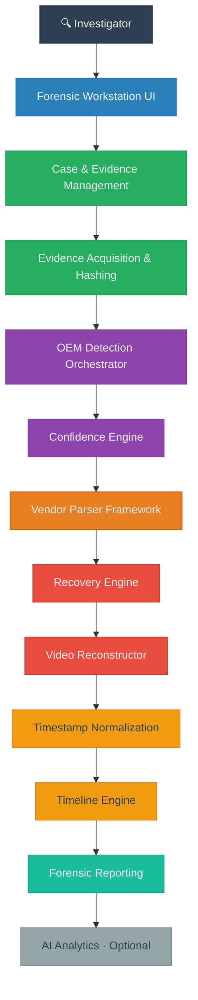
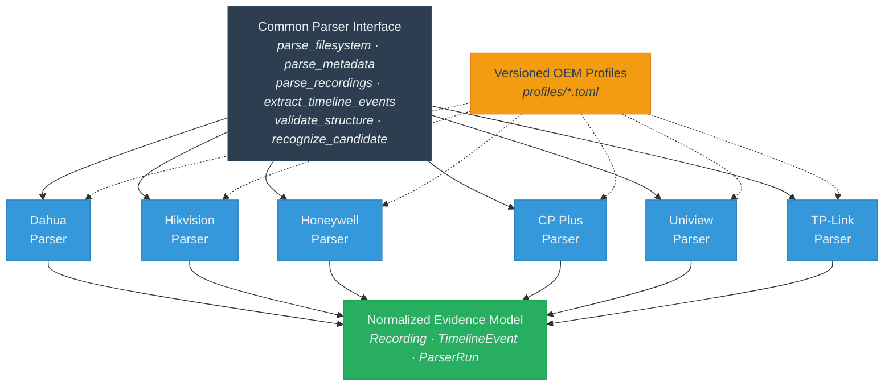
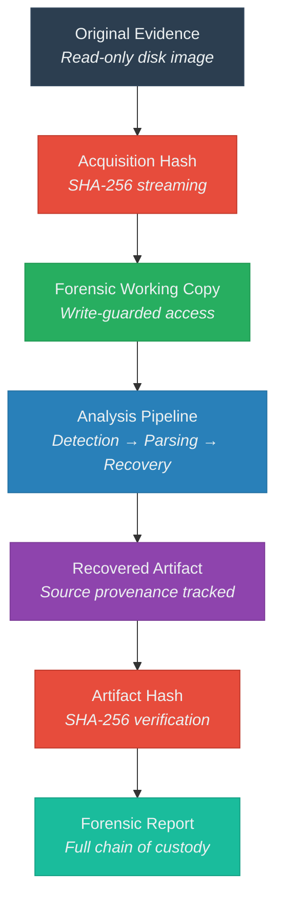
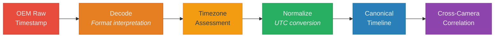

<div align="center">

```
 ╔══════════════════════════════════════════════════════════════════╗
 ║                                                                  ║
 ║     ██████╗ ██╗   ██╗██████╗     ███████╗ ██████╗ ██████╗        ║
 ║     ██╔══██╗██║   ██║██╔══██╗    ██╔════╝██╔═══██╗██╔══██╗       ║
 ║     ██║  ██║██║   ██║██████╔╝    █████╗  ██║   ██║██████╔╝       ║
 ║     ██║  ██║╚██╗ ██╔╝██╔══██╗    ██╔══╝  ██║   ██║██╔══██╗       ║
 ║     ██████╔╝ ╚████╔╝ ██║  ██║    ██║     ╚██████╔╝██║  ██║       ║
 ║     ╚═════╝   ╚═══╝  ╚═╝  ╚═╝    ╚═╝      ╚═════╝ ╚═╝  ╚═╝       ║
 ║                                                                  ║
 ║         Multi-Vendor DVR/NVR Forensic Analysis Platform          ║
 ║                                                                  ║
 ╚══════════════════════════════════════════════════════════════════╝
```

**Standardized acquisition, proprietary storage analysis, video recovery,<br>
timeline reconstruction, and forensic reporting across surveillance manufacturers.**

---


[Architecture](#system-architecture) · [Capabilities](#core-capabilities) · [OEM Support](#oem-support-matrix) · [Workflow](#forensic-workflow) · [Setup](#installation) · [Roadmap](#development-roadmap)

</div>

---

## Project Overview

Modern DVR and NVR systems record surveillance footage onto proprietary storage architectures that differ significantly between manufacturers. These devices bypass standard filesystems, instead writing video frames, metadata indexes, and timestamps directly to raw disk in vendor-specific binary formats. Generic forensic imaging tools and media players cannot interpret these structures — making evidence recovery from seized DVR hard drives a specialized, technically demanding process.

This platform provides a **unified forensic investigation workflow** that abstracts manufacturer-specific storage complexity behind a standardized processing pipeline. An investigator creates a case, registers disk evidence, and the system automatically detects the storage manufacturer, dispatches the appropriate parser, recovers recordings, normalizes timestamps across cameras, validates artifact integrity, and produces documented forensic reports — regardless of which vendor manufactured the DVR.

The architecture enforces strict separation between **physical evidence** (the original disk), **recovered artifacts** (extracted recordings with provenance), and **derived analysis** (timelines, analytics, reports). Every operation preserves the original evidence read-only, tracks provenance through cryptographic hashing, and maintains chain-of-custody logging. Forensic results are deterministic: the same evidence, profile, and configuration always produce the same output.

```
RAW EVIDENCE → OEM DETECTION → VENDOR PARSER → RECOVERY → NORMALIZATION
     → TIMELINE → VALIDATION → VIDEO RECONSTRUCTION → REPORTING
```

---

## The Problem

| Challenge | Forensic Impact |
|:---|:---|
| **Proprietary filesystems** | Generic tools cannot interpret vendor-specific storage layouts |
| **Fragmented recordings** | Simple file carving may produce incomplete or disordered footage |
| **Deleted recordings** | Evidence may persist outside active metadata indexes |
| **Timestamp variations** | Each OEM encodes time differently, complicating cross-camera chronology |
| **Multiple OEM vendors** | Different storage models require entirely different parsing logic |
| **Large disk images** | Multi-terabyte evidence demands bounded-memory processing |
| **Evidence integrity** | Every recovered artifact requires cryptographic provenance |
| **Reporting requirements** | Findings need standardized, reproducible documentation |

---

## The Solution

The platform addresses these challenges through a layered architecture that isolates vendor-specific complexity from the forensic investigation workflow.



---

## Core Capabilities

### 1. Evidence Acquisition

The platform ingests raw disk images and forensic copies as read-only evidence sources, never modifying original data.

- Read-only evidence access enforced at the reader layer with write-guard protection
- Support for raw disk images (`.raw`, `.dd`, `.img`)
- Source-safety inspection distinguishes verified read-only from unknown source states
- Bounded-memory streaming — evidence is never loaded entirely into memory
- Memory-mapped and sequential reader strategies for different analysis patterns
- Configurable read-window sizes (8–64 MiB) with validated bounds

### 2. Automatic OEM Detection

The detection orchestrator runs all registered vendor detectors against evidence in parallel, producing deterministic, sorted results.

- Profile-driven signature matching — all vendor knowledge lives in versioned data profiles, not source code
- Multi-signal detection with weighted scoring per evidence item
- Storage topology profiling (MBR, GPT, unpartitioned raw) to identify candidate regions
- Deterministic output ordering independent of execution timing

### 3. Confidence-Based Attribution

A dedicated confidence engine evaluates detection results through a strict decision tree to assign forensic attribution.

- Weighted scoring with validation-status and quality factors
- Five-level attribution: `Confirmed`, `CompatibleCandidate`, `Ambiguous`, `Unknown`, `Insufficient`
- OEM-exclusive evidence required for `Confirmed` attribution — no shortcutting
- Configurable thresholds, margins, and quality requirements via versioned configuration
- Sole producer of attribution decisions — no other component may assert OEM identity

### 4. Proprietary Filesystem Analysis

Each OEM is implemented through a dedicated parser adapter behind a common forensic processing interface.

- Common `Parser` trait with methods for filesystem, metadata, recording, and timeline extraction
- Parsers interpret OEM-specific storage structures without asserting OEM identity
- All OEM factual knowledge (signatures, offsets, structures) lives in versioned TOML profiles under `profiles/`
- Structure validation before data interpretation
- Parser outputs feed the recovery and timeline engines

### 5. Video Recovery & Reconstruction

The recovery engine orchestrates bounded evidence scanning with multi-level recovery strategies, while the video reconstructor handles codec classification and container production.

- Multi-level recovery framework: L1 (indexed), L2 (orphan/slack), L3 (raw carving)
- Multi-signal NAL-evidence codec classification (H.264, H.265, MJPEG, MPEG-4)
- FFmpeg-based remuxing (preferred over re-encoding) with forensic provenance
- Native vs. derived artifact separation — originals are never replaced
- Frame validation, gap marking, and keyframe analysis
- Ambiguous codec evidence yields `REVIEW`, never arbitrary tie-breaking

### 6. Timestamp Normalization

The time-evidence model maintains strict separation between raw, recorder-native, normalized, and reference timestamps.

- Raw timestamp bytes preserved verbatim alongside interpreted values
- Unknown timezone states are preserved and flagged — never silently assumed UTC
- Clock correction modeling with drift rate and residual tracking
- Reference time anchoring from external trusted sources
- Physical storage order explicitly distinguished from chronological order

### 7. Cross-Camera Timeline

The timeline engine builds a unified chronological view across multiple cameras and recording sessions.

- Three distinguishable ordering modes: Physical (disk offset), RecorderNative, Normalized (UTC)
- Cross-camera event correlation with configurable time-window matching
- Event grouping across cameras that observed the same temporal window
- Unknown-timezone events are included with explicit warnings, not silently dropped

### 8. Integrity & Chain of Custody

Every operation is auditable through cryptographic hashing and append-only custody logging.

- SHA-256 streaming hash computation in bounded windows
- Provenance tracking: which evidence bytes, parser version, and profile produced each artifact
- Append-only chain-of-custody log (ingest, detection, parsing, recovery, export, reporting)
- Write-guard enforcement prevents accidental evidence modification
- Transformation history records every processing step applied to derived artifacts

### 9. Forensic Reporting

Reports aggregate all analysis stages with complete provenance, stated limitations, and reproducibility information.

- Comprehensive report model: evidence summary, detection attribution, capability stages, validation states, recordings, recovery, timeline, artifacts, chain of custody
- JSON, CSV, and formatted human-readable export formats
- Report auditing with provenance verification
- Stated forensic limitations explicitly included — reports never claim legal admissibility
- Capability stages (detection, profiling, parsing, reconstruction, validation) reported separately from validation outcomes

### 10. AI Video Analytics (Optional)

An optional downstream analysis layer provides probabilistic AI-assisted visual analytics on recovered video.

- Operates exclusively on derived video clips — never receives paths to original evidence
- All findings labeled as `AI-assisted` with confidence scores and disclaimers
- Object detection (person, vehicle) with bounding-box coordinates
- Motion analysis support
- Python FastAPI microservice architecture, isolated from the core forensic pipeline

> **Architectural principle:** AI analyzes recovered evidence; it does not replace evidence acquisition, parsing, or validation.

---

## Forensic Workflow

```
┌─────────────────────────────────────────────────────────────────┐
│                    FORENSIC INVESTIGATION FLOW                  │
├─────────┬───────────────────────────────────────────────────────┤
│  STEP   │  OPERATION                                           │
├─────────┼───────────────────────────────────────────────────────┤
│   01    │  Create Case — assign examiner, case identifiers     │
│   02    │  Register Evidence — ingest disk image read-only     │
│   03    │  Verify Integrity — SHA-256 hash of evidence source  │
│   04    │  Inspect Source Safety — read-only vs. unknown       │
│   05    │  Detect OEM — multi-vendor signature analysis        │
│   06    │  Classify Attribution — confidence-based scoring     │
│   07    │  Analyze Storage — OEM-specific structure parsing    │
│   08    │  Recover Recordings — bounded multi-level recovery   │
│   09    │  Reconstruct Video — codec classification & remux    │
│   10    │  Normalize Timeline — timestamp standardization      │
│   11    │  Correlate Cameras — cross-camera event matching     │
│   12    │  Analyze Video — optional AI-assisted analytics      │
│   13    │  Generate Report — forensic documentation            │
└─────────┴───────────────────────────────────────────────────────┘
```

The platform enforces a clear separation between three evidence tiers:

| Tier | Description | Integrity |
|:---|:---|:---|
| **Physical Evidence** | Original disk image, never modified | Acquisition hash |
| **Recovered Artifacts** | Extracted recordings with source provenance | Artifact hash + transformation history |
| **Derived Analysis** | Timelines, reports, AI findings | Linked to source artifacts |

---

## System Architecture

```
┌──────────────────────────────────────────────────────────────────┐
│                    Investigator Experience                        │
│            React 18 + TypeScript + Vite Frontend                 │
├──────────────────────────────────────────────────────────────────┤
│                   Forensic API (Axum/Tokio)                      │
│           REST endpoints · SQLite persistence · CORS             │
├──────────────────────────────────────────────────────────────────┤
│                  Case & Evidence Management                      │
│     Case · Evidence · Acquisition · Chain of Custody · Export    │
├──────────────────────────────────────────────────────────────────┤
│                 Forensic Processing Engine                       │
│  ┌─────────────┐  ┌──────────────┐  ┌──────────────────────┐    │
│  │  Detection   │→ │  Confidence  │→ │  Parsing Orchestrator│    │
│  │ Orchestrator │  │    Engine    │  │                      │    │
│  └─────────────┘  └──────────────┘  └──────────────────────┘    │
├──────────────────────────────────────────────────────────────────┤
│                   OEM Parser Framework                           │
│    ┌────────┬────────┬──────────┬────────┬────────┬────────┐    │
│    │ Dahua  │Hikvision│Honeywell│CP Plus │Uniview │TP-Link │    │
│    │ Parser │ Parser  │ Parser  │ Parser │ Parser │ Parser │    │
│    └────────┴────────┴──────────┴────────┴────────┴────────┘    │
│              Common Parser Trait Interface                       │
├──────────────────────────────────────────────────────────────────┤
│                  Recovery & Video Layer                           │
│      Recovery Engine · Video Reconstructor · FFmpeg Service      │
├──────────────────────────────────────────────────────────────────┤
│                 Timeline & Normalization                          │
│    Timeline Engine · Cross-Camera Correlator · Time Evidence     │
├──────────────────────────────────────────────────────────────────┤
│                  Reporting & Analytics                            │
│     JSON/CSV/Formatted Reports · Report Auditor · AI Service    │
├──────────────────────────────────────────────────────────────────┤
│                   Evidence Foundation                             │
│   Evidence Reader · Hashing Service · Determinism Harness        │
│         Bounded Memory · Read-Only · Write Guards                │
└──────────────────────────────────────────────────────────────────┘
```

### Key Architectural Decisions

- **OEM isolation**: All vendor-specific knowledge lives in versioned TOML profile data (`profiles/`), never in Rust source constants. Parsers consume profiles at runtime.
- **Pure forensic core**: Core crates carry no network or database dependencies, ensuring forensic results are testable, deterministic, and pure.
- **Single network boundary**: Only the API crate (`apps/api`) touches the network and database — all other crates are library-only.
- **Evidence is read-only**: No crate exposes a write path to evidence. Write attempts are logged and denied.
- **Deterministic results**: The same evidence + profile + configuration always produces identical forensic output, verified through a determinism comparison harness.

---

## OEM Support Matrix

<details open>
<summary><strong>Current OEM Implementation Status</strong></summary>

| OEM | Detection | Profile | Parser | Recovery | Timeline | Validation | Status |
|:---|:---:|:---:|:---:|:---:|:---:|:---:|:---|
| **Dahua** | ✅ | ✅ | 🟡 | 🟡 | 🟡 | 🟡 | 🟡 In Development |
| **Hikvision** | ✅ | ✅ | 🟡 | 🟡 | 🟡 | 🟡 | 🟡 In Development |
| **Honeywell** | ✅ | ✅ | 🟡 | 🟡 | 🟡 | 🟡 | 🟡 In Development |
| **CP Plus (UBS)** | ✅ | ✅ | 🟡 | 🟡 | 🟡 | 🟡 | 🟡 In Development |
| **Uniview** | ✅ | ✅ | 🟡 | 🟡 | 🟡 | 🟡 | 🟡 In Development |
| **TP-Link VIGI** | ✅ | ✅ | 🟡 | 🟡 | 🟡 | 🟡 | 🔬 Research |
| **Godrej** | — | — | — | — | — | — | ⚪ Planned |
| **Matrix** | — | — | — | — | — | — | ⚪ Planned |

</details>

**Legend:**
✅ Implemented &nbsp;·&nbsp; 🟡 In Development &nbsp;·&nbsp; 🔬 Research &nbsp;·&nbsp; ⚪ Planned &nbsp;·&nbsp; — Not started

> **Note:** Detection modules and OEM profiles exist for six vendors. Parser implementations follow the common `Parser` trait and are actively being developed. TP-Link VIGI profiles are provisional, derived from firmware reverse engineering. Godrej and Matrix are directory placeholders with no implementation.

---

## OEM Parser Architecture

The platform isolates OEM-specific storage interpretation from the rest of the forensic pipeline through a common parser interface and externalized profile data.



**Design rationale:** Vendor-specific storage structures have been reverse-engineered and are being translated into deterministic parser components. Each parser reads OEM-specific metadata, recording structures, and video references according to its versioned profile — but all parsers produce the same normalized output types (`Recording`, `TimelineEvent`, `ParserRun`). This means the recovery engine, timeline engine, and reporting layer work identically regardless of which vendor's storage is being analyzed.

---

## Evidence Integrity

The platform is designed to support reproducible and auditable forensic workflows.



| Principle | Implementation |
|:---|:---|
| **Evidence preservation** | Original evidence is accessed read-only; write guards log and deny modification attempts |
| **Cryptographic provenance** | SHA-256 hashes computed over evidence and every recovered artifact |
| **Artifact lineage** | Each artifact records which evidence bytes, parser version, and profile produced it |
| **Chain of custody** | Append-only event log of all forensic actions (ingest, detection, recovery, export) |
| **Deterministic results** | Same evidence + profile + config = identical output, verified by determinism harness |
| **Stated limitations** | Reports document what was and was not performed; unrun checks are never reported as `PASS` |

---

## Timestamp Normalization



- The **raw timestamp bytes** are preserved verbatim and remain recoverable at all times
- An **unknown timezone** stays `Unknown` and is never silently treated as UTC
- The **recorder-native interpretation** is stored alongside the normalized value — never overwritten
- **Clock correction** supports drift-rate modeling and residual error tracking
- **Physical storage order** is explicitly distinguished from **chronological order** — the two are never conflated

---

## Video Recovery & Reconstruction

```
Disk Image
     │
     ▼
 Candidate Region Identification
     │
     ▼
 Structural Validation
     │
     ▼
 NAL Evidence / Codec Classification
     │     H.264 │ H.265 │ MJPEG │ MPEG-4
     ▼
 Frame Extraction & Ordering
     │
     ▼
 Gap Marking (never synthesized)
     │
     ▼
 FFmpeg Remux → Container Production
     │
     ▼
 Artifact Hashing & Provenance
     │
     ▼
 Validated Video Artifact
```

- **Metadata-driven recovery** (L1) uses active storage indexes; **orphan/slack recovery** (L2) searches outside indexes; **raw carving** (L3) operates without metadata
- **Codec identity never proves OEM identity** — stream characteristics are media facts, not manufacturer attribution
- **Remuxing is preferred** over re-encoding to preserve original frame data
- **Gaps are marked, never filled** — no frame, recording, or timestamp is ever synthesized
- **FFmpeg discovery** follows strict precedence: configured path → environment variable → bundled binary → system PATH
- Recovery that was truncated by bounds is reported as `REVIEW`, never `PASS`

---

## Forensic Reporting

Reports aggregate the complete forensic evaluation with full provenance and stated limitations.

<details>
<summary><strong>Report Structure</strong></summary>

| Section | Contents |
|:---|:---|
| **Evidence Summary** | Source path, image format, size, SHA-256, acquisition status, source safety |
| **OEM Detection** | Attribution status, classification, confidence score, profile version, matched rules |
| **Capability Stages** | Detection, profiling, parsing, reconstruction, validation maturity per OEM |
| **Validation States** | Per-check outcomes with mandatory reasons — unrun checks are `UNKNOWN`, not `PASS` |
| **Recordings** | Discovered recordings with two-dimensional state (DataState × RecoveryStatus) |
| **Recovery Results** | Searched regions, candidate counts, acceptance/rejection, bounded-scan status |
| **Timeline** | Unified cross-camera events with raw/native/normalized timestamps |
| **Artifacts** | Native and derived artifacts with complete provenance and transformation history |
| **Chain of Custody** | Chronological log of all forensic actions |
| **Limitations** | Explicit statement of what was not performed and known constraints |

</details>

Export formats: **JSON** · **CSV** · **Formatted human-readable text**

---

## Repository Structure

```
sih2026/
├── crates/                          # Forensic core — pure, deterministic, no network
│   ├── forensic-core/               #   Domain vocabulary: identifiers, hashing, provenance,
│   │                                #   case models, validation, determinism harness
│   ├── evidence-reader/             #   Read-only evidence access: raw, mmap, bounded scanning
│   ├── hashing/                     #   Streaming SHA-256 computation in bounded windows
│   ├── detection/                   #   OEM detection orchestrator, topology profiler, detectors
│   ├── confidence/                  #   Confidence engine: scoring, attribution, decision tree
│   ├── parsers-core/                #   Common Parser trait interface
│   ├── parsing/                     #   Parsing orchestrator
│   ├── parsers/                     #   Per-OEM parser implementations
│   │   ├── dahua/                   #     Dahua DHFS parser
│   │   ├── hikvision/               #     Hikvision parser
│   │   ├── honeywell/               #     Honeywell parser
│   │   ├── cpplus-ubs/              #     CP Plus / UBS storage parser
│   │   ├── uniview/                 #     Uniview parser
│   │   └── tplink/                  #     TP-Link VIGI NVR parser
│   ├── recovery/                    #   Recovery engine, video reconstructor, FFmpeg service
│   ├── timeline/                    #   Timeline engine, cross-camera correlation
│   └── reporting/                   #   Forensic report model, JSON/CSV/formatted exporters
│
├── apps/
│   ├── api/                         # Axum/Tokio REST API — sole network/database boundary
│   ├── frontend/                    # React 18 + TypeScript + Vite forensic workstation UI
│   └── ai-service/                  # Python FastAPI AI analytics microservice (optional)
│
├── profiles/                        # Versioned OEM profile data (TOML) — runtime loaded
│   ├── dahua/                       #   Dahua DHFS profile
│   ├── hikvision/                   #   Hikvision profile
│   ├── honeywell/                   #   Honeywell profile
│   ├── cpplus-ubs/                  #   CP Plus / UBS profile
│   ├── uniview/                     #   Uniview profile
│   ├── tplink/                      #   TP-Link VIGI NVR profile (provisional)
│   ├── godrej/                      #   Placeholder — not implemented
│   └── matrix/                      #   Placeholder — not implemented
│
├── config/                          # Platform configuration (non-OEM)
├── validation_corpus/               # Deterministic validation corpus manifests
├── evidence_samples/                # Synthetic evidence samples for testing
├── tests/                           # Cross-crate tests and fixture generators
├── packages/                        # Distribution packages (Windows, macOS)
├── docs/                            # Documentation and decision notes
│   └── decisions/                   #   Open engineering decisions
├── scripts/                         # Build and packaging scripts
└── services/                        # Supplementary services
    └── ai/                          #   AI service documentation
```

---

## Technology Stack

| Layer | Technology | Role |
|:---|:---|:---|
| **Forensic Core** | Rust (2021 edition) | Memory-safe, deterministic forensic processing |
| **Serialization** | Serde + serde_json + TOML | Profile loading, evidence serialization, report export |
| **Cryptography** | SHA2 (sha2 crate) | Evidence and artifact integrity hashing |
| **Time** | Chrono | Timestamp parsing, timezone handling, normalization |
| **Identifiers** | UUID v4 | Case, evidence, artifact, examiner identification |
| **Error Handling** | thiserror | Typed forensic error hierarchy |
| **Video Processing** | FFmpeg (runtime) | Codec probing, stream remuxing, media validation |
| **API Server** | Axum + Tokio + Tower | Async REST API with CORS and static file serving |
| **Database** | SQLx + SQLite | Case persistence, evidence metadata, artifact registry |
| **Frontend** | React 18 + TypeScript + Vite | Forensic workstation user interface |
| **AI Analytics** | Python + FastAPI + Pydantic | Optional video analytics microservice |
| **CI** | GitHub Actions | Workspace build and test validation |

---

## Development Status

### Engineering Maturity Model


### Current Status by Component

| Component | Maturity | Notes |
|:---|:---|:---|
| **Forensic Core Types** | ✅ Implemented | Domain models, identifiers, validation states, provenance, determinism |
| **Evidence Reader** | ✅ Implemented | Raw/mmap readers, bounded scanning, write guards, source safety |
| **Hashing Service** | ✅ Implemented | Streaming SHA-256, region/full-image hashing, cancellation |
| **Detection Orchestrator** | ✅ Implemented | Multi-vendor detection, deterministic ordering, topology profiling |
| **Confidence Engine** | ✅ Implemented | Weighted scoring, attribution decision tree, configurable thresholds |
| **OEM Profiles** | ✅ Implemented | Profile loader, registry, validation — six OEM profiles authored |
| **Parser Interface** | ✅ Implemented | Common trait with six methods |
| **OEM Parsers** | 🟡 In Development | Trait implementations in progress for all six OEMs |
| **Recovery Engine** | 🟡 In Development | Orchestration framework present; L1/L2/L3 strategies expanding |
| **Video Reconstructor** | 🟡 In Development | Codec classifier and NAL analysis implemented; reconstruction pipeline active |
| **FFmpeg Service** | ✅ Implemented | Discovery, probing, remuxing, artifact hashing, verification |
| **Timeline Engine** | 🟡 In Development | Three orderings implemented; cross-camera correlator present |
| **Reporting** | 🟡 In Development | Report model and JSON/CSV/formatted exporters present |
| **API** | ✅ Implemented | Full REST endpoint suite for case, evidence, detection, parsing, recovery |
| **Frontend** | ✅ Implemented | Forensic workstation UI with views for all pipeline stages |
| **AI Service** | 🟡 Prototype | FastAPI stub with simulated detection responses |
| **Validation Corpus** | 🟡 In Development | Manifest schema defined; synthetic fixture generator present |
| **Distribution** | ✅ Packaged | Windows (ZIP) and macOS (DMG) distribution packages |

---

## Development Roadmap

| Phase | Focus | Status |
|:---|:---|:---:|
| **Phase 1** | Forensic Foundation — core types, evidence reader, hashing, write guards, determinism | ✅ Complete |
| **Phase 2** | OEM Detection — detector implementations, profiles, confidence engine, topology | ✅ Complete |
| **Phase 3** | Parser Framework — common interface, per-OEM parser stubs, profile-driven parsing | 🟡 Active |
| **Phase 4** | Recovery Engine — L1/L2/L3 strategies, bounded scanning, candidate validation | 🟡 Active |
| **Phase 5** | Timeline Engine — timestamp normalization, cross-camera correlation, unified timeline | 🟡 Active |
| **Phase 6** | Video Reconstruction — codec classification, FFmpeg remuxing, artifact production | 🟡 Active |
| **Phase 7** | Reporting & Analytics — forensic reports, AI analytics integration | 🟡 Active |
| **Phase 8** | Validation & Testing — validation corpus expansion, regression testing, benchmarks | ⚪ Planned |
| **Phase 9** | Production Hardening — real-evidence validation, performance optimization, documentation | ⚪ Planned |

---

## Validation Strategy

Parser and pipeline validation uses deterministic corpus testing with known expected outcomes.

<details>
<summary><strong>Validation Approach</strong></summary>

**Test fixtures include:**
- Known-good synthetic recordings per OEM
- Controlled corruption and deletion scenarios
- Fragmented and truncated recordings
- Lone-signature false-positive cases
- Unknown model/firmware variations
- Overlapping-signature edge cases

**Validation metrics (when implemented):**
- OEM detection accuracy (true positive / false positive rates)
- Recovery yield by level (L1/L2/L3)
- Timestamp normalization error
- Temporal ordering accuracy
- Throughput and bounded-memory compliance

**Corpus rules:**
- Real evidence is **never committed** — all fixtures are synthetic and explicitly labeled
- Same case + same profile + same config = identical result (determinism invariant)
- A synthetic fixture containing a lone magic value must not pass OEM detection

</details>

---

## Installation

### Prerequisites

- **Rust** ≥ 1.82 (2021 edition)
- **Node.js** ≥ 18 (for frontend)
- **FFmpeg** (optional, for video reconstruction — discovered automatically)
- **Python** ≥ 3.10 (optional, for AI analytics service)

### Build

```bash
# Clone the repository
git clone https://github.com/ashok280705/VIDEO.git
cd VIDEO

# Build the Rust workspace
cargo build --workspace --all-targets

# Run the test suite
cargo test --workspace
```

### Frontend

```bash
cd apps/frontend
npm install
npm run build    # Production build
npm run dev      # Development server
```

### AI Service (Optional)

```bash
cd apps/ai-service
pip install -r requirements.txt
python main.py
```

### Run the Forensic API

```bash
cargo run --bin forensic-api
```

The API serves the frontend and provides REST endpoints at `http://localhost` (default port configured in the binary).

---

## Usage

The platform exposes a REST API consumed by the forensic workstation frontend. Key API endpoints:

```
POST   /api/cases                              Create a new forensic case
GET    /api/cases                              List all cases
GET    /api/cases/:id                          Get case details
POST   /api/cases/:id/evidence                 Register evidence to a case
GET    /api/cases/:id/custody                  View chain of custody

GET    /api/evidence/:id                       Get evidence details
GET    /api/evidence/:id/safety                Inspect source safety status
GET    /api/evidence/:id/bytes                 Read evidence bytes (bounded)
GET    /api/evidence/:id/search                Search evidence for patterns
POST   /api/evidence/:id/detection             Run OEM detection
POST   /api/evidence/:id/parsing               Run OEM parsing
GET    /api/evidence/:id/topology              Get storage topology
POST   /api/evidence/:id/recordings/:rec/reconstruct   Reconstruct a recording

GET    /api/evidence/:id/artifacts             List evidence artifacts
GET    /api/artifacts/:id                      Get artifact details
POST   /api/artifacts/:id/verify               Verify artifact integrity
GET    /api/artifacts/:id/video                Stream artifact video

GET    /api/ffmpeg/status                      Check FFmpeg availability
GET    /api/capabilities                       Get platform capabilities
```

> **Note:** The platform is in active development. API endpoints and the frontend UI reflect current implementation status and may evolve.

---

## Documentation

| Document | Location | Contents |
|:---|:---|:---|
| Profiles documentation | [`profiles/README.md`](profiles/README.md) | OEM profile schema, validation rules, evidence-status levels |
| Configuration documentation | [`config/README.md`](config/README.md) | Reader and classification configuration |
| Validation corpus | [`validation_corpus/README.md`](validation_corpus/README.md) | Corpus manifest schema, determinism rules |
| Engineering decisions | [`docs/decisions/`](docs/decisions/) | Open architectural and engineering decisions |
| AI service | [`apps/ai-service/README.md`](apps/ai-service/README.md) | AI analytics service documentation |
| Frontend | [`apps/frontend/README.md`](apps/frontend/README.md) | Forensic workstation UI |

<details>
<summary><strong>Planned Documentation</strong></summary>

- Examiner operating guide with stated limitations
- Per-OEM analysis notes (under `docs/reverse-engineering/`)
- Capability stage matrix documentation
- Validation benchmark reports
- Deployment and packaging guide

</details>

---

## Contributing

Contributions to the platform are welcome across multiple areas:

| Area | Description | Deliverables |
|:---|:---|:---|
| **OEM Research** | Reverse-engineer new vendor storage formats | Research notes + profile data |
| **Parser Development** | Implement the `Parser` trait for new or existing OEMs | Parser crate + profile + tests |
| **Recovery Strategies** | Expand L1/L2/L3 recovery approaches | Recovery module additions + test cases |
| **Timestamp Handling** | Implement OEM-specific timestamp decoding | Time-evidence parsing + validation |
| **Validation Corpus** | Create deterministic test fixtures for edge cases | Corpus manifests + synthetic fixtures |
| **Documentation** | Examiner guides, architecture documentation | Markdown documentation |

### New OEM Parser Checklist

A complete OEM contribution should include:

1. **Research documentation** — storage format analysis (kept in `docs/`)
2. **OEM Profile** — versioned TOML profile in `profiles/<oem>/`
3. **Detector module** — signature-based detection in `crates/detection/src/detectors/`
4. **Parser implementation** — `Parser` trait implementation in `crates/parsers/<oem>/`
5. **Test fixtures** — synthetic corpus cases in `validation_corpus/`
6. **Tests** — unit and integration tests

> All OEM factual knowledge (signatures, offsets, structures, confidence weights) must live in profile data, never as Rust source constants.

---

## Responsible Use

This platform is intended for:

- **Authorized forensic investigations** conducted by qualified examiners
- **Digital forensics research** and methodology development
- **Evidence analysis** in support of legitimate investigative processes
- **Academic study** of proprietary surveillance storage systems

The platform supports forensic defensibility through reproducibility, provenance, and documentation. It does not guarantee legal admissibility — admissibility is determined by jurisdiction, procedure, and adjudicator.

---

<div align="center">

**Multi-Vendor DVR/NVR Forensic Analysis Platform**

*Active development · SIH 2026*

</div>
