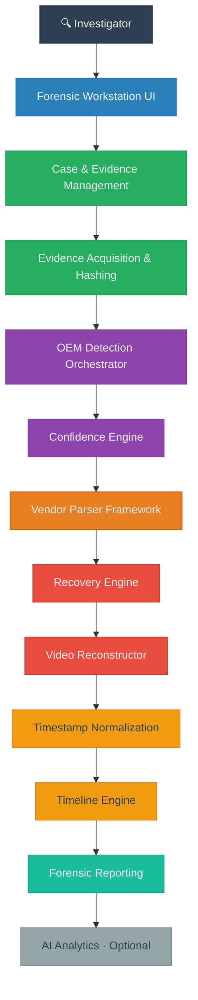

<div align="center">

```
 ╔══════════════════════════════════════════════════════════════════╗
 ║                                                                  ║
 ║     ██████╗ ██╗   ██╗██████╗     ███████╗ ██████╗ ██████╗        ║
 ║     ██╔══██╗██║   ██║██╔══██╗    ██╔════╝██╔═══██╗██╔══██╗       ║
 ║     ██║  ██║██║   ██║██████╔╝    █████╗  ██║   ██║██████╔╝       ║
 ║     ██║  ██║╚██╗ ██╔╝██╔══██╗    ██╔══╝  ██║   ██║██╔══██╗       ║
 ║     ██████╔╝ ╚████╔╝ ██║  ██║    ██║     ╚██████╔╝██║  ██║       ║
 ║     ╚═════╝   ╚═══╝  ╚═╝  ╚═╝    ╚═╝      ╚═════╝ ╚═╝  ╚═╝       ║
 ║                                                                  ║
 ║         Multi-Vendor DVR/NVR Forensic Analysis Platform          ║
 ║                                                                  ║
 ╚══════════════════════════════════════════════════════════════════╝
```

**Standardized acquisition, proprietary storage analysis, video recovery,<br>
timeline reconstruction, and forensic reporting across surveillance manufacturers.**

---


[Architecture](#system-architecture) · [Capabilities](#core-capabilities) · [OEM Support](#oem-support-matrix) · [Workflow](#forensic-workflow) · [Setup](#installation) · [Roadmap](#development-roadmap)

</div>

---

## Project Overview

Modern DVR and NVR systems record surveillance footage onto proprietary storage architectures that differ significantly between manufacturers. These devices bypass standard filesystems, writing video frames, metadata indexes, and timestamps directly to raw disk in vendor-specific binary formats that generic imaging tools and media players cannot interpret.

This platform provides a **unified forensic investigation workflow** over that complexity. An investigator creates a case and registers a disk image; the system detects the storage manufacturer, dispatches the appropriate parser, recovers recordings (including deleted/lost footage), normalizes timestamps across cameras, and produces a documented, reproducible report — regardless of which vendor made the DVR. Evidence is treated read-only, every derived artifact carries cryptographic provenance, and results are deterministic: the same image + profile + config always produces the same output.

```
RAW EVIDENCE → OEM DETECTION → VENDOR PARSER → RECOVERY → NORMALIZATION
     → TIMELINE → VALIDATION → VIDEO RECONSTRUCTION → REPORTING
```

---

## The Problem

| Challenge | Forensic Impact |
|:---|:---|
| **Proprietary filesystems** | Generic tools cannot interpret vendor-specific storage layouts |
| **Fragmented recordings** | Simple carving may produce incomplete or disordered footage |
| **Deleted recordings** | Evidence may persist outside active metadata indexes |
| **Timestamp variations** | Each OEM encodes time differently, complicating cross-camera chronology |
| **Multiple OEM vendors** | Different storage models require entirely different parsing logic |
| **Large disk images** | Multi-terabyte evidence demands bounded-memory processing |

---

## The Solution

A layered architecture isolates vendor-specific complexity from the investigation workflow.



---

## Core Capabilities

- **Evidence acquisition** — read-only ingest of raw disk images (`.raw`, `.dd`, `.img`) with write-guard protection and bounded-memory streaming.
- **Automatic OEM detection** — all registered vendor detectors run in parallel with profile-driven signature matching and deterministic output ordering.
- **Confidence-based attribution** — a decision tree assigns a five-level status (`Confirmed`, `CompatibleCandidate`, `Ambiguous`, `Unknown`, `Insufficient`); only OEM-exclusive evidence yields `Confirmed`.
- **Proprietary filesystem analysis** — one parser adapter per OEM behind a common `Parser` trait, driven entirely by versioned profiles.
- **Video recovery & reconstruction** — bounded multi-level recovery (L1/L2/L3) with codec classification and FFmpeg remuxing.
- **Timestamp normalization** — raw, recorder-native, and normalized time are kept distinct; unknown timezones are never assumed.
- **Cross-camera timeline** — unified chronology across cameras with physical / recorder-native / normalized ordering and time-window correlation.
- **Integrity & chain of custody** — SHA-256 provenance over evidence and every artifact, plus an append-only custody log.
- **Forensic reporting** — JSON / CSV / human-readable reports with explicit, stated limitations.
- **AI analytics (optional)** — downstream, AI-assisted visual analysis that operates on derived clips only.

---

## Forensic Workflow

```
┌─────────────────────────────────────────────────────────────────┐
│                    FORENSIC INVESTIGATION FLOW                  │
├─────────┬───────────────────────────────────────────────────────┤
│  STEP   │  OPERATION                                            │
├─────────┼───────────────────────────────────────────────────────┤
│   01    │  Create Case — assign examiner, case identifiers      │
│   02    │  Register Evidence — ingest disk image read-only      │
│   03    │  Verify Integrity — SHA-256 hash of evidence source   │
│   04    │  Detect OEM — multi-vendor signature analysis         │
│   05    │  Classify Attribution — confidence-based scoring      │
│   06    │  Analyze Storage — OEM-specific structure parsing     │
│   07    │  Recover Recordings — bounded multi-level recovery    │
│   08    │  Reconstruct Video — codec classification & remux     │
│   09    │  Normalize & Correlate — timeline standardization     │
│   10    │  Generate Report — forensic documentation             │
└─────────┴───────────────────────────────────────────────────────┘
```

The pipeline keeps three evidence tiers strictly separated:

| Tier | Description | Integrity |
|:---|:---|:---|
| **Physical Evidence** | Original disk image, never modified | Acquisition hash |
| **Recovered Artifacts** | Extracted recordings with source provenance | Artifact hash + transformation history |
| **Derived Analysis** | Timelines, reports, AI findings | Linked to source artifacts |

---

## System Architecture

```
┌──────────────────────────────────────────────────────────────────┐
│                    Investigator Experience                       │
│            React 18 + TypeScript + Vite Frontend                 │
├──────────────────────────────────────────────────────────────────┤
│                   Forensic API (Axum/Tokio)                      │
│           REST endpoints · SQLite persistence · CORS             │
├──────────────────────────────────────────────────────────────────┤
│                 Forensic Processing Engine                       │
│  Detection Orchestrator → Confidence Engine → Parsing → Recovery │
│        → Timeline & Normalization → Reporting & Analytics        │
├──────────────────────────────────────────────────────────────────┤
│                   OEM Parser Framework                           │
│    ┌────────┬────────┬──────────┬────────┬────────┬────────┐     │
│    │ Dahua  │Hikvision│Honeywell│CP Plus │Uniview │TP-Link │     │
│    └────────┴────────┴──────────┴────────┴────────┴────────┘     │
│              Common Parser Trait Interface                       │
├──────────────────────────────────────────────────────────────────┤
│                   Evidence Foundation                            │
│   Evidence Reader · Hashing Service · Determinism Harness        │
│         Bounded Memory · Read-Only · Write Guards                │
└──────────────────────────────────────────────────────────────────┘
```

Key architectural decisions:

- **OEM facts live in data** — signatures, offsets, and structures live in versioned TOML profiles under `profiles/`, never as Rust source constants; parsers consume them at runtime.
- **Pure forensic core** — core crates carry no network or database dependencies, keeping results testable and deterministic.
- **Single network boundary** — only the API crate (`apps/api`) touches the network and database; every other crate is library-only.
- **Read-only, deterministic** — no crate exposes a write path to evidence, and the same evidence + profile + config always produces identical output.

### Repository Structure

```
crates/             Deterministic forensic core (no network/DB): evidence reader,
                    hashing, detection, confidence, per-OEM parsers, recovery,
                    timeline, reporting
apps/api/           Axum/Tokio REST API — the only network/database boundary
apps/frontend/      React 18 + TypeScript + Vite workstation UI
apps/ai-service/    Optional Python/FastAPI analytics (derived clips only)
profiles/           Versioned OEM profile data (TOML), loaded at runtime
config/             Platform (non-OEM) configuration
validation_corpus/  Deterministic validation manifests and synthetic fixtures
tests/              Cross-crate tests and fixture generators
docs/               Documentation and engineering decision notes
```

---

## OEM Support Matrix

| OEM | Detection | Profile | Parser | Recovery | Timeline | Validation | Status |
|:---|:---:|:---:|:---:|:---:|:---:|:---:|:---|
| **Dahua** | ✅ | ✅ | 🟡 | 🟡 | 🟡 | 🟡 | 🟡 In Development |
| **Hikvision** | ✅ | ✅ | 🟡 | 🟡 | 🟡 | 🟡 | 🟡 In Development |
| **Honeywell** | ✅ | ✅ | 🟡 | 🟡 | 🟡 | 🟡 | 🟡 In Development |
| **CP Plus (UBS)** | ✅ | ✅ | 🟡 | 🟡 | 🟡 | 🟡 | 🟡 In Development |
| **Uniview** | ✅ | ✅ | 🟡 | 🟡 | 🟡 | 🟡 | 🟡 In Development |
| **TP-Link VIGI** | ✅ | ✅ | 🟡 | 🟡 | 🟡 | 🟡 | 🔬 Research |
| **Godrej** | — | — | — | — | — | — | ⚪ Planned |
| **Matrix** | — | — | — | — | — | — | ⚪ Planned |

**Legend:** ✅ Implemented · 🟡 In Development · 🔬 Research · ⚪ Planned · — Not started

> Detection modules and OEM profiles exist for six vendors; parser implementations follow the common `Parser` trait and are actively being developed. TP-Link VIGI profiles are provisional, derived from firmware reverse engineering. Godrej and Matrix are directory placeholders with no implementation. Detection uses signatures — codec identity never proves OEM identity, and unsupported or ambiguous images resolve to a generic Annex-B carving fallback.

---

## Forensic Integrity

Chain-of-custody and provenance are enforced across every stage so workflows stay reproducible and auditable.

| Principle | Implementation |
|:---|:---|
| **Evidence preservation** | Original evidence is accessed read-only; write guards log and deny modification attempts |
| **Cryptographic provenance** | SHA-256 hashes computed over evidence and every recovered artifact |
| **Artifact lineage** | Each artifact records which evidence bytes, parser version, and profile produced it |
| **Chain of custody** | Append-only log of all forensic actions (ingest, detection, recovery, export, reporting) |
| **Deterministic results** | Same evidence + profile + config = identical output, verified by a determinism harness |
| **Stated limitations** | Reports document what was and was not performed; unrun checks are `UNKNOWN`, never `PASS` |

---

## Video Recovery & Reconstruction

- **Multi-level recovery** — L1 uses active storage indexes, L2 searches orphan/slack space outside indexes, and L3 carves raw without metadata.
- **Codec identity is a media fact, not attribution** — stream characteristics (H.264, H.265, MJPEG, MPEG-4) never prove OEM identity.
- **Remuxing is preferred** over re-encoding to preserve original frame data, with provenance recorded on every artifact.
- **Gaps are marked, never filled** — no frame, recording, or timestamp is ever synthesized.
- **Bounded and honest** — recovery truncated by scan bounds, and ambiguous codec evidence, are reported as `REVIEW`, never `PASS`.

---

## Timestamp Normalization

Time is treated as evidence with distinct raw, recorder-native, normalized, and reference layers.

- **Raw timestamp bytes are preserved verbatim** and remain recoverable alongside every interpreted value.
- **Unknown timezones stay `Unknown`** and are flagged — never silently treated as UTC.
- **Recorder-native interpretation is stored alongside** the normalized value, not overwritten.
- **Physical storage order is distinguished from chronological order**, and clock correction supports drift-rate and residual-error modeling.

---

## Forensic Reporting

Reports aggregate the complete evaluation with full provenance and explicit limitations, and never claim legal admissibility. Each report covers the evidence summary, OEM detection attribution, per-OEM capability stages, validation states (unrun checks are `UNKNOWN`, not `PASS`), discovered recordings, recovery results, the unified timeline, artifacts with transformation history, and the chain-of-custody log.

Export formats: **JSON** · **CSV** · **Formatted human-readable text**

---

## Technology Stack

| Layer | Technology | Role |
|:---|:---|:---|
| **Forensic Core** | Rust (2021 edition) | Memory-safe, deterministic forensic processing |
| **Serialization** | Serde · serde_json · TOML | Profile loading, serialization, report export |
| **Integrity & Time** | SHA-2 · Chrono · UUID v4 | Hashing, timestamp handling, identifiers |
| **Video Processing** | FFmpeg (runtime) | Codec probing, stream remuxing, media validation |
| **API & Persistence** | Axum · Tokio · Tower · SQLx + SQLite | Async REST API and case/artifact persistence |
| **Frontend** | React 18 · TypeScript · Vite | Forensic workstation user interface |
| **AI Analytics** | Python · FastAPI (optional) | Downstream video analytics microservice |
| **CI** | GitHub Actions | Workspace build and test validation |

---

## Current Development Status

| Component | Status | Notes |
|:---|:---|:---|
| **Forensic core** | ✅ Implemented | Domain types, evidence reader, streaming SHA-256, write guards, determinism |
| **Detection & confidence** | ✅ Implemented | Multi-vendor detection, topology profiling, attribution decision tree |
| **OEM profiles & parser interface** | ✅ Implemented | Six OEM profiles authored; common `Parser` trait defined |
| **OEM parsers** | 🟡 In Development | Trait implementations in progress across all six OEMs |
| **Recovery engine & video reconstructor** | 🟡 In Development | Orchestration and codec/NAL analysis present; L1/L2/L3 expanding |
| **FFmpeg service** | ✅ Implemented | Discovery, probing, remuxing, artifact hashing, verification |
| **Timeline engine** | 🟡 In Development | Three orderings implemented; cross-camera correlator present |
| **Reporting** | 🟡 In Development | Report model and JSON/CSV/formatted exporters present |
| **API & frontend** | ✅ Implemented | REST suite and forensic workstation UI across pipeline stages |
| **AI service** | 🟡 Prototype | FastAPI stub with simulated detection responses |
| **Validation corpus** | 🟡 In Development | Manifest schema defined; synthetic fixture generator present |
| **Distribution** | ✅ Packaged | Windows (ZIP) and macOS (DMG) packages |

---

## Development Roadmap

| Phase | Focus | Status |
|:---|:---|:---:|
| **Phase 1** | Forensic Foundation — core types, evidence reader, hashing, write guards, determinism | ✅ Complete |
| **Phase 2** | OEM Detection — detectors, profiles, confidence engine, topology | ✅ Complete |
| **Phase 3** | Parser Framework — common interface, per-OEM parsers, profile-driven parsing | 🟡 Active |
| **Phase 4** | Recovery Engine — L1/L2/L3 strategies, bounded scanning, candidate validation | 🟡 Active |
| **Phase 5** | Timeline Engine — timestamp normalization, cross-camera correlation | 🟡 Active |
| **Phase 6** | Video Reconstruction — codec classification, FFmpeg remuxing, artifact production | 🟡 Active |
| **Phase 7** | Reporting & Analytics — forensic reports, AI analytics integration | 🟡 Active |
| **Phase 8** | Validation & Testing — corpus expansion, regression testing, benchmarks | ⚪ Planned |
| **Phase 9** | Production Hardening — real-evidence validation, performance, documentation | ⚪ Planned |

---

## Validation

Parser and pipeline validation uses deterministic corpus testing against known expected outcomes. Fixtures cover known-good recordings per OEM, controlled corruption/deletion, fragmented and truncated recordings, lone-signature false positives, and overlapping-signature edge cases. Two invariants hold throughout: the same case + profile + config always produces an identical result, and a synthetic fixture containing only a lone magic value must not pass OEM detection. Real evidence is never committed — all fixtures are synthetic and explicitly labeled. Accuracy, recovery-yield, and normalization-error metrics are planned as the corpus expands.

---

## Installation

### Prerequisites

- **Rust** ≥ 1.82 (2021 edition)
- **Node.js** ≥ 18 (for the frontend)
- **FFmpeg** (optional, for video reconstruction — discovered automatically)
- **Python** ≥ 3.10 (optional, for the AI analytics service)

### Build

```bash
# Clone the repository
git clone https://github.com/ashok280705/VIDEO.git
cd VIDEO

# Build and test the Rust workspace
cargo build --workspace --all-targets
cargo test --workspace
```

### Run the Forensic API

```bash
cargo run --bin forensic-api
```

The API serves the frontend and REST endpoints (default port configured in the binary).

### Frontend

```bash
cd apps/frontend
npm install
npm run dev      # development server
npm run build    # production build
```

### AI Service (optional)

```bash
cd apps/ai-service
pip install -r requirements.txt
python main.py
```

---

## Basic Usage

With the API running, the React frontend drives the full workflow: create a case, register a disk image as read-only evidence, run OEM detection and parsing, recover and reconstruct recordings, and generate a forensic report.

> The platform is in active development; features reflect current implementation status and may evolve.

---

## Documentation

| Document | Location | Contents |
|:---|:---|:---|
| Profiles | [`profiles/README.md`](profiles/README.md) | OEM profile schema, validation rules, evidence-status levels |
| Configuration | [`config/README.md`](config/README.md) | Reader and classification configuration |
| Validation corpus | [`validation_corpus/README.md`](validation_corpus/README.md) | Corpus manifest schema, determinism rules |
| Engineering decisions | [`docs/decisions/`](docs/decisions/) | Open architectural and engineering decisions |
| AI service | [`apps/ai-service/README.md`](apps/ai-service/README.md) | AI analytics service documentation |
| Frontend | [`apps/frontend/README.md`](apps/frontend/README.md) | Forensic workstation UI |

---

## Responsible Use

Intended for authorized forensic investigations, digital-forensics research and methodology development, and academic study of proprietary surveillance storage. The platform supports defensibility through reproducibility, provenance, and documentation, but does not guarantee legal admissibility — that is determined by jurisdiction, procedure, and adjudicator.

---

## Contributing

Contributions are welcome across OEM research, parser development, recovery strategies, timestamp handling, validation fixtures, and documentation. A new OEM typically needs a versioned TOML profile, a signature-based detector, a `Parser` trait implementation, and synthetic corpus fixtures with tests. All OEM factual knowledge (signatures, offsets, structures, confidence weights) must live in profile data under `profiles/`, never as Rust source constants.

---

<div align="center">

**Multi-Vendor DVR/NVR Forensic Analysis Platform**

*Active development · SIH 2026*

</div>
